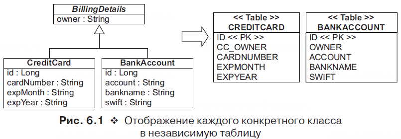
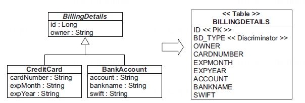
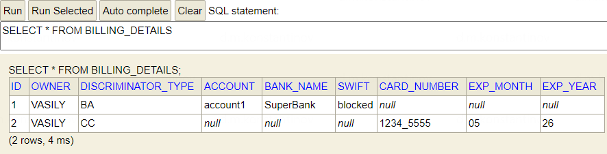
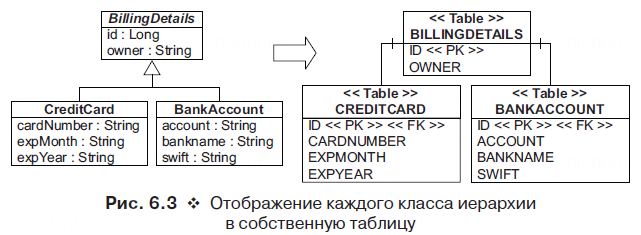

== Стратегии наследования в JPA/Hibernate

*Content:*

- 1. Четыре стратегии наследования
- 2. "@MappedSuperclass" annotation. Одна таблица на класс, суперкласс не является Entity
- 3. InheritanceType.TABLE_PER_CLASS. Одна таблица на класс & UNION & полиморфизм
- 4. InheritanceType.SINGLE_TABLE. Одна таблица для всей иерархии классов
  * 4.1 Плюсы и минусы одной таблицы для всей иерархии классов
  * 4.2 Реализация. Столбец селектора/дискриминатор
  * 4.3 Вид таблицы в БД
  * 4.4 Как жить без столбца селектора/дискриминатора (унаследованная схема БД)
- 5. InheritanceType.JOINED. Таблица для каждого подкласса & JOIN
- 6. Наследование embeddable-классов
- 7. Практические рекомендации к выбору типа наследования

=== 1. Четыре стратегии наследования

Для реализации наследования мы должны использовать специальные аннотации в объявлении суперкласса.
Существуют четыре стратегии представления иерархии наследования:

1. *_@MappedSuperclass_* - Не @Entity-суперкласс.
Одна таблица для каждого конкретного класса и полиморфизм.
Суперкласс не получится извлечь из БД;
2. *_InheritanceType.TABLE_PER_CLASS_* - Одна таблица для каждого конкретного класса, но полное исключение полиморфизма и отношений наследования из схемы SQL.
Для полиморфного поведения во время выполнения необходимо использовать запросы с SQL- инструкцией `UNION`;
3. *_InheritanceType.SINGLE_TABLE_* - Единая таблица для целой иерархии классов: полиморфизм поддерживается за счет денормализации схемы SQL, а определение суперкласса/подкласса осуществляется посредством различения строк;
4. *_InheritanceType.JOINED_* - Одна таблица для каждого подкласса: отношение `is a` (наследования) представлено в виде отношения `has a` (связь по внешнему ключу) с применением SQL-операции `JOIN`.

=== 2. "@MappedSuperclass" annotation. Одна таблица на класс, суперкласс не является Entity

Предположим, что мы выбрали простейший путь - отображать каждый класс в отдельную таблицу.
Тогда схема нашего отображения выглядит так:

Над суперкласом вешается аннотация `@MappedSuperclass`, в противном случае его свойства не будут сохраняться в БД - *_See:_* link:../../hibernate-learning/src/main/java/ch6_hibernate/p151_table_per_class_with_polymorphism/entity/BillingDetails.java[BillingDetails.java]:

[source,java]
----
@MappedSuperclass
public abstract class BillingDetails {

    protected String owner;
}
----

*NOTE!* суперкласс не является entity, поэтому не получится выполнить запрос по типу *"select bd from BillingDetails bd"*:

[source,java]
----
// Данный код упадет с ошибкой 'BillingDetails is not mapped'
// потому что BillingDetails - не @Entity

List<BillingDetails> details = em.createQuery(
        "select bd from BillingDetails bd", BillingDetails.class).getResultList();

----

Каждый дочерний класс можно отобразить при помощи аннотации _@Entity_. *_See:_* link:../../hibernate-learning/src/main/java/ch6_hibernate/p151_table_per_class_with_polymorphism/entity/CreditCard.java[CreditCard.java]:

Также в дочернем классе можно переопределить отображение одного или нескольких столбцов суперкласса, используя аннотации @AttributeOverride или @AttributeOverrides соответственно.
Например, можно переименовать столбец "owner" в "BA_OWNER", а также сделать его *_non-nullable_*. *_See:_* link:../../hibernate-learning/src/main/java/ch6_hibernate/p151_table_per_class_with_polymorphism/entity/BankAccount.java[BankAccount.java]:

[source,java]
----
@Entity
@AttributeOverride(name = "owner",
    column = @Column(name = "BA_OWNER", nullable = false))
public class BankAccount {

    @Id
    @GeneratedValue(strategy = "..."))
    @SequenceGenerator(name = "...")
    private Long id;

    private String account;

    private String bankName;

    private String swift;

}
----

Для чего же вообще нужен *_@MappedSuperclass_*?

- Во-первых, вы можете объявить в суперклассе общий id с общим именем столбца и общей стратегией генератора для всех подклассов, чтобы вам не пришлось его повторять.
- Во-вторых, вы хоть и не можете извлекать суперкласс из БД напрямую - вы можете пользоваться свойствами полиморфизма уже в Java-коде. *_See:_* link:../../hibernate-learning/src/main/java/ch6_hibernate/p151_table_per_class_with_polymorphism/JpaInheritanceMappingScheduler.java[JpaInheritanceMappingScheduler.java]:

[source,java]
----
public void process() {

    // some code

    List<BankAccount> bankAccounts = bankAccountRepository.findAll();
    assertEquals(1, bankAccounts.size());
    List<CreditCard> creditCards = creditCardRepository.findAll();
    assertEquals(2, creditCards.size());

    // работает полиморфизм
    checkOwners(creditCards, true);
    checkOwners(bankAccounts, false);
}

private void checkOwners(
    List<? extends BillingDetails> billingDetailsList, boolean canBeNull) {
    for (BillingDetails billingDetails : billingDetailsList) {
        if (canBeNull) {
            assertTrue(
                    billingDetails.getOwner() == null
                    || OWNER_NAME.equals(billingDetails.getOwner()));
        } else {
            assertEquals(OWNER_NAME, billingDetails.getOwner());
        }
    }
}
----

=== 3. InheritanceType.TABLE_PER_CLASS. Одна таблица на класс & UNION & полиморфизм

Как и в предыдущем случае - две таблицы. Но при этом родительский абстрактный класс является entity. Данное наследование по структуре таблиц похоже на `@MappedSuperclass`, с некоторыми отличиями.

Во-первых, суперкласс обязан содержать столбец ID, чтобы все подклассы могли использовать его в своих таблицах (для `@MappedSuperclass` это условие не обязательно). Обе таблицы – CREDITCARD и BANKACCOUNT – имеют столбец первичного ключа ID. *_See:_* link:../../hibernate-learning/src/main/java/ch6_hibernate/p154_table_per_class_with_union/entity/BillingDetails.java[BillingDetails.java v2]:
[source,java]
----
@Data
@Entity
@Inheritance(strategy = InheritanceType.TABLE_PER_CLASS)
public abstract class BillingDetails {

    @Id
    @GeneratedValue(strategy = GenerationType.SEQUENCE, generator = "s_billing_details")
    @SequenceGenerator(name = "s_billing_details", sequenceName = "s_billing_details", allocationSize = 1)
    protected Long id;

    @NotNull
    protected String owner;

}
----

Соответственно, в примере выше используется одна SEQUENCE для родительского класса, в отличие от двух SEQUENCE для каждого подкласса в случае с `@MappedSuperclass`.

Во-вторых, не получится использовать аннотацию @AttributeOverride, поскольку она может быть применена только к mapped supperclass или к embedded-классам.

Все отображения конкретных классов наследуют хранимые свойства суперкласса (или интерфейса) без изменений. Требуется только добавить аннотацию @Entity перед каждым подклассом. *_See:_* link:../../hibernate-learning/src/main/java/ch6_hibernate/p154_table_per_class_with_union/entity/BankAccount.java[BankAccount.java v2]:
[source,java]
----
@Entity
@Data
@Table(name = "bank_accounts")
// @AttributeOverride нельзя использовать вместе с @Inheritance
public class BankAccount extends BillingDetails {

    @NotNull
    private String account;
    @NotNull
    private String bankName;
    @NotNull
    private String swift;

}
----

В-третьих, если бы класс BillingDetails был конкретным, понадобилась бы дополнительная таблица для хранения экземпляров BillingDetails. Иначе будут вылетать ошибки типа:
----
org.h2.jdbc.JdbcSQLSyntaxErrorException: Таблица "BILLING_DETAILS" не найдена
----
Если прям для BillingDetails нужна отдельная таблица - лучше использовать `InheritanceType.JOINED`.

Преимущества данной стратегии отображения станут очевидны после знакомтва с полиморфными запросами. К примеру, запрос *"select bd from BillingDetails bd"* (*_See:_* link:../../hibernate-learning/src/main/java/ch6_hibernate/p154_table_per_class_with_union/JpaInheritanceMappingScheduler.java[JpaInheritanceMappingScheduler.java]):

[source,java]
----
List<BillingDetails> details = em.createQuery(
        "select bd from BillingDetails bd", BillingDetails.class).getResultList();
assertEquals(2, details.size());
----

сгенерирует следующее выражение SQL:

[source, sql]
----
select id, owner, account, bank_name, swift, card_number, exp_month, exp_year, clazz_
from (
    select
	    id, owner, account, bank_name, swift,
	    null as card_number,
	    null as exp_month,
	    null as exp_year,
	    1 as clazz_
	from bank_accounts
    union all
    select
	    id, owner,
		null as account,
		null as bank_name,
		null as swift,
		card_number, exp_month, exp_year,
		2 as clazz_
	from credit_cards )
----

Этот SELECT использует подзапросы в предложении FROM для извлечения всех экземпляров класса BillingDetails из всех таблиц конкретных классов. Таблицы объединяются с помощью оператора UNION, а в промежуточный результат вставляются литералы `clazz_` (со значениями 1 и 2) - они нужны фреймворку Hibernate для создания экземпляра правильного класса из данных в конкретной записи. Оператор UNION требует, чтобы участвующие в нем запросы имели одинаковую структуру столбцов, поэтому вместо несуществующих столбцов пришлось вставить NULL. В теории оптимизатор БД должен сделать это быстрее, чем слияние результатов двух запросов в памяти, как это сделал бы механизм полиморфной загрузки в Hibernate.

Другим гораздо более важным преимуществом является возможность применения полиморфных ассоциаций; например, теперь стало возможным отобразить ассоциацию от класса User к классу BillingDetails. Hibernate может использовать запрос с выражением UNION для имитации единой таблицы в качестве цели отображения ассоциации. Мы обсудим эту тему далее.

=== 4. InheritanceType.SINGLE_TABLE. Одна таблица для всей иерархии классов

Иерархию классов целиком можно отобразить в одну таблицу. Эта таблица будет содержать столбцы для всех полей каждого класса в иерархии. Конкретный подкласс, представляемый отдельной записью, определяется значением дополнительного столбца с селектором типа или формулой:

==== 4.1 Плюсы и минусы одной таблицы для всей иерархии классов

- Плюсы:
  * Данная стратегия отображения – лучшая с точки зрения производительности как для полиморфных, так и не для полиморфных запросов.
  * Эволюция схемы происходит довольно просто.
- Минусы:
  * Нарушается целостность данных. Столбцы для свойств, объявленных в подклассах, могут содержать null. Если каждый подкласс объявляет несколько свойств, которым нельзя присваивать null, отказ от ограничения NOT NULL может стать серьезной проблемой с точки зрения корректности данных.
  * Денормализация - создается функциональная зависимость между неключевыми столбцами, что нарушает третью нормальную форму.

==== 4.2 Реализация. Столбец селектора/дискриминатор

Суперкласс, помимо аннотации "@Inheritance", также аннотирован дополнительными аннотациями: +
Во-первых, он должен содержать имя общей таблицы в аннотации "@Table(name = "billing_details")" - очевидно, что теперь суперкласс не обязательно делать абстрактным. +
Во-вторых, для различения типов записей необходимо определить столбец селектора с помощью аннотации @DiscriminatorColum - `@DiscriminatorColumn(name = "discriminator_type")`. +
*_See:_* link:../../hibernate-learning/src/main/java/ch6_hibernate/p156_single_table_for_hierarchy/entity/BillingDetails.java[BillingDetails.java v3]:
[source,java]
----
@Data
@Entity
@Inheritance(strategy = InheritanceType.SINGLE_TABLE)
@DiscriminatorColumn(name = "discriminator_type")
@Table(name = "billing_details")
public class BillingDetails {

    @Id
    @GeneratedValue(strategy = GenerationType.SEQUENCE, generator = "s_billing_details")
    @SequenceGenerator(name = "s_billing_details", sequenceName = "s_billing_details", allocationSize = 1)
    protected Long id;

    @NotNull
    protected String owner;

}
----

Столбец селектора _@DiscriminatorColumn_ не является полем сущности – Hibernate использует его для собственных нужд - однако в БД он должен присутствовать. Столбец мы назвали "discriminator_type", а его значениями являются строки – в данном случае "CC" или "BA". Hibernate автоматически устанавливает и извлекает значения селектора. Если не определить столбец селектора в суперклассе, по умолчанию он будет называться "DTYPE", а его значениями будут строки. Каждый конкретный класс в иерархии наследования может задавать свое значение селектора через аннотацию `@DiscriminatorValue`, как показано в определении класса link:../../hibernate-learning/src/main/java/ch6_hibernate/p156_single_table_for_hierarchy/entity/CreditCard.java[CreditCard.java v3]:
[source,java]
----
@Entity
@Data
@EqualsAndHashCode(callSuper = false)
@Accessors(chain = true)
@DiscriminatorValue("CC")
public class CreditCard extends BillingDetails {

    @NotNull
    private String cardNumber;
    @NotNull
    private String expMonth;
    @NotNull
    private String expYear;
}
----

Важно отметить, что аннотации @NotNull пусть и не учитываются на этапе автогенерации схемы (если таковая имеется), но зато валидируются в java-рантайме. Поэтому оставлять такие аннотации все равно полезно, пусть и в БД эти поля будут non-nullable. С другой стороны, у данной схемы тоже есть минусы - если кто-то вручную обновит столбцы в таблице, не заполнив non-nullable значения для того или иного класса, при извлечении entity-классов Hibernate получит ошибку.

==== 4.3 Вид таблицы в БД

Таблица в БД выглядит следующим образом:

==== 4.4 Как жить без столбца селектора/дискриминатора (унаследованная схема БД)

Крайне редкая штука, но изредка, особенно при работе с унаследованными схемами, просто нет возможности добавить еще один столбец селектора в таблицы сущностей. В таком случае можно применить выражение для вычисления значения дискриминатора в каждой строке. Формулы вычисления селектора не являются частью JPA, но в Hibernate для этих целей имеется дополнительная аннотация `@DiscriminatorFormula`:
[source,java]
----
@Entity
@Inheritance(strategy = InheritanceType.SINGLE_TABLE)
@org.hibernate.annotations.DiscriminatorFormula(
    "case when CARD_NUMBER is not null then 'CC' else 'BA' end"
)
public abstract class BillingDetails {
// ...
}
----

В схеме отсутствует столбец селектора, поэтому, чтобы определить, что представляет конкретная запись – CreditCard или BankAccount, данное отображение полагается на SQL-выражение CASE/WHEN (редкое выражение из стандарта ANSI). Результатом вычисления выражения будет литерал – "CC" или "BA", – который будет использован Hibernate как дискриминатор.

=== 5. InheritanceType.JOINED. Таблица для каждого подкласса & JOIN

Четвертый вариант – каждый класс/подкласс, включая абстрактные классы и даже интерфейсы, объявляющий хранимые свойства, располагает собственной таблицей. Объединение происходит по foreign key. В отличие от стратегии, где каждому конкретному классу соответствует своя таблица, здесь таблица конкретной  Entity содержит только столбцы для ненаследуемых свойств, объявленных в самом подклассе.

Например, суперкласс выглядит очень похоже на предыдущие случаи - *_See:_* link:../../hibernate-learning/src/main/java/ch6_hibernate/p159_joined_table/entity/BillingDetails.java[BillingDetails.java v4]:
[source, java]
----
@Data
@Entity
@Inheritance(strategy = InheritanceType.JOINED)
@Table(name = "billing_details")
public class BillingDetails {

    @Id
    @GeneratedValue(strategy = GenerationType.SEQUENCE, generator = "s_billing_details")
    @SequenceGenerator(name = "s_billing_details", sequenceName = "s_billing_details", allocationSize = 1)
    protected Long id;

    @NotNull
    protected String owner;
}
----

Аналогично можно сказать и про подклассы - ничего лишнего, практически никакого отличия от обычных ненаследуемых entity-классов (за исключением "extends BillingDetails")  - *_See:_* link:../../hibernate-learning/src/main/java/ch6_hibernate/p159_joined_table/entity/BankAccount.java[BankAccount.java v4]:
[source, java]
----
@Entity
@Data
@Table(name = "bank_accounts")
public class BankAccount extends BillingDetails {

    @NotNull
    private String account;
    @NotNull
    private String bankName;
    @NotNull
    private String swift;
}
----

В данной стратегии Hibernate использует `left outer join` и конструкцию `case when` для запроса *"select bd from BillingDetails bd"*:
[source, sql]
----
select
    BD.id, BD.owner,
    CC.exp_month, CC.exp_year, CC.card_number,
    BA.account, BA.bank_name, BA.swift,
    case
        when CC.id is not null then 1
        when BA.id is not null then 2
        when BD.id is not null then 0
    end
from
    billing_details BD
    left outer join credit_cards CC on BD.id=CC.id
    left outer join bank_accounts BA on BD.id=BA.id
----

Для более простого запроса к подклассу, такого как *"select cc from CreditCard cc"*, Hibernate использует `inner join`:
[source, sql]
----
select
    id, owner, exp_month, exp_year, card_number
from
    credit_cards
    inner join billing_details on credit_cards.id=id
----

Как видите, подобную стратегию отображения уже труднее реализовать вручную – даже создавать отчеты на основе произвольных запросов становится сложнее. Более того, хотя эта стратегия кажется простой, для сложных иерархий классов производительность может оказаться неприемлемой. Запросы требуют соединения нескольких таблиц или многих последовательных операций чтения.

=== 6. Наследование embeddable-классов

Мы можем применять @MappedSuperclass (и @AttributeOverride) к суперклассу embeddable-класса:

[source, java]
----
@MappedSuperclass
public abstract class Measurement {

    @NotNull
    protected String name;
    @NotNull
    protected String symbol;
}

// ...

@Embeddable
@AttributeOverrides({
    @AttributeOverride(name = "name",
        column = @Column(name = "DIMENSIONS_NAME")),
    @AttributeOverride(name = "symbol",
        column = @Column(name = "DIMENSIONS_SYMBOL"))
})
public class Dimensions extends Measurement {

    @NotNull
    protected BigDecimal depth;
    @NotNull
    protected BigDecimal height;
    @NotNull
    protected BigDecimal width;
}
----

Однако важно помнить, что класс entity может использовать только дочерний класс в иерархии - поскольку реализация JPA не знает, как полиморфно сохранять и загружать экземпляры родительского класса - отсутствует столбец-селектор.
[source, java]
----
@Entity
public class Item {

    // нельзя использовать родительский класс
    // ...
    // protected Measurement measurement;

    protected Dimensions dimensions;

    // ...
}
----

=== 7. Практические рекомендации к выбору типа наследования

- 1. Если полиморфные ассоциации или запросы не требуются, выбирайте `InheritanceType.TABLE_PER_CLASS`. Другими словами: если вы редко выполняете (или никогда не выполняете) запрос "select bd from BillingDetails bd" и если у вас нет классов, ссылающихся на BillingDetails, отдавайте предпочтение явному отображению на основе UNION, поскольку при этом сохраняется возможность последующего добавления (оптимизированных) полиморфных запросов и ассоциаций.
- 2. Если требуются полиморфные запросы или ассоциации (ассоциация с суперклассом, а следовательно, со всеми классами иерархии и с динамическим определением конкретного класса во время выполнения), а подклассы объявляют относительно мало новых полей (особенно если основная разница между подклассами только в поведении), выбирайте стратегию `InheritanceType.SINGLE_TABLE`. Ваша цель в том, чтобы сократить количество столбцов, которые могут содержать null, и убедиться, что денормализованная схема не вызовет впоследствии проблем.
- 3. Если требуются полиморфные ассоциации или запросы, а подклассы объявляют много non-nullable полей (подклассы отличаются в основном данными), выбирайте стратегию `InheritanceType.JOINED`. С другой стороны, в зависимости от ширины и глубины иерархии наследования и возможной стоимости соединений по сравнению с объединениями вы можете выбрать стратегию `InheritanceType.TABLE_PER_CLASS`. Такое решение требует оценки планов выполнения запросов SQL на реальных данных.