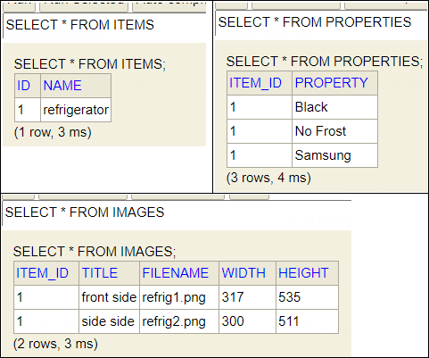

== Коллекции простых типов и embeddable-объектов

Если речь идёт не о коллекциях entity-объектов, а коллекция embeddable или даже простых типов, в дело вступает анноташка `@ElementCollection`. Она позволяет сохранять и вытаскивать из БД как простые (String, Integer) типы, так и embeddable-классы. Примечательно и то, что простой тип можно вытащить из любой таблицы с любым количеством столбцов - т. е. вы можете вытащить один столбец с простыми значениями для ваших нужд (а hibernate обычным селектом вытащит этот столбец из другой таблицы).

Рассмотрим entity-класс link:../../hibernate-learning/src/main/java/ch6_hibernate/p188_embeddable_components_collections/entity/Item.java[Item.java]. Совместно с `@ElementCollection` также используется аннотация `@CollectionTable`, которая указывает имя таблицы, из которой будут браться значения коллекции, через нее же можно настроить параметры *_foreign key_* через аннотацию `@JoinColumn`:

[source, java]
----
@Data
@Entity
@Table(name = "items")
public class Item {

    @Id
    private BigDecimal id;

    @NotNull
    private String name;

    // means that the collection is not a collection of entities,
    // but a collection of simple types (Strings, etc.) or a collection of @Embeddable elements
    @ElementCollection(fetch = FetchType.EAGER)
    @CollectionTable(name = "images")
    protected Collection<Image> images = new ArrayList<>();

    @ElementCollection(fetch = FetchType.EAGER)
    @CollectionTable(name="properties",
        joinColumns = @JoinColumn(name = "item_id"))
    @Column(name = "property")
    protected Set<String> properties = new HashSet<>();

}
----

Теперь рассмотрим совершенно стандартный embeddable-класс link:../../hibernate-learning/src/main/java/ch6_hibernate/p188_embeddable_components_collections/entity/Image.java[Image.java]:
[source, java]
----
@Data
@Embeddable
public class Image {

    @Column(nullable = false)
    protected String title;
    @Column(nullable = false)
    protected String filename;
    protected int width;
    protected int height;
}
----

Очевидно, что для списка строк *properties* отдельного класса нет, однако таблица *PROPERTIES* в БД присутствует. Рассмотрим схему БД целиком:

И рассмотрим как работать с такими сущностями в классе link:../../hibernate-learning/src/main/java/ch6_hibernate/p188_embeddable_components_collections/EmbeddableComponentsCollectionsScheduler.java[EmbeddableComponentsCollectionsScheduler.java]:
[source, java]
----
public void process() {
    Image image1 = new Image().setFilename("refrig1.png")
        .setTitle("front side").setHeight(535).setWidth(317);
    Image image2 = new Image().setFilename("refrig2.png")
        .setTitle("side side").setHeight(511).setWidth(300);

    Item item = new Item().setName("refrigerator");
    item.getImages().add(image1);
    item.getImages().add(image2);

    item.getProperties().addAll(List.of("No Frost", "Black", "Samsung"));
    repository.save(item);

    Map<String, Object> itemInDb =
        jdbcTemplate.queryForList("select * from items").get(0);
    List<Map<String, Object>> imagesInDb =
        jdbcTemplate.queryForList("select * from images");
    List<Map<String, Object>> propertiesInDb =
        jdbcTemplate.queryForList("select * from properties");
}
----

При извлечении entity *_Item_* из БД Hibernate делает следующие три запроса:
[source, sql]
----
select id, name from items;
# ---
select item_id, property from properties where item_id=?
# ---
select item_id, filename, height, title, width from images where item_id=?
----
