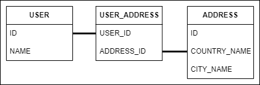
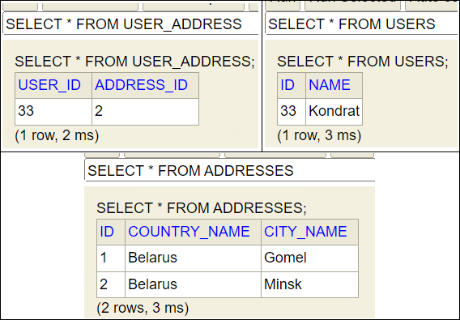

== @OneToOne и использование таблицы соединения (joined table)

*Content:*

- 1. @OneToOne + @JoinTable + LAZY FetchMode
- 2. Sql-запросы при EAGER FetchMode
- 3. OneToOne joined table duplicate records

=== 1. @OneToOne + @JoinTable + LAZY FetchMode

Вообще, ссылки типа `@OneToOne` используются для одинарных ссылок на независимые сущности. Две записи могут быть связаны с помощью foreign key. В этом случае одна из таблиц должна иметь столбец внешнего ключа, ссылающегося на первичный ключ ассоциированной таблицы.

Но что если мы хотим обойтись без foreign key (или если сущности могут быть не связаны и зачастую могут быть null)? Тогда лучшим решением для работы с необязательными значениями является *промежуточная таблица*: если в таблице нашлась строка, значит, ссылка существует, и наоборот.

Пусть у нас есть вышеуказанная схема таблиц - две сущности link:../../hibernate-learning/src/main/java/ch6_hibernate/p220_oneToOne_joined_table/entity/User.java[User.java] и link:../../hibernate-learning/src/main/java/ch6_hibernate/p220_oneToOne_joined_table/entity/Address.java[Address.java] с промежуточной таблицей *USER_ADDRESS*.

В этом случае мы будем использовать аннотацию `@JoinTable` совместно с `@OneToOne`. FetchMode становим в *_LAZY_* (чтобы не получать лишних join-ов):

*_See:_* link:../../hibernate-learning/src/main/java/ch6_hibernate/p220_oneToOne_joined_table/entity/User.java[User.java]
[source, java]
----
@Data
@Entity
@Table(name = "users")
public class User {

    @Id
    private BigDecimal id;

    @NotNull
    private String name;

    @EqualsAndHashCode.Exclude
    @ToString.Exclude
    @OneToOne(fetch = FetchType.LAZY)
    @JoinTable(
            name = "user_address", // Имя таблицы соединения - обязательно!
            joinColumns = @JoinColumn(name = "user_id"), // столбец id текущей таблицы (users)
            // столбец id таблицы, к которой идёт связь (addresses)
            inverseJoinColumns = @JoinColumn(name = "address_id", nullable = false, unique = true)
    )
    protected Address address;

}
----
*_See:_* link:../../hibernate-learning/src/main/java/ch6_hibernate/p220_oneToOne_joined_table/entity/Address.java[Address.java]
[source, java]
----
@Data
@Entity
@Table(name = "addresses")
@Accessors(chain = true)
public class Address {

    @Id
    private BigDecimal id;

    @Column(nullable = false)
    private String countryName;

    private String cityName;

    @EqualsAndHashCode.Exclude
    @ToString.Exclude
    @OneToOne(fetch = FetchType.LAZY)
    @JoinTable(
            name = "user_address",
            joinColumns = @JoinColumn(name = "address_id"),
            inverseJoinColumns = @JoinColumn(name = "user_id")
    )
    protected User user;

}
----

В данном случае работу с этими связями приходится вести через транзакции. При работе с entity (например, при получении юзера и доступа к его полю адреса) получаем два запроса:
[source, sql]
----
select
    id, name, address_id
from
    users
left outer join
    user_address on id=user_id
where id=?

# ---

select
    id, city_name, country_name, user_id
from
    addresses
left outer join
    user_address on id=address_id
where id=?
----

Работу с транзакциями можно увидеть в
*_See:_* link:../../hibernate-learning/src/main/java/ch6_hibernate/p220_oneToOne_joined_table/OneToOneJoinedTableScheduler.java[OneToOneJoinedTableScheduler.java].

Данные в БД выглядят следующим образом:

=== 2. Sql-запросы при EAGER FetchMode

Допустим, что один конец двунаправленной связи мы сделаем Eager. Например, в классе *_User_*:
[source, java]
----
@Data
@Entity
@Table(name = "users")
public class User {

    // ...

    @EqualsAndHashCode.Exclude
    @ToString.Exclude
    @OneToOne(fetch = FetchType.EAGER) // eager
    @JoinTable(
            name = "user_address",
            joinColumns = @JoinColumn(name = "user_id"),
            inverseJoinColumns = @JoinColumn(
                    name = "address_id", nullable = false, unique = true)
    )
    protected Address address;

}
----

Тогда при запросе entity User мы можем работать вне транзакции (хотя вот с entity Address так не прокатит), а SQL-запрос будет выглядеть более-менее терпимо:
[source, sql]
----
select
    USER.id,
    USER.name,
    USER_ADDRESS_1.address_id,
    ADDRESS.id,
    ADDRESS.city_name,
    ADDRESS.country_name,
    USER_ADDRESS_2.user_id
from
    users USER
left outer join
    user_address USER_ADDRESS_1 on USER.id=USER_ADDRESS_1.user_id
left outer join
    addresses ADDRESS on USER_ADDRESS.address_id=ADDRESS.id
left outer join
    user_address USER_ADDRESS_2 on ADDRESS.id=USER_ADDRESS_2.address_id
where
    USER.id=?
----

Если же оба конца двунаправленной связи мы сделаем Eager, то получим проблему с большим количеством JOIN-ов (которые Hibernate сам не может разрешить):
[source, sql]
----
select
    USERS_1.id as id1_2_0_,
    USERS_1.name as name2_2_0_,
    USER_ADDRESS_1.address_id as address_2_1_0_,
    ADDRESS.id as id1_0_1_,
    ADDRESS.city_name as city_nam2_0_1_,
    ADDRESS.country_name as country_3_0_1_,
    USER_ADDRESS_2.user_id as user_id1_1_1_,
    USERS_2.id as id1_2_2_,
    USERS_2.name as name2_2_2_,
    USER_ADDRESS_3.address_id as address_2_1_2_
from
    users USERS_1
left outer join
    user_address USER_ADDRESS_1 on USERS_1.id=USER_ADDRESS_1.user_id
left outer join
    addresses ADDRESS on USER_ADDRESS_1.address_id=ADDRESS.id
left outer join
    user_address USER_ADDRESS_2 on ADDRESS.id=USER_ADDRESS_2.address_id
left outer join
    users USERS_2 on USER_ADDRESS_2.user_id=USERS_2.id
left outer join
    user_address USER_ADDRESS_3 on USERS_2.id=USER_ADDRESS_3.user_id
where
    USERS_1.id=?
----

Такой дикий sql-запрос является неоптимальным и такого поведения нужно избегать. Именно поэтому в большинстве случаев оба конца двунаправленной связи с общей таблицей имеют LAZY FetchMode.

=== 3. OneToOne joined table duplicate records

Обратите внимание на то, что в link:../../hibernate-learning/src/main/java/ch6_hibernate/p220_oneToOne_joined_table/OneToOneJoinedTableScheduler.java[OneToOneJoinedTableScheduler.java] идет присвоение юзера адресу, но не наоборот:
[source, java]
----
public void process() {
    userRepository.deleteAll();
    addressRepository.deleteAll();
    User user = new User().setName("Kondrat");
    Address address = new Address().setCountryName("Belarus").setCityName("Gomel");
    Address address2 = new Address().setCountryName("Belarus").setCityName("Minsk");
    transactionalProcessor.runInNewTransaction(() -> {
        userRepository.saveAndFlush(user);
        addressRepository.save(address);
        address2.setUser(user);

        // user.setAddress(address2);
        //
        // если такое сделать - то будет 2 записи в "user_address". Подробнее на
        // https://stackoverflow.com/questions/8641322/hibernate-one-to-many-with-join-table-duplicate-inserts

        addressRepository.saveAndFlush(address2);
    });
}
----

Согласно link:https://stackoverflow.com/questions/8641322/hibernate-one-to-many-with-join-table-duplicate-inserts[Stackoverflow], если у вас есть двунаправленная ассоциация, вам следует объявить отображение этой ассоциации только один раз, на одной стороне ассоциации.

В противном случае вы получите дубликат в таблице "user_address".