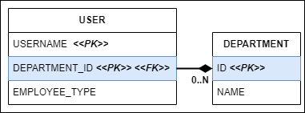
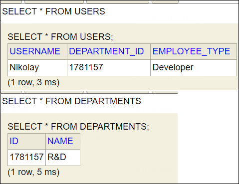

== Составные PK. FK на составной PK

*Content:*

- 1. Отображение составных Primary Keys
- 2. Foreign Keys внутри составных Primary Keys

=== 1. Отображение составных Primary Keys

Предположим, что первичный ключ таблицы USERS включает два столбца: USERNAME и DEPARTMENT_ID. Тогда нужно написать отдельный класс составного идентификатора, объявляющего только ключевые поля, и назвать его *UserId*.

Обычно используют аннотацию `@IdClass` и соответствующий подход с non-entity Serializable классом. В некоторый случаях для этого предлагают использовать `@EmbeddedId` вместо `@IdClass`, сравнение доступно в статье link:https://www.baeldung.com/jpa-composite-primary-keys[baeldung].

В нашем случае составной ключ выглядит так - внутренний класс представляет собой класс составного ключа (с полным совпадением типов и имен полей как и в entity-классе), в самом классе поля составного ключа помечаются аннотацией `@Id`: *_See:_* link:../../hibernate-learning/src/main/java/ch6_hibernate/p259_complex_keys_in_db/entity/User.java[User.java]
[source, java]
----
@Data
@Entity
@Table(name = "users")
@IdClass(User.UserId.class)
public class User {

    @Id
    @NotNull
    private String username;

    @Id
    @NotNull
    private String departmentId;

    private String employeeType;

    @AllArgsConstructor
    @NoArgsConstructor
    public static class UserId implements Serializable {

        private String username;
        private String departmentId;

    }
}
----

И теперь можно извлечь entity таким образом: +
*_See:_* link:../../hibernate-learning/src/main/java/ch6_hibernate/p259_complex_keys_in_db/ComplexKeysInDBScheduler.java[ComplexKeysInDBScheduler.java]
[source, java]
----
User savedUser = userRepository
                    .getById(new User.UserId("Nikolay", "R&D"));
----

=== 2. Foreign Keys внутри составных Primary Keys

Статья на link:https://stackoverflow.com/questions/61214642/unilateral-onetomany-with-composite-key-that-is-also-a-foreign-key-should-use[stackoverflow].

Пусть теперь у нас появился отдельный класс link:../../hibernate-learning/src/main/java/ch6_hibernate/p259_complex_keys_in_db/entity/Department.java[Department.java], на который ссылается класс User. И поле *departmentId* в таблице *Users* - это и *_Primary Key_*, и *_Foreign Key_*:

В этом случае класс *User* буден несколько видоизменен. Во-первых, вместо поля `departmentId:String` появляется ссылка на класс link:../../hibernate-learning/src/main/java/ch6_hibernate/p259_complex_keys_in_db/entity/Department.java[Department.java], аннотированная не только `@Id` но и `@ManyToOne`. При этом класс *UserId* изменит только имя поля на `department` - его типом по-прежнему остается String - тип, который лежит в таблице *USERS*. +
*_See:_* link:../../hibernate-learning/src/main/java/ch6_hibernate/p259_complex_keys_in_db/entity/User.java[User.java]:
[source, java]
----
@Data
@Entity
@Table(name = "users")
@IdClass(User.UserId.class)
public class User {

    @Id
    @NotNull
    private String username;

    @Id
    @ManyToOne(fetch = FetchType.LAZY)
    @NotNull
    private Department department;

    private String employeeType;

    @AllArgsConstructor
    @NoArgsConstructor
    public static class UserId implements Serializable {

        private String username;
        private String department;

    }
}
----
А вот так выглядит класс link:../../hibernate-learning/src/main/java/ch6_hibernate/p259_complex_keys_in_db/entity/Department.java[Department.java]:
[source, java]
----
@Data
@Entity
@Table(name = "departments")
public class Department {

    @Id
    @NotNull
    private String id;

    @NotNull
    private String name;

    @EqualsAndHashCode.Exclude
    @ToString.Exclude
    @OneToMany(mappedBy = "department", fetch = FetchType.LAZY)
    private Collection<User> users = new ArrayList<>();

}
----

Работу с сущностями *User* и *Department* можно увидеть в
*_See:_* link:../../hibernate-learning/src/main/java/ch6_hibernate/p259_complex_keys_in_db/ComplexKeysInDBScheduler.java[ComplexKeysInDBScheduler.java]:
[source, java]
----
Department department = new Department()
        .setId(DEPARTMENT_ID).setName(DEPARTMENT_NAME);
departmentRepository.save(department);

transactionalProcessor.runInNewTransaction(() -> {
    var dep = departmentRepository.findAll().get(0);
    User u = new User().setUsername(USERNAME)
                .setDepartment(dep).setEmployeeType(EMPLOYEE_TYPE);
    userRepository.saveAndFlush(u);
});
----

Данные в БД выглядят следующим образом:

