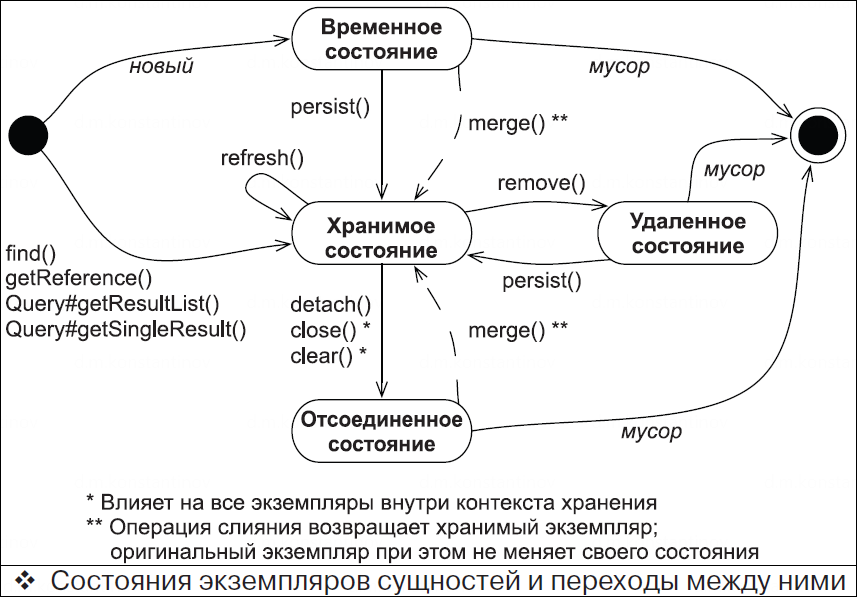

==  JPA entity lifecycle. Session. Единица работы. Persistence context

*Content:*

- 1. Основные термины. Единица работы
- 2. Session как единица работы.
- 3. Состояния экземпляров сущностей
- 4. Persistence context. Синхронизация JPA с БД
  * 4.1 Метод saveAndFlush()
  * 4.2 Persistence context как кэш первого уровня

=== 1. Основные термины. Единица работы

Очень полезные ссылки - link:http://hibernate-refdoc.3141.ru/ch13.TransactionsAndConcurrency[hibernate-refdoc],
link:https://habr.com/ru/articles/271115/[habr]

При работе с JPA приложение должно учитывать жизненный цикл *_entities_*. Мы называем его *_жизненным циклом хранения_*, представляющим набор состояний, через которые проходит экземпляр сущности за время своего существования. Также мы будем использовать термин *_единица работы_* – набор операций, атомарно меняющих состояние сущностей в БД. Еще один важный термин - *_контекст хранения_*. Вы можете рассматривать контекст хранения как сервис, запоминающий все модификации и изменения состояния, которые производятся над данными в рамках конкретной *_единицы работы_* (несколько упрощенное представление).

Вообще, *_единицу работы_* можно определить более подробно. По сути это серия операций, которые мы хотим отправить в базу данных одним пакетом. В принципе, это может быть и одна транзакция, хотя выполнение *_единицы работы_* часто будет охватывать несколько транзакций физической базы данных. С другой стороны, в примерах с link:../../hibernate-learning/src/main/java/ch6_hibernate/p279_1_insert_id_order/InsertIdOrderScheduler.java[InsertIdOrderScheduler.java] в логах можно увидеть, что завершение транзакции запускает выполнение sql-запросов - т. е. *_единица работы_* вполне может существовать и в рамках одной транзакции. Поэтому зачастую мы говорим о более абстрактном понятии *_единицы работы_*.

Более подробно все это описано на link:http://hibernate-refdoc.3141.ru/ch13.TransactionsAndConcurrency[hibernate-refdoc]. Здесь же важно понять, что при правильной работе (отсутствии autocommit при каждом sql-запросе) Hibernate завершает *_единицу работы_*, отправляя свои данные в БД, через какое-то время, причем каждый пакет операций включает в себя одну и более транзакций.

=== 2. Session как единица работы.

Подробнее на link:http://hibernate-refdoc.3141.ru/ch13.TransactionsAndConcurrency#:~:text=13.1.%20%D0%A1%D0%B5%D1%81%D1%81%D0%B8%D1%8F%20%D0%B8%C2%A0%D0%BE%D0%B1%D0%BB%D0%B0%D1%81%D1%82%D0%B8%20%D0%B2%D0%B8%D0%B4%D0%B8%D0%BC%D0%BE%D1%81%D1%82%D0%B8%20%D1%82%D1%80%D0%B0%D0%BD%D0%B7%D0%B0%D0%BA%D1%86%D0%B8%D0%B9[hibernate-refdoc].

*_Session_* — это недорогой в плане создания, потоконебезопасный объект, который следует использовать один раз, а затем отбрасывать для: одного запроса, разговора или отдельной единицы работы. *_Session_* не получит JDBC Connection или Datasource, пока ей это не понадобится и не будет потреблять какие-либо ресурсы без причины. Объект *_Session_* может пережить более одной транзакции (*_единицы работы_*).

Наиболее распространённым шаблоном использования объекта *_Session_* является *_session-per-request_* (в многопользовательском веб-приложении). Когда клиент посылает запрос на сервер, открывается новый *_Session_* для всех операций с базой данных. По завершении работы, и после того, как был подготовлен ответ для клиента, сессия сбрасывается (`flush()`) и закрывается.

=== 3. Состояния экземпляров сущностей

- *Transient - Временное состояние*
  * Новые Java-объекты, являются временными (transient), т. е. их состояние будет потеряно и уничтожено сборщиком мусора, как только исчезнут последние ссылки на них. Чтобы экземпляр сущности перешел из временного состояния в хранимое, требуется вызвать метод `persist()` или создать ссылку из хранимого экземпляра и настроить каскадную передачу состояния.
- *Persisted - Хранимое состояние*
  * Экземпляр хранимой сущности имеет представление в базе данных. Он или уже хранится в базе данных, или будет сохранен по окончании выполнения *_единицы работы_*. Идентификатору сущности присвоено значение первичного ключа. Приложение может создавать экземпляры и делать их хранимыми, вызывая метод `persist()`.
- *Removed - Удаленное состояние*
  * Удалить экземпляр сущности из БД можно несколькими способами, например, вызовом метода `remove()`. JPA удалит сущность из БД в конце выполнения *_единицы работы_*. Вы должны избавиться от всех ссылок на такой экземпляр после завершения работы с ним.
- *Detached - Отсоединенное состояние*
  * Для понимания идеи отсоединенных экземпляров сущностей рассмотрим процесс загрузки экземпляра. Чтобы получить entity по его id, вы вызываете метод `find()`. После этого вы завершаете выполнение *_единицы работы_* и закрываете *_контекст хранения_*. В приложении при этом остается *_дескриптор_* – ссылка на загруженный экземпляр. Он теперь находится в отсоединенном состоянии, и его данные перестают быть актуальными. Вы можете избавиться от ссылки, позволив сборщику мусора освободить занимаемую экземпляром память, или продолжить работу с данными в отсоединенном состоянии, а позже вызвать метод `merge()` для сохранения изменений в рамках новой *_единицы работы_*.

=== 4. Persistence context. Синхронизация JPA с БД

Контекст хранения позволяет выполнять автоматическую проверку состояний объектов (dirty checking), чтобы выявить модифицированные сущности. Затем JPA автоматически или по требованию синхронизирует с БД состояние экземпляров через методы `commit()` или `flush()` - последний метод часто используется в транзакциях в виде `saveAndFlush()`.

Обычно по завершении *_единицы работы_* JPA коммитит изменения из памяти в БД, выполняя SQL-запросы. Процедура коммита может выполняться и в другое время. Например, Hibernate может выполнять синхронизацию с базой данных перед выполнением запроса. Это гарантирует получение запросами изменений, произведенных ранее в рамках *_единицы работы_*.

==== 4.1 Метод saveAndFlush()

Давайте на примере покажем, что такое "синхронизация с БД". +
Обычно мы используем метод `saveAndFlush()`, когда нашей бизнес-логике необходимо прочитать сохраненные изменения на более позднем этапе той же транзакции, но до фиксации. Например, представьте себе сценарий, в котором нам нужно выполнить хранимую процедуру, которая ожидает свойства объекта, который мы собираемся сохранить. В этом случае метод `save()` не будет работать, так как изменения не синхронизированы с БД и хранимая процедура об изменениях не знает. Метод `saveAndFlush()` идеально подходит для такого сценария. При этом мы все так же можем откатить изменения в случае провала транзакции - и метод `saveAndFlush()` при ролбэке транзакции удалит все, что он сохранил. Ссылки: link:https://www.baeldung.com/spring-data-jpa-save-saveandflush[baeldung], link:https://stackoverflow.com/questions/49855138/transactional-annotation-works-with-saveandflush[stackoverflow].

==== 4.2 Persistence context как кэш первого уровня

*_Persistence context_* выступает в роли кэша первого уровня; он запоминает все экземпляры в рамках конкретной *_единицы работы_*. Например, если загрузить сущность через id (primary key), Hibernate может сначала проверить текущую *_единицу работы_* в *_persistence context_*. Если экземпляр сущности обнаружится в контексте хранения, никакого обращения к базе не будет – для приложения это будет повторным чтением. Последовательные вызовы метода `em.find(Item.class, ITEM_ID)` для одного *_persistence context_* будут возвращать одинаковый результат.

Этот кэш также влияет на результаты произвольных запросов (выполняемых через Query, например). Hibernate читает результат SQL-запроса и сначала пытается отыскать каждый экземпляр сущности в контексте хранения, используя поиск по _id_. И только если экземпляр сущности не найдена в текущем контексте, Hibernate прочитает данные из результата запроса.  +
Если экземпляр сущности уже находится в контексте хранения, Hibernate *_проигнорирует все потенциально более новые данные из запроса из-за уровня изоляции транзакций в базе данных_*, при котором возможно чтение только подтвержденных данных (read commited).

Объект Session кэширует у себя загруженные объекты; при загрузке объекта из БД в первую очередь проверяется кэш. Для того, чтобы удалить объект из кэша и отсоединить от сессии, используется метод `session.evict(Object)`. Метод `session.clear()` применит `evict()` ко всем объектам в сессии.

- http://hibernate-refdoc.3141.ru/ch13.TransactionsAndConcurrency
- https://habr.com/ru/articles/271115/