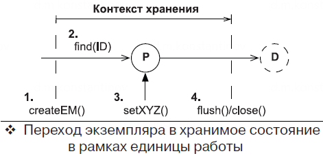
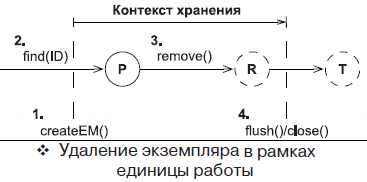

== Интерфейс EntityManager - часть 1

*Content:*

- 1. Интерфейс EntityManager - введение
- 2. Сохранение данных через EntityManager. Порядок выполнения SQL-INSERT и присвоения ID сущностям
- 3. Извлечение и модификация хранимых данных
  * 3.1 Hibernate state snapshots. Hibernate создает копии исходного состояния объекта. Dirty checking
  * 3.2 Получение прокси-объекта (ссылки на объект) entity
- 4. Удаление entity
- 5. Редко используемые методы EntityManager

=== 1. Интерфейс EntityManager - введение

В JPA основным интерфейсом для создания *_единиц работы_* является *EntityManager*.

Объект *_EntityManager_* применяется для выполнения одной единицы работы в одном потоке, и его создание является довольно дорогостоящей операцией. Листинг демонстрирует типичную, каноническую форму единицы работы:
[source, java]
----
EntityManager em = null;
UserTransaction tx = TM.getUserTransaction();
try {
    tx.begin();
    // Управляется приложением
    em = JPA.createEntityManager();

    // ...

    // Синхронизирует/выталкивает контекст хранения
    // похож по концепции на em.flush()
    tx.commit();
} catch (Exception ex) {
    // Откат транзакции, обработка исключения
    // ...
} finally {
    if (em != null && em.isOpen()) {
        em.close();
    }
}
----
Весь код между вызовами `tx.begin()` и `tx.commit()` выполняется в рамках одной транзакции.

Создание экземпляра *_EntityManager_* запускает его контекст хранения. Hibernate не будет обращаться к базе данных без необходимости; экземпляр *_EntityManager_* не извлекает JDBC Connection из пула, пока не потребуется выполнить SQL-запрос. Вы можете создать и закрыть объект EntityManager, так и не выполнив ни одной операции с базой данных. Hibernate выполняет выражения SQL, когда вы ищете или запрашиваете данные или когда он записывает изменения сущностей в БД.

В процессе создания объекта *_EntityManager_* Hibernate присоединяется к текущей системной транзакции и ожидает ее подтверждения. Когда Hibernate получит уведомление (от механизма *JTA*) о подтверждении транзакции, он произведет синхронизацию с БД. Проверку состояния объектов и синхронизацию можно выполнить принудительно в любое время в течение транзакции, с помощью метода `EntityManager.flush()`.

Вы можете определять временные границы существования контекста хранения, выбирая момент вызова метода `EntityManager.close()`.

=== 2. Сохранение данных через EntityManager. Порядок выполнения SQL-INSERT и присвоения ID сущностям

Давайте создадим новый экземпляр сущности и переведем его в хранимое состояние:
[source, java]
----
Item item = new Item();
item.setName("Some Item");
em.persist(item);

Long ITEM_ID = item.getId();
----
Эта единица работы и изменение состояния экземпляра *_Item_* изображены на рисунке (где T = transient, P = persisted, D = detached):

image:img/SavingEntityViaEM.png[]

Для записи экземпляра *_Item_* в базу данных Hibernate должен выполнить SQL-инструкцию INSERT. И здесь есть два варианта, связанных с тем, как реализовано присвоение идентификатора:

- 1. Если генератор идентификаторов вызывается перед вставкой (а не в момент вставки) - объект сохранится в БД при выталкивании контекста хранения (операция `flush()`, коммит транзакции `em.commit()`, завершение *_единицы работы_*). Вызов метода `persist()` лишь присвоит значение id объекту.
- 2. Иначе, если генератор идентификаторов не вызывается перед вставкой, выражение INSERT будет выполнено в момент вызова `persist()`. Что *важно* - другие INSERT операции, ожидающие своего часа, выполняются вместе с этой принудительно. Но только INSERT - операции другого типа (UPDATE, DELETE) не выполняются.

Связанные с этим проблемы рассмотрены в статье link:p279_insert_id_order.adoc[] (вкратце - выполнение всех накопленных insert-ов посреди транзакций и невозможность батчевого insert-а в случае генерации ID во время вставки).

=== 3. Извлечение и модификация хранимых данных

С помощью *_EntityManager_* можно извлекать объекты из БД. Предположим что мы где-то сохранили ID объекта Item из прошлого пункта, и теперь нужно найти этот объект по ID в рамках новой единицы работы:
[source, java]
----
Item item = em.find(Item.class, ITEM_ID);

if (item != null) {
    item.setName("New Name");
}
----

Эта единица работы и создание экземпляра *_Item_* изображены на рисунке (где P = persisted, D = detached):

Возвращаемый экземпляр сущности находится в хранимом состоянии, и его можно изменить в рамках единицы работы. Контекст хранения автоматически обнаружит эти изменения и запишет их в базу данных. Hibernate старается передать изменения в базу данных как можно позже. Инструкции DML обычно устанавливают в базе данных блокировку, существующую до конца транзакции, так что Hibernate старается свести продолжительность блокировки к минимуму.

==== 3.1 Hibernate state snapshots. Hibernate создает копии исходного состояния объекта. Dirty checking

Для отслеживания изменений в сущностях, Hibernate использует *"state snapshots"* или *"снимки состояния"*, представляющие из себя *массивы хранимых БД объектов*. Их также можно назвать *копиями состояния*.

Для примера возьмем класс link:../../hibernate-learning/src/main/java/ch6_hibernate/p279_1_insert_id_order/entity/User.java[User.java] - тогда для объектов этого класса *_снимком состояния_* будет массив объектов `[[BigDecimal][String]]` (поскольку именно такие типы полей содержит таблица "users"):
[source, java]
----
@Entity
@Table(name = "users")
public class User {
    @Id
    private BigDecimal id;

    private String name;

    @OneToMany(mappedBy = "user") // не хранится в таблице "users"
    protected List<Address> addresses;
}
----

Массив *_копии состояния_* расходует память. Проверка состояния объектов с использованием копий также увеличивает накладные расходы, поскольку во время выталкивания контекста Hibernate должен сравнить все экземпляры в контексте с их копиями.

Как это все работает? В момент загрузки объекта User из базы данных Hibernate создает копию исходного массива состояния загруженных строк для сравнения исходного и модифицированного объектов. При сбросе единицы работы происходит сравнение исходного массива и объекта сущности. Если объект отличается от копии, значит, требуется выполнить операцию UPDATE. Подобное сравнение называется *dirty checking*.

*_Dirty checking_* просто сравнивает отдельные поля сущности с их значением в массиве состояния. Она не зависит от методов Equals/Hashcode (кроме случаев использования java.util.Set, но это связано с API коллекций).

В большинстве случаев разработчикам нет смысла беспокоиться о грязной проверке, это забота фреймворка. Однако мы можем настроить порядок выявления изменений, используя два способа:

- 1. Указать в property `hibernate.entity_dirtiness_strategy` имя класса, реализующего интерфейс `org.hibernate.CustomEntityDirtinessStrategy`.
- 2. Использовать интерфейс `org.hibernate.Interceptor`, который представляет схожий и более удобный механизм управления проверкой состояния объектов путем реализации его метода `findDirty()` - об этом мы поговорим несколько позже - *_See:_* ...

==== 3.2 Получение прокси-объекта (ссылки на объект) entity

Иногда может потребоваться получить экземпляр сущности без обращения к базе данных. Например, если вы еще не знаете, понадобится ли вам полностью инициализированный
экземпляр. В этом случае можно заставить *_EntityManager_* загрузить пустой указатель – прокси-объект. +
*_See:_* link:../../hibernate-learning/src/main/java/ch6_hibernate/p277_entity_proxy_reference/EntityProxyReferenceScheduler.java[EntityProxyReferenceScheduler.java]:
[source, java]
----
private void process(EntityManager em) {
    User user1 = em.getReference(User.class, USER_ID_1);
    assertFalse(isInitialized(em, user1));
    assertEquals(user1.getName(), "Mikhail");
    assertTrue(isInitialized(em, user1));

    User user2 = em.getReference(User.class, USER_ID_2);
    assertFalse(isInitialized(em, user2));
    Hibernate.initialize(user2);
    assertTrue(isInitialized(em, user2));

    User user3 = new User().setName(USER_NAME_3);
    userRepository.save(user3);
    User userFromDb = em.getReference(User.class, user3.getId());
    assertTrue(isInitialized(userFromDb));
}

private boolean isInitialized(EntityManager em, User user) {
    return em.getEntityManagerFactory()
       .getPersistenceUnitUtil().isLoaded(user)
}

----
В листинге выше показан метод проверки, загружен ли entity в текущий persistence context. Если контекст хранения уже содержит объект *_User_* с заданным ID, он будет возвращен методом `getReference()` без обращения к БД. Если в данный
момент в управляемом состоянии нет ни одной такой entity, Hibernate создаст прокси-объект. Это значит, что метод `getReference()` не будет обращаться к БД, но и не вернет null, в отличие от метода find(). +
Стоит только вызвать какой-нибудь метод прокси-объекта, например `User.getName()`, как тут же будет выполнена инструкция SELECT для его полной инициализации. Исключением из правила является метод getId(). Если соответствующей записи в БД не окажется, при вызове метода `User.getName()` будет возбуждено исключение `EntityNotFoundException`.

В Hibernate имеется удобный статический метод `initialize()` для загрузки данных прокси-объекта, который так же может вызвать исключение `EntityNotFoundException`.

После закрытия контекста хранения прокси-объект User становится detached, и если он не был инициализирован, пока контекст хранения был открыт, при обращении к прокси-объекту будет возбуждено исключение `LazyInitializationException`.

=== 4. Удаление entity

Для удаления используется метод `em.remove(item);`. В середине транзакции Hibernate помещает текущий объект в очередь удаления из БД и переводит в состояние *_removed_*. По окончанию транзакции Hibernate удаляет данные из БД и переводит объект в состояние *_detached_*.

Если метод `remove()` вызвать для прокси-объекта, Hibernate предварительно выполнит инструкцию SELECT, чтобы загрузить данные - *_экземпляр сущности должен быть полностью инициализирован перед переходом между состояниями жизненного цикла_*.

Особое внимание стоит уделить ID-шнику entity. По умолчанию Hibernate не сбрасывает значение ID удаляемого экземпляра сущности. Иногда бывает полезно продолжить работать с "удаленными" данными и дальше – например, на случай, если пользователь захочет отменить операцию. Тогда в рамках этой же транзакции можно вызвать `persist()` для удаленного экземпляра и отменить удаление. С другой стороны, если присвоить переменной `hibernate.use_identifier_rollback` значение `true`, Hibernate сбросит значение ID после удаления экземпляра сущности.

JPA также предоставляет массовые операции, транслирующиеся непосредственно в SQL-выражения DELETE, не вовлекающие в работу обработчиков событий жизненного цикла. Мы обсудим эти операции в разделе 20.

=== 5. Редко используемые методы EntityManager

Метод `em.refresh()` - заставляет HB выполнить select и обновить сущность. Обычно используется, если сущность существует в течении нескольких системных транзакций.

Метод `em.replicate()` используют, когда нужно извлечь данные из одной базы данных и сохранить в другую. Тогда используется 2 EntityManager. Достаточно редкий кейс.

