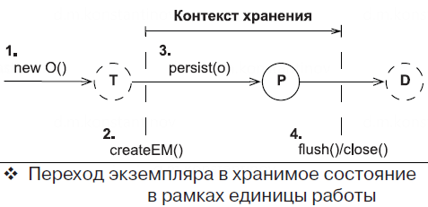

== Интерфейс EntityManager

*Content:*

- 1. Интерфейс EntityManager - введение
- 2. Сохранение данных через EntityManager. Порядок выполнения SQL-INSERT и присвоения ID сущностям

=== 1. Интерфейс EntityManager - введение

В JPA основным интерфейсом для создания *_единиц работы_* является *EntityManager*.

Объект *_EntityManager_* применяется для выполнения одной единицы работы в одном потоке, и его создание является довольно дорогостоящей операцией. Листинг демонстрирует типичную, каноническую форму единицы работы:
[source, java]
----
EntityManager em = null;
UserTransaction tx = TM.getUserTransaction();
try {
    tx.begin();
    // Управляется приложением
    em = JPA.createEntityManager();

    // ...

    // Синхронизирует/выталкивает контекст хранения
    // похож по концепции на em.flush()
    tx.commit();
} catch (Exception ex) {
    // Откат транзакции, обработка исключения
    // ...
} finally {
    if (em != null && em.isOpen()) {
        em.close();
    }
}
----
Весь код между вызовами `tx.begin()` и `tx.commit()` выполняется в рамках одной транзакции.

Создание экземпляра *_EntityManager_* запускает его контекст хранения. Hibernate не будет обращаться к базе данных без необходимости; экземпляр *_EntityManager_* не извлекает JDBC Connection из пула, пока не потребуется выполнить SQL-запрос. Вы можете создать и закрыть объект EntityManager, так и не выполнив ни одной операции с базой данных. Hibernate выполняет выражения SQL, когда вы ищете или запрашиваете данные или когда он записывает изменения сущностей в БД.

В процессе создания объекта *_EntityManager_* Hibernate присоединяется к текущей системной транзакции и ожидает ее подтверждения. Когда Hibernate получит уведомление (от механизма *JTA*) о подтверждении транзакции, он произведет синхронизацию с БД. Проверку состояния объектов и синхронизацию можно выполнить принудительно в любое время в течение транзакции, с помощью метода `EntityManager.flush()`.

Вы можете определять временные границы существования контекста хранения, выбирая момент вызова метода `EntityManager.close()`.

=== 2. Сохранение данных через EntityManager. Порядок выполнения SQL-INSERT и присвоения ID сущностям

Давайте создадим новый экземпляр сущности и переведем его в хранимое состояние:
[source, java]
----
Item item = new Item();
item.setName("Some Item");
em.persist(item);

Long ITEM_ID = item.getId();
----
Эта единица работы и изменение состояния экземпляра *_Item_* изображены на рисунке (где T = transient, P = persisted, D = detached):

Для записи экземпляра *_Item_* в базу данных Hibernate должен выполнить SQL-инструкцию INSERT. И здесь есть два варианта, связанных с тем, как реализовано присвоение идентификатора:

- 1. Если генератор идентификаторов вызывается перед вставкой (а не в момент вставки) - объект сохранится в БД при выталкивании контекста хранения (операция `flush()`, коммит транзакции `em.commit()`, завершение *_единицы работы_*). Вызов метода `persist()` лишь присвоит значение id объекту.
- 2. Иначе, если генератор идентификаторов не вызывается перед вставкой, выражение INSERT будет выполнено в момент вызова `persist()`. Что *важно* - другие INSERT операции, ожидающие своего часа, выполняются вместе с этой принудительно. Но только INSERT - операции другого типа (UPDATE, DELETE) не выполняются.

Связанные с этим проблемы рассмотрены в статье link:p279_insert_id_order.adoc[] (вкратце - выполнение всех накопленных insert-ов посреди транзакций и невозможность батчевого insert-а в случае генерации ID во время вставки).

