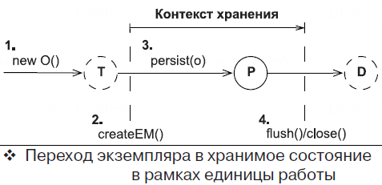
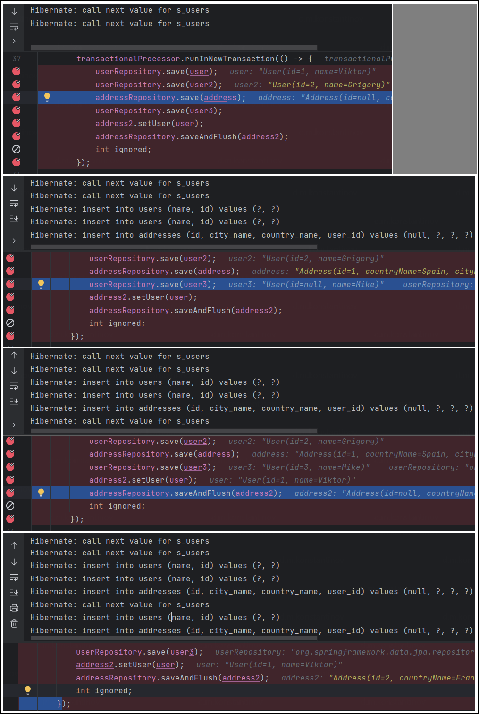
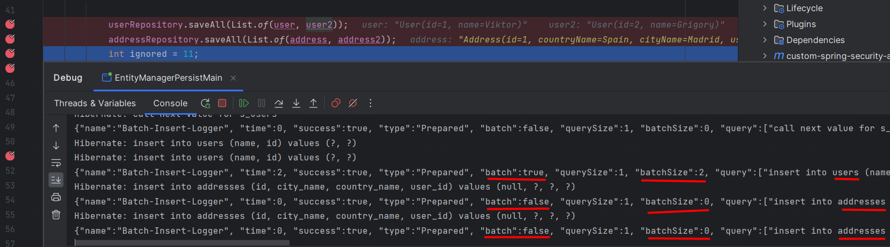
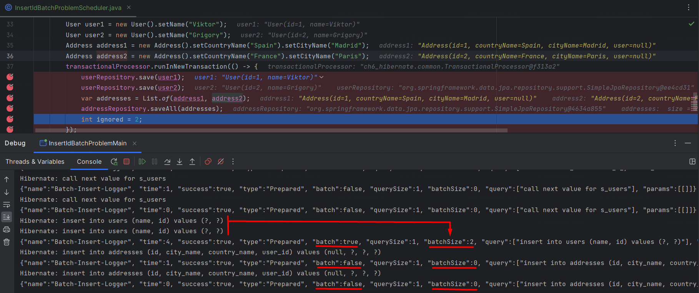

== Порядок выполнения SQL-INSERT и присвоения ID сущностям

*Content:*

- 1. Порядок выполнения INSERT/assign ID
- 2. Проблемы с батчевыми вставками при генерации ID самой БД

=== 1. Порядок выполнения INSERT/assign ID

Для записи экземпляра сущности в базу данных Hibernate должен выполнить SQL-инструкцию INSERT. И здесь есть два варианта, связанных с тем, как реализовано *_присвоение ID_*:

- 1. Если генератор идентификаторов вызывается перед вставкой (а не в момент вставки) - объект сохранится в БД при выталкивании контекста хранения (операция `flush()`, коммит транзакции `em.commit()`, завершение *_единицы работы_*). Вызов метода `persist()` лишь присвоит значение id объекту.
- 2. Иначе, если генератор идентификаторов не вызывается перед вставкой, выражение INSERT будет выполнено в момент вызова `persist()`. Что *важно* - другие INSERT операции, ожидающие своего часа, выполняются вместе с этой принудительно. Но только INSERT - операции другого типа (UPDATE, DELETE) не выполняются.

Рассмотрим пример с двумя сущностями - link:../../hibernate-learning/src/main/java/ch6_hibernate/p279_1_insert_id_order/entity/User.java[User.java] и link:../../hibernate-learning/src/main/java/ch6_hibernate/p279_1_insert_id_order/entity/Address.java[Address.java]:
[source, java]
----
@Entity
public class User {

    @Id
    @GeneratedValue(strategy = GenerationType.SEQUENCE, generator = "s_users")
    @SequenceGenerator(name = "s_users", sequenceName = "s_users", allocationSize = 1)
    private BigDecimal id;

    // ...
}

@Entity
public class Address {

    @Id
    @GeneratedValue(strategy = GenerationType.IDENTITY)
    private BigDecimal id;

    // ...
}
----

В первом случае используется стратегия `GenerationType.SEQUENCE`. Последовательность вызывается перед выполнением каждой инструкции INSERT для вставки новой записи. Во втором - `GenerationType.IDENTITY`. Значение id определяется во время вставки записи. Теперь посмотрим на логи Hibernate при сохранении одних и других экземпляров сущностей: +
*_See:_* link:../../hibernate-learning/src/main/java/ch6_hibernate/p279_1_insert_id_order/InsertIdOrderScheduler.java[InsertIdOrderScheduler.java].

В чем же основной прикол? На первом и втором кадре показано, что до строчки `addressRepository.save(address)` никаких INSERT-ов не происходит, хотя вызван метод `save()` для двух *_Users_*, а происходит только получение будущих id-шников. И все "ожидающие" INSERT-ы выполняются только при сохранении *_Address_*, который получает значение id из БД и вынужден выполнить INSERT при сохранении. Третий и четвертый кадр дублируют описанную выше ситуацию.

Операции другого типа (UPDATE, DELETE) не ведут себя подобным образом. Далее в link:../../hibernate-learning/src/main/java/ch6_hibernate/p279_1_insert_id_order/InsertIdOrderScheduler.java[InsertIdOrderScheduler.java] есть пример второй транзакции, где операции над *_Users_* исполняются только по завершению транзакции, хотя внутри создается новый *_Address_* и его INSERT операция выполняется до завершения транзакции:
[source, java]
----
Address address3 = new Address().setCountryName("Thailand").setCityName("Bangkok");
transactionalProcessor.runInNewTransaction(() -> {
    var savedUser = userRepository.findById(user2.getId()).get();
    userRepository.delete(savedUser); // delete операция
    savedUser = userRepository.findById(user3.getId()).get();
    savedUser.setName("Oleg");
    userRepository.save(savedUser); // update операция
    addressRepository.save(address3);
    int ignored = 11;
    // ЛОГИ HIBERNATE - произошел только insert address
    // Hibernate: insert into addresses (id, city_name, country_name, user_id) values (null, ?, ?, ?)
});
// ЛОГИ HIBERNATE - и только по окончанию транзакции - update и delete
// Hibernate: update users set name=? where id=?
// Hibernate: delete from users where id=?
----

*NOTE!* Про то, какие стратегии генерации идентификаторов формируют ID после выполнения INSERT (или до этого) - см. страницу 101 в книге `Бауэр К, Кинг Г, Грегори Г, Java Persistence API и Hibernate`.

=== 2. Проблемы с батчевыми вставками при генерации ID самой БД

К слову, данная особенность INSERT не позволяет производить Hibernate батчевые вставки при использовании, если используется `@GeneratedValue(strategy = GenerationType.IDENTITY)` - см подробнее на link:https://medium.com/parallaxtec/bulk-insert-auto-increment-hibernate-yes-its-possible-d76b5dfec0f7[medium.com].

Для демонстрации нам понадобится подключить специальный логгер для Hibernate через link:../../hibernate-learning/src/main/java/ch6_hibernate/p279_2_insert_id_batch_problem/utils/DatasourceProxyBeanPostProcessor.java[DatasourceProxyBeanPostProcessor.java] - обычное включение логов через `spring.jpa.show-sql: true` не даёт информации о том, произошел ли батчевый insert или нет.

Давайте опять возьмем наши классы link:../../hibernate-learning/src/main/java/ch6_hibernate/p279_2_insert_id_batch_problem/entity/User.java[User.java] и link:../../hibernate-learning/src/main/java/ch6_hibernate/p279_2_insert_id_batch_problem/entity/Address.java[Address.java]. И попытаемся их сохранить в шедулере link:../../hibernate-learning/src/main/java/ch6_hibernate/p279_2_insert_id_batch_problem/InsertIdBatchProblemScheduler.java[InsertIdBatchProblemScheduler.java]:
[source, java]
----
public void process() {
    User user1 = new User().setName("Viktor");
    User user2 = new User().setName("Grigory");
    Address address1 = new Address().setCountryName("Spain").setCityName("Madrid");
    Address address2 = new Address().setCountryName("France").setCityName("Paris");
    transactionalProcessor.runInNewTransaction(() -> {
        userRepository.save(user1);
        userRepository.save(user2); // batch saving user1 & user2
        var addresses = List.of(address1, address2);
        addressRepository.saveAll(addresses); // non-batch saving
    });
}
----

Если взглянуть на то, что происходит - то мы увидим, что сначала сохраняются 2 объекта *_User_*, а потом 2 объекта *_Address_* - через `saveAll()`. И несмотря на это, объекты *_User_* сохраняются через батч, а объекты *_Address_* - по одной строчке, поскольку каждой entity нужно получить значение id после вставки. Теперь посмотрим на логи, которые это доказывают и на скриншоты реальных логов во время исполнения:

----
Hibernate: insert into users (name, id) values (?, ?)
Hibernate: insert into users (name, id) values (?, ?)
{ ... "batch":true, ... "batchSize":2, "query":[
  "insert into users (name, id) values (?, ?)"
], "params":[ ["Viktor","1"], ["Grigory","2"] ]}

Hibernate: insert into addresses (id, city_name, country_name, user_id) values (null, ?, ?, ?)
{ ... "batch":false, ... "batchSize":0, "query":[
  "insert into addresses (id, city_name, country_name, user_id) values (null, ?, ?, ?)"
], "params":[["Madrid","Spain","NULL(NUMERIC)"]]}

Hibernate: insert into addresses (id, city_name, country_name, user_id) values (null, ?, ?, ?)
{... "batch":false, ... "batchSize":0, "query":[
  "insert into addresses (id, city_name, country_name, user_id) values (null, ?, ?, ?)"
], "params":[["Paris","France","NULL(NUMERIC)"]]}
----