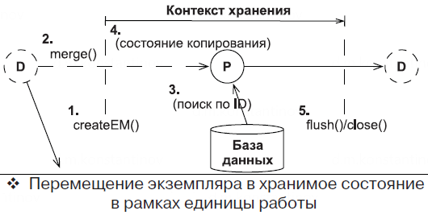

== Слияние экземпляров сущностей

Предположим, что в рамках предыдущей единицы работы вы извлекли (сохранили) экземпляр User, а теперь хотите его изменить и сохранить в рамках новой единицы работы. Тогда стоит использовать метод `em.merge()`:

[source, java]
----
User myUser = new User();
// ... начало работы в одной транзакции
em.save(myUser);
// ... окончание работы в одной транзакции

// ...

// ... начало работы в другой транзакции
User mergedUser = em.merge(myUser);
mergedUser.setUsername("doejohn");
em.save(myUser);
// ... окончание работы в другой транзакции
----

Данная операция вызывается неявно при вызове метода `save()` у *_JpaRepository_* (*_See:_* *_SimpleJpaRepository.class_*):

[source, java]
----
@Transactional
@Override
public <S extends T> S save(S entity) {

    Assert.notNull(entity, "Entity must not be null.");

    if (entityInformation.isNew(entity)) {
        em.persist(entity);
        return entity;
    } else {
        return em.merge(entity);
    }
}
----

Если при вызове метода `merge()` в контексте хранения не будет найден ни один хранимый экземпляр с таким же ID и поиск в БД не даст результатов, Hibernate создаст новый объект User. Затем выполнит копирование *_detached_* экземпляра в новый экземпляр и поместит новый экземпляр в базу данных при сбросе сессии.

Если экземпляр, переданный в метод `merge()`, является не *_detached_*, а *_transient_* (у него отсутствует ID), Hibernate создаст новый объект User, скопирует в него значения transient экземпляра, сделает его хранимым и вернет обратно. Проще говоря, операция `merge()` может работать с *_detached_* и *_transient_* экземплярами сущностей. Hibernate всегда возвращает в результате хранимый экземпляр.