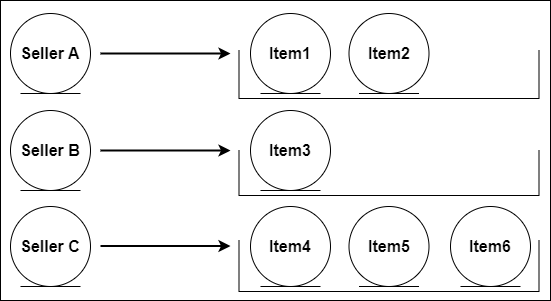

== Проблема N+1 в Hibernate и как ее решать

*Content:*

- 1. Демонстрация проблемы N+1

=== 1. Демонстрация проблемы N+1

Для начала давайте поймем, как вообще работает эта "проблема N+1", она же проблема декартового произведения.

Предположим что у вас есть продавец (link:../../hibernate-learning/src/main/java/ch6_hibernate/p347_n_plus_1_problem/entity/Seller.java[Seller.java]) и товары (link:../../hibernate-learning/src/main/java/ch6_hibernate/p347_n_plus_1_problem/entity/Item.java[Item.java]), которые он продает. Каждому продавцу соответствует несколько (или 0) товаров. Связь Seller-Item является LAZY со стороны Seller и EAGER со стороны Item (по дефолту *_OneToMany_* и *_ManyToOne_*):

Тогда, если вы одновременно выберете N товаров по списку ID из базы и потом будете в транзакции запрашивать их Items - то вы на каждый товар получите дополнительно 1 запрос в БД для запроса товара. Получается N+1 запрос:

[source, java]
----
transactionalProcessor.runInNewTransaction(() ->
        sellerRepository.saveAll(List.of(
                generateSeller("Хозмаг", "Ламинат"),
                generateSeller("Продуктовый", "Яблочный сок"),
                generateSeller("Одежда", "Свитер"),
                generateSeller("Обувной", "Кроссовки"),
                generateSeller("Мебельный", "Диван"),
                generateSeller("Кафе", "Кофе")
        )));

transactionalProcessor.runInNewTransaction(() -> {
    var sellers = sellerRepository.findAll();
    // Hibernate: select id, external_id, name from sellers
    //
    // N+1 проблема - происходит LAZY-инициализация N раз
    sellers.forEach(seller ->
            log.info(
                    "Количество товаров у продавца {}: {}",
                    seller.getName(),
                    seller.getItems().size()));
    // получаем 6 дополнительных запросов
    // Hibernate:
    // select seller_id, id, name from items where seller_id=?
    // select seller_id, id, name from items where seller_id=?
    // select seller_id, id, name from items where seller_id=?
    // select seller_id, id, name from items where seller_id=?
    // select seller_id, id, name from items where seller_id=?
    // select seller_id, id, name from items where seller_id=?
});
----

Такая же ситуация нас ждет если мы захотим извлечь все товары - т. к. связь *_ManyToOne_* EAGER, то при извлечении товаров мы одновременно будем извлекать продавцов вместе с ними (даже не доходя до геттеров seller в строке с выводом в консоль). Ситуация идентична как для `findAll()`, так и для `findAllById()`:

[source, java]
----
transactionalProcessor.runInNewTransaction(() -> {
    // N+1 проблема - выполняется сразу,
    // т. к. связь item->seller имеет тип EAGER
    var items = itemRepository.findAll();
    // Hibernate:
    // select id, name, seller_id from items
    // select id, external_id, name from sellers where id=?
    // select id, external_id, name from sellers where id=?
    // select id, external_id, name from sellers where id=?
    // select id, external_id, name from sellers where id=?
    // select id, external_id, name from sellers where id=?
    // select id, external_id, name from sellers where id=?
    log.info("Общее количество товаров: {}", items.size());
});

transactionalProcessor.runInNewTransaction(() -> {
    // N+1 проблема - выполняется сразу,
    // т. к. связь item->seller имеет тип EAGER
    var items = itemRepository.findAllById(
            List.of(itemId0.get(), itemId1.get(), itemId2.get()));
    // Hibernate:
    // select id, name, seller_id from items
    // select id, external_id, name from sellers where id=?
    // select id, external_id, name from sellers where id=?
    // select id, external_id, name from sellers where id=?
    log.info("Общее количество найденных по id товаров: {}", items.size());
});
----

К слову, если мы будем извлекать сущности по одному, то у нас будет один запрос с join-ом, если связь EAGER и два запроса если связь LAZY:

[source, java]
----
transactionalProcessor.runInNewTransaction(() -> {
    // Hibernate: выборка двух сущностей через join
    var item0 = em.find(Item.class, itemId1.get());
    // select I.id, I.name, I.seller_id, S.id, S.external_id, S.name
    // from items I left outer join sellers S on I.seller_id=S.id
    // where I.id=?
    log.info("Продавец: {}", item0.getSeller().getName());

    var item1 = itemRepository.findById(itemId2.get()).get();
    // Hibernate: выборка двух сущностей через join
    //
    // select I.id, I.name, I.seller_id, S.id, S.external_id, S.name
    // from items I left outer join sellers S on I.seller_id=S.id
    // where I.id=?
    log.info("Продавец: {}", item1.getSeller().getName());

    var seller = sellerRepository.findById(sellerId0.get()).get();
    // Hibernate: выборка двух сущностей через два запроса
    //
    // select id, external_id, name from sellers where id=?
    // select seller_id, id, name from items where seller_id=?
    log.info("Товары: {}", seller.getItems());
});
----
