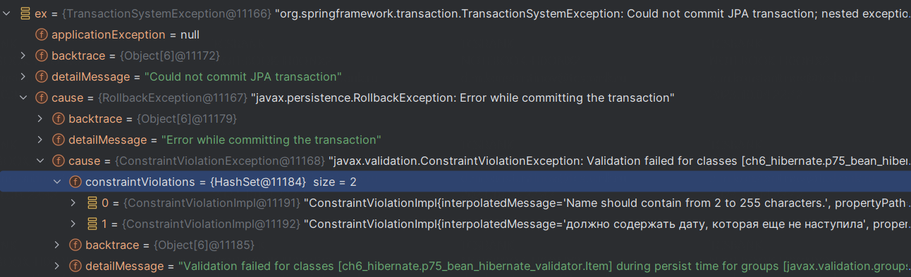
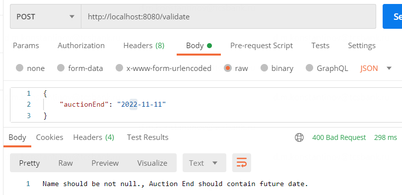

== Валидация Entities через Bean (Hibernate) Validation

*Content:*

- 1. Bean Validation. Валидация через persist() и Validator.validate()
- 2. Валидация через аннотации @Validated/@Valid
- 3. Валидация @Controller через @Valid
- 4. Аннотация @Accessors - замена @Builder

=== 1. Bean Validation - что это

Суть идеи, лежащей в основе Bean Validation, – в том, что определять для entities правила, подобные *_@NotNull_* и *_@Size_*, гораздо проще, чем постоянно писать проверки. Аннотации валидации можно применять как к полям, так и к геттерам класса. Валидации являются частью API класса и помещаются в Javadoc. Механизм валидации имеет свои настройки, не зависящие от настроек реализации JPA, т. е. HibernateValidator может вызывать методы доступа, тогда как Hibernate ORM может обращаться напрямую к полям класса.

Для работы нужно подключить либо hibernate-validator + jakarta.el:
[source, xml]
----
<dependencies>
    <!-- обновление на версии выше невозможно,
    на версии hibernate-validator:8.0.1.Final
    валидация при persist entity перестаёт работать -->
    <dependency>
        <groupId>org.hibernate.validator</groupId>
        <artifactId>hibernate-validator</artifactId>
        <version>6.1.6.Final</version>
    </dependency>
    <dependency>
        <groupId>org.glassfish</groupId>
        <artifactId>jakarta.el</artifactId>
        <version>4.0.2</version>
    </dependency>
</dependencies>
----
Либо spring-boot-starter-validation:
[source, xml]
----
<dependencies>
    <dependency>
        <groupId>org.springframework.boot</groupId>
        <artifactId>spring-boot-starter-validation</artifactId>
        <version>2.7.9</version>
    </dependency>
</dependencies>
----

Есть три подхода к валидации. Первый - автовалидация при persist, достаточно спорный подход к архитектуре. +
*_See:_* link:../../hibernate-learning/src/main/java/ch6_hibernate/p75_bean_hibernate_validator/HibernateValidationScheduler.java[HibernateValidationScheduler.java]
[source, java]
----
        try {
            // автовалидация при persist, спорный подход к архитектуре
            // работает при определенных зависимостях и их версиях
            itemsService.saveNewInvalidItem();
        } catch (Exception ex) {
            ConstraintViolationException cve =
                    (ConstraintViolationException) ex.getCause().getCause();
            Assertions.assertEquals(1, cve.getConstraintViolations().size());
            ConstraintViolation v = cve.getConstraintViolations().stream().findFirst().get();
            Assertions.assertEquals(
                    "Name should contain from 2 to 255 characters.", v.getMessage());
        }
----

При попытке commit-а изменений получаем несколько exceptions, в самом конце которых - *ConstraintViolationException*. Он содержит набор всех *ConstraintViolation*, возникших при попытке обработать entity:

[source, text]
----
- TransactionSystemException
  - RollbackException
    - ConstraintViolationException
----

Более правильный путь - использовать `javax.validation.Validator` и валидировать классы вызовом метода `validate()`. +
*_See:_* link:../../hibernate-learning/src/main/java/ch6_hibernate/p75_bean_hibernate_validator/service/ItemsService.java[ItemsService.validateAndSave()]
[source, java]
----
    private final Validator validator;

    @Transactional
    public void validateAndSave() {
        Item item = new Item()
                .setName("b")
                .setAuctionEnd(LocalDate.now().minusDays(2));
        var constraintViolations = validator.validate(item);
        if (!CollectionUtils.isEmpty(constraintViolations)) {
            System.out.printf("Невалидный entity %s: %s \n", item, constraintViolations);
            return;
        }
        repository.save(item);
    }
----

=== 2. Валидация через аннотации @Validated/@Valid

Самая практичная валидация - это сочетание аннотаций *_@Validated_*/*_@Valid_*, где @Valid аннотирует параметр метода, который нужно валидировать, а @Validated аннотирует класс, в котором находится данный метод. Зачастую речь идёт о service-layer, когда перед сохранением в репозитории объект передается в сервис и валидируется там. +
*_See:_* link:../../hibernate-learning/src/main/java/ch6_hibernate/p75_bean_hibernate_validator/service/ItemsService.java[ItemsService.validateWithAnnotationAndSave()]

[source, java]
----
@Service
@Validated
@RequiredArgsConstructor
public class ItemsService {

    @Transactional
    public void validateWithAnnotationAndSave(@Valid Item item) {
        repository.save(item);
    }
}
----

=== 3. Валидация @Controller через @Valid

Для *_@Controller_*/*_@RestController_* не нужно устанавливать аннотацию @Validated - достаточно будет одной валидации @Valid в методе контроллера. *_See:_* link:https://stackoverflow.com/a/66056870[stackoverflow] +

*_See:_* link:../../hibernate-learning/src/main/java/ch6_hibernate/p75_bean_hibernate_validator/controller/HibernateValidatorController.java[HibernateValidatorController.java]:

[source, java]
----
@Slf4j
@Controller // Для @Controller/@RestController аннотация @Validated не нужна
public class HibernateValidatorController {

    @PostMapping("/validate")
    public String validate(@Valid @RequestBody Item item) {
        return "done";
    }
}
----

Однако надо помнить, что подобная проверка будет выкидывать checked-исключение *_MethodArgumentNotValidException_*, которое надо будет отдельно обрабатывать в ExceptionHandler. Равно как и checked-исключения проверки констрейнтов *_ConstraintViolationException_*, которые прилетят от аннотаций *_@Validated_*/*_@Valid_*. *_See:_* link:../../hibernate-learning/src/main/java/ch6_hibernate/p75_bean_hibernate_validator/controller/ExceptionHandlerController.java[ExceptionHandlerController.java]:

[source, java]
----
@RestControllerAdvice
@Slf4j
public class ExceptionHandlerController {

    @ExceptionHandler
    @ResponseStatus(HttpStatus.BAD_REQUEST)
    public String errors(MethodArgumentNotValidException e) {
        return e.getBindingResult().getAllErrors().stream()
                .map(DefaultMessageSourceResolvable::getDefaultMessage)
                .collect(Collectors.joining(", "));
    }

    @ExceptionHandler
    @ResponseStatus(HttpStatus.BAD_REQUEST)
    public String errors(ConstraintViolationException e) {
        return e.getConstraintViolations().stream()
                .map((cv) -> cv == null ? "null" : cv.getMessage())
                .collect(Collectors.joining(", "));
    }
}
----

Пример обработки MethodArgumentNotValidException - response message содержит все constraint violation messages через запятую (в данном примере сообщений 2):

=== 4. Аннотация @Accessors - замена @Builder

Аннотация `@Accessors(chain = true)` позволяет из сеттеров возвращать текущий объект (и работать как с билдером, но еще лучше):
[source, java]
----
@Accessors(chain = true)
public class Item {
    // some fields
}

//...

private final ItemsRepository repository;

repository.save(new Item()
    .setName("a") // как с билдером
    .setAuctionEnd(LocalDate.now().minusDays(2))
);
----
