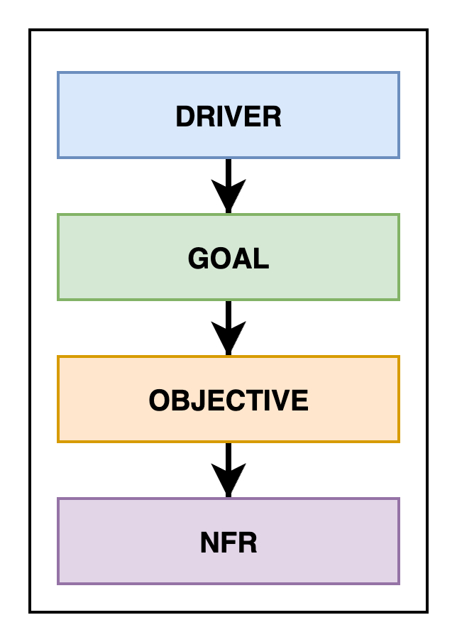

== Сбор требований к программной системе: от стейкхолдеров к архитектуре

*Content:*

- 1. Типы требований к программной системе (FR, NFR, etc)
- 2. Функциональные требования (FR)
- 3. Источники функциональных требований
* 3.1 Документация как источник функциональных требований
* 3.2 User Story (пользовательская история) как источник функциональных требований
* 3.3 Use Case как источник функциональных требований
- 4. Методы сбора функциональных требований
- 5. Нефункциональные требования (NFR)
- 6. Аттрибуты качества как источник NFR
* 6.1 Примеры атрибутов качества NFR (не исчерпывающий список):
* 6.2 Сценарии атрибутов качества - это и есть NFR
* 6.3 Текстовая структура сценария атрибутов качества
- 7. Источники NFR - Driver/Goal/Objective
- 8. Источники NFR - Цель проектирования/SLA/FR
* 8.1 Цель проектирования как источник NFR
* 8.2 SLA как источник NFR
* 8.3 FR как источник NFR
- 9. Методы сбора NFR
- 10. Ограничения в проектировании
- 11. Опасения и риски в проектировании
- 12. Управление требованиями заказчика (приоритизация)

=== 1. Типы требований к программной системе (FR, NFR, etc)

После определения ключевых заинтересованных сторон (стейкхолдеров) следующим этапом является *_сбор требований к будущей системе_*. Любая программная система, по сути, представляет собой совокупность требований и решений, основанных на этих требованиях.

По сути, все требования можно разделить на 4 категории:

1. *_Функциональные требования_*: описывают, что система должна делать, какие задачи решать.
2. *_Нефункциональные требования_*: определяют как система должна работать, ее качества и ограничения.
3. *_Ограничения_*: внешние факторы, которые влияют на процесс разработки и архитектуру системы.
4. *_Опасения и риски_*: потенциальные проблемы, которые необходимо учитывать при проектировании.

Рассмотрим каждую категорию подробнее.

=== 2. Функциональные требования (FR)

*Функциональность* – это способность системы выполнять задачи, для которых она создается. Для гибкости вашей архитектуры важно сосредоточиться на *_ключевом функционале_*, а именно:

- На тех функциональностях, которые *_критически важны_* для достижения бизнес-целей проекта.
- На тех функциональностях, которые (обычно) имеют высокий уровень технической сложности/требуют interaction сразу нескольких компонентов системы.

Обычно, ключевой функционал составляет около *10% от общего числа* user-stories (истории использования) или use-cases. Учет ключевой функциональности при проектировании архитектуры необходим по двум основным причинам:

1. Распределение функциональности: необходимо продумать, как ключевые функции будут распределены между компонентами системы (например, модулями), чтобы обеспечить возможность их изменения и повторного использования. Неправильное распределение может привести к накоплению технического долга, который впоследствии потребует рефакторинга и может замедлить разработку.
2. Нефункциональные требования: ключевая функциональность часто напрямую связана с нефункциональными требованиями. Анализ функциональных требований (FR) позволяет выявить и сформулировать соответствующие нефункциональные требования (NFR).

Собранные функциональные требования рекомендуется формализовать в виде вариантов использования (use cases). Такая формализация упрощает дальнейшее формирование NFR.

=== 3. Источники функциональных требований

==== 3.1 Документация как источник функциональных требований

Существующие регламенты, описания процессов, организационная структура, спецификации продуктов, процедуры, стандарты, инструкции и шаблоны документов могут содержать ценную информацию о потребностях заказчика.

*Пример:*

При поиске в каталоге интернет-магазина система должна предоставлять клиенту список доступных товаров, с возможностью фильтрации и сортировки по категориям, цене, отображения комментариев к товарам и их рейтинга, а также предоставлять возможность добавить товар в корзину.

==== 3.2 User Story (пользовательская история) как источник функциональных требований

*_User Story_* это краткое описание потребности пользователя и того, как продукт должен ее удовлетворить.

*Примеры:*

- Как клиент, я хочу видеть список товаров, соответствующих моему поисковому запросу, чтобы быстро найти нужный товар.
- Как клиент, я хочу фильтровать товары по категориям и цене, чтобы сузить область поиска.
- Как клиент, я хочу видеть отзывы других покупателей о товаре, чтобы принять обоснованное решение о покупке.
- Как клиент, я хочу добавить товар в корзину, чтобы сохранить его для последующей покупки.

==== 3.3 Use Case как источник функциональных требований

*_Use Case_* позволяет собрать и структурировать функциональные требования с точки зрения различных участников взаимодействия с системой. Диаграммы вариантов использования определяют границы системы и ее взаимодействие с внешними системами и пользователями.

*Пример:*

Клиент может:

- Выполнить поиск товаров по ключевым словам.
- Просмотреть список найденных товаров.
- Отфильтровать товары по категориям и цене.
- Просмотреть отзывы о товаре.
- Добавить товар в корзину.

=== 4. Методы сбора функциональных требований

Часто для сбора требований недостаточно просто изучить существующие источники. Необходимо напрямую взаимодействовать со стейкхолдерами. Для этого существуют различные методы:

1. *_Мозговой штурм_*: эффективный метод для получения идей в новых или недостаточно изученных областях. Позволяет быстро и практически бесплатно собрать множество идей от различных стейкхолдеров. +
*Преимущества:* генерация большого количества идей, включая нестандартные решения, развитие идей участниками. +
*Недостатки:* требует мотивации участников.

2. *_Event Storming_*: метод совместной работы разработчиков и бизнес-экспертов для быстрого исследования сложной предметной области. Также см ссылки про event storming на link:sn009_ddd_p1_architecture.adoc[sn009-ddd-architecture] +
*Преимущества:* генерация множества идей, имеет четкую последовательность шагов и структурированный подход к анализу бизнес-процессов, присутствует дизайн-секция, где участники выделяют агрегаты/субдомены согласованных вариантов использования.
*Недостатки:* требует опытного фасилитатора, не подходит для простых проектов, плохо ложится на технические задачи (помним, что стейкхолдеры - это больше про бизнес).

=== 5. Нефункциональные требования (NFR)

Как мы уже обсудили, программная система определяется набором функциональных требований. Однако, для обеспечения успеха проекта, этого недостаточно.

Функциональные требования – это то, *_что система делает_*, а нефункциональные требования – это то, *_как она это делает_*.

Способ организации системы, как правило, не влияет на её функциональность. Можно реализовать все функции в одном монолитном модуле или распределить их по множеству небольших, слабо связанных компонентов. Внешне система может работать одинаково, если оценивать только функциональные возможности. Однако, именно способ организации системы определяет, насколько легко будет вносить изменения, масштабировать её, обеспечивать надежность и безопасность.

Способность системы выдерживать сбои не является функциональным требованием, но напрямую влияет на доверие пользователей. Аналогично, способность системы справляться с растущей нагрузкой не относится к функциональности, но позволяет быстро масштабироваться при необходимости. Защита от кибератак не влияет на то, что система делает, но критически важна для репутации компании и соблюдения законодательства.

Часто системы перерабатываются не из-за недостатков в функциональности, а из-за сложностей в поддержке, масштабировании, низкой производительности или уязвимостей в безопасности. Все эти аспекты описываются нефункциональными требованиями (NFR). NFR отвечают на вопрос "как". Как это должно работать?

Важно, чтобы NFR были сформулированы максимально конкретно.

*Примеры некорректных требований NFR:*

- Система должна быть простой в использовании.
- Система должна иметь высокую производительность.

*Примеры корректных требований NFR:*

- Пользователь должен найти и заказать интересующий его продукт в течение двух минут.
- Система должна обрабатывать 10 000 сообщений в секунду.

=== 6. Аттрибуты качества как источник NFR

==== 6.1 Примеры атрибутов качества NFR (не исчерпывающий список):

NFR обычно группируются в категории, называемые атрибутами качества:

- *_Maintainability_* (Эволюционность/Поддерживаемость): Определяет, насколько легко систему можно модифицировать, улучшать или адаптировать к изменяющимся требованиям.
   * *_Modularity_* (Модульность): Степень, в которой система состоит из независимых компонентов, изменение одного из которых минимально влияет на другие.
*_Analysability_* (Анализируемость): Насколько легко оценить влияние изменений на систему, выявить причины сбоев или определить компоненты, требующие модификации.
*_Modifiability_* (Изменяемость): Насколько эффективно и без ошибок можно модифицировать систему.
- *_Reliability_* (Надежность): Определяет, насколько стабильно система выполняет свои функции в заданных условиях в течение определенного времени.
    * *_Faultlessness_* (Безотказность): Степень, в которой система работает без сбоев в нормальных условиях.
    * *_Availability_* (Доступность): Степень, в которой система доступна для использования, когда это необходимо.
    * *_Fault tolerance_* (Отказоустойчивость): Способность системы продолжать работу при наличии аппаратных или программных ошибок.
    * *_Recoverability_* (Восстанавливаемость): Способность системы восстанавливать данные и возвращаться в рабочее состояние после сбоя.
- *_Scalability_* (Масштабируемость): Способность системы справляться с увеличением нагрузки без снижения производительности.
- *_Performance_* (Производительность): Определяет, как быстро система реагирует на действия пользователя.
    * *_Latency_* (Задержка): Время, необходимое для ответа на событие.
    * *_Throughput_* (Пропускная способность): Количество событий, обработанных за единицу времени.
- *_Elasticity_* (Эластичность): Способность системы автоматически масштабировать ресурсы в зависимости от текущей нагрузки.
- *_Deployability_* (Развертываемость): Скорость и простота развертывания системы.
- *_Testability_* (Тестируемость): Легкость проведения тестирования и проверки внесенных изменений.
- *_Security_* (Безопасность): Защита системы от несанкционированного доступа, атак и утечки данных.
    * *_Confidentiality_* (Конфиденциальность): Обеспечение доступа к данным только авторизованным пользователям.
    * *_Integrity_* (Целостность): Защита данных от несанкционированного изменения или удаления.
    * *_Non-repudiation_* (Неотказуемость): Возможность доказать, что определенное действие было совершено.
    * *_Accountability_* (Подотчетность): Возможность отследить действия до конкретного пользователя или компонента.
    * *_Authenticity_* (Подлинность): Подтверждение идентичности пользователя или ресурса.
    * *_Resistance_* (Устойчивость): Способность системы противостоять атакам.
- *_Simplicity_* (Простота): Сложность проектирования и реализации системы.
- *_Overall cost_* (Общая стоимость): Стоимость разработки и эксплуатации системы.

Этот список не является исчерпывающим, но он позволяет сформировать представление о важности нефункциональных требований.

==== 6.2 Сценарии атрибутов качества - это и есть NFR

*_Атрибуты качества_* – это *_измеримое или тестируемое свойство системы_*, которое определяет, насколько хорошо система соответствует ожиданиям заинтересованных сторон, помимо выполнения основной функциональности. Важно отметить, что сами по себе атрибуты качества не являются нефункциональными требованиями, однако, на основе атрибутов качества формируются сценарии атрибутов качества, которые уже представляют собой полноценные и конкретные NFR.

Другими словами, атрибут качества – это общая характеристика (например, безопасность, производительность), а сценарий атрибута качества – это конкретное, измеримое требование, основанное на этом атрибуте (например, "время отклика на запрос не должно превышать 2 секунды в 95% случаев").

При проектировании архитектуры программного обеспечения для оценки и обеспечения требуемых нефункциональных характеристик используются различные сценарии аттрибутов качества, которые можно разделить на три основных типа:

1. *_Use Case Scenario_* (Сценарий использования) - описывает типичное поведение системы в нормальных условиях. Если система разрабатывается с нуля, сценарий отражает ожидаемое поведение при первом запуске. +
*Пример:* Пользователь добавляет товар в корзину в период пиковой нагрузки и получает успешный ответ в течение 5 секунд в 95% случаев.

2. *_Growth Scenario_* (Сценарий роста) - отражает ожидаемые изменения в системе, будь то изменения в среде выполнения (например, увеличение объема трафика) или в среде разработки (например, изменение формата данных). +
*Пример:* Администратор добавляет новый сервер базы данных для снижения времени отклика с 5 секунд до 2,5 секунд, что занимает 1 неделю работы специалиста.

3. *_Exploratory Scenario_* (Исследовательский сценарий) - описывает экстремальные изменения в системе, которые не обязательно ожидаются или желательны. Эти сценарии используются для выявления границ прочности архитектуры и оценки её устойчивости к нештатным ситуациям. +
*Пример:* В процессе нормальной работы выходит из строя половина серверов, но система продолжает функционировать без снижения доступности.

==== 6.3 Текстовая структура сценария атрибутов качества

Сценарий аттрибутов качества - это одно большое предложение(реже 2-3), которое можно целиком разбить на следующие составляющие:

1. Источник
2. Стимул
3. Артефакт
4. Среда
5. Ответ
6. Мера отклика

Пример (с разделением красными точками):

*Пользователь* 🔴источник +
*добавляет товар в корзину* 🔴стимул +
*в момент пиковой нагрузки при распродаже* 🔴среда +
*и получает успешный ответ* 🔴ответ +
*в течение 3 секунд в 98% случаях*. 🔴мера отклика

=== 7. Источники NFR - Driver/Goal/Objective

Эффективным способом выявления нефункциональных требований (NFR) является анализ *бизнес-драйверов* и *бизнес-целей* организации.

*_Driver_* – это внешнее или внутреннее условие, которое побуждает организацию к определению своих целей. Примеры бизнес-драйверов:

- Изменение законов государства в отношении бизнеса
- Регуляторные изменения
- Повышение требований к безопасности
- Влияние внешнеполитических факторов

*_Goal_* (бизнес-цель) – это высокоуровневое заявление о намерениях или направлении развития организации, используемое для оценки её успеха. Цель всегда связана с бизнес-драйвером. Примеры бизнес-целей:

- Увеличение выручки компании
- Сокращение времени реакции службы поддержки
- Внедрение онлайн-управления активами
- Захват 10% рынка
- Выход на рынок раньше конкурентов

*_Objective_* (задача) – служит для разбиения Goal на составляющие (этапы), ограниченные во времени. Objective используется для демонстрации прогресса в достижении поставленной Goal. Пример:

- Для поддержки запланированного захвата доли рынка необходимо увеличить загрузку производственных мощностей на 20% к концу 2020 года.

Таким образом, анализ взаимосвязи между бизнес-драйверами, целями и задачами позволяет выявить нефункциональные требования, необходимые для успешной реализации стратегии организации.

=== 8. Источники NFR - Цель проектирования/SLA/FR

Определение нефункциональных требований (NFR) начинается с понимания контекста и целей проекта:

==== 8.1 Цель проектирования как источник NFR

Крайне важно четко понимать, какую цель преследует проектирование системы. Что побуждает нас к этому архитектурному проекту? Какие бизнес-цели в данный момент наиболее актуальны для организации?

Примеры целей проектирования:

1. Предварительная архитектура (Initial Agile Architecture): Определение основных архитектурных концепций и распределения ответственности на ранних этапах проекта.

2. Рефакторинг в рамках работы с техническим долгом: Улучшение качества системы и упрощение её поддержки.

3. Глубокий рефакторинг из-за накопленного технического долга: Сохранение функциональности системы при одновременном улучшении её качественных характеристик.

4. Проектирование в рамках создания прототипа: Исследование предметной области, изучение новых технологий, получение обратной связи от пользователей или оценка определенных качественных характеристик (например, масштабируемости, отказоустойчивости, эволюционности).

Выбор цели проектирования напрямую влияет на процесс принятия архитектурных решений, в том числе - на NFR. То, что требуется уже "матерой" системе - не нужно прототипу, и наоборот.

==== 8.2 SLA как источник NFR

SLA также является важным источником информации о требуемых нефункциональных характеристиках системы.

Примеры требований из SLA:

- Максимальное время простоя системы в случае критического сбоя – не более 60 минут.
- В случае выхода из строя хранилища данных, система может потерять данные не более чем за 24 часа.
- Система должна быть доступна 99.5% времени.

==== 8.3 FR как источник NFR

Функциональные требования (FR) могут быть преобразованы в сценарии атрибутов качества, что позволяет сформулировать конкретные NFR.

Пример получения NFR из FR:

- *FR:* Таксист может построить маршрут на карте.
- *NFR:* ВТаксист может построить маршрут на карте в течение 1 секунды в 99% случаев при нормальной работе системы.

=== 9. Методы сбора NFR

Для сбора NFR, как и для функциональных требований, часто требуется комбинировать различные методы.

1. *_Анкетирование_* - этот метод предполагает составление опросника с открытыми (требующими развернутого ответа) и закрытыми (с вариантами выбора) вопросами. Анкетирование используется для подтверждения или детализации известных требований и выбора оптимальных решений. +
*Преимущества:* Быстрота получения результатов, низкая стоимость. +
*Недостатки:* Не подходит для выявления скрытых требований, сложность охвата всех необходимых вопросов, неэффективен для нетехнических заинтересованных сторон.

2. *_Интервью_* – это личная беседа с заинтересованными сторонами. Важно использовать как открытые вопросы для получения информации, так и закрытые для подтверждения конкретных требований. +
*Преимущества:* Гибкость в порядке вопросов, возможность использования вспомогательных материалов, анализ невербальной реакции. +
*Недостатки:* Трудоемкость, сложность получения согласованных ответов от разных интервьюируемых.

3. *_Воркшопы_*. Существуют различные форматы воркшопов, например, ATAM, QAW и mini QAW. Рассмотрим Quality Attribute Workshop (QAW).

Quality Attribute Workshop (QAW) – это метод определения критически важных атрибутов качества системы (доступность, производительность, безопасность, модифицируемость и т.д.), вытекающих из бизнес-целей. QAW позволяет быстро и экономично собрать идеи от различных заинтересованных сторон. +
*Преимущества:* Генерация множества идей, включая нестандартные, приоритизация сценариев атрибутов качества. +
*Недостатки:* Требуется мотивированные участники и опытный фасилитатор. Сложность организации совместной работы.

Основные этапы QAW (вкратце):

- Приветствие и знакомство (15 мин.)
- Обзор QAW (15 мин.)
- Бизнес-драйверы (30 мин.)
- Системная архитектура (30 мин.)
- Генерация и приоритизация сценариев (4 часа)
- Подведение итогов (1 час)

=== 10. Ограничения в проектировании

Помимо функциональных и нефункциональных требований, при проектировании системы существуют ограничения – факторы, которые жёстко ограничивают выбор возможных решений. Эти ограничения могут быть связаны с технологиями, организацией или внешними условиями.

*Важно:* Ограничения ставят архитектора в определенные рамки. Эти условия не получится так просто взять и изменить без значительных последствий.

Примеры ограничений:

- Временное ограничение: Разработка системы должна быть завершена за 3 месяца.
- Технологическое ограничение: Для хранения данных необходимо использовать только PostgreSQL.
- Регуляторное ограничение: Система должна соответствовать требованиям законодательства, таким как ФЗ 112.
- Организационное ограничение: Необходимо использовать существующую инфраструктуру компании.

=== 11. Опасения и риски в проектировании

Риски часто выявляются на этапе дизайна системы. Риск неудовлетворения определенного требования может быть связан с ограничениями в технологическом стеке, уровнем опыта команды, неопределенностью будущих условий и другими факторами.

Примеры:

- Анализ объема и модели данных указывает на целесообразность использования NoSQL решения, но необходимое решение отсутствует в списке предлагаемых сервисов компании.
- Реализация self-contained services (самодостаточные сервисы) является оптимальным способом обеспечения доступности и скорости разработки, однако команда не имеет опыта работы с этим паттерном.
- Выявление и оценка рисков на ранних этапах проектирования позволяет принять меры для их смягчения или избежать их реализации.

=== 12. Управление требованиями заказчика (приоритизация)

Важной частью работы архитектора является корректировка требований заказчика, чтобы они были реалистичными и достижимыми. Необходимо аргументированно объяснять, почему определенные показатели могут быть недостижимы в данной системе, опираясь на отраслевые стандарты и личный опыт. Важно стремиться к достижению компромисса, согласовывая с заказчиком реалистичные значения, а в случае превышения ожиданий – рассматривать это как приятный бонус.

Для управления ожиданиями заказчика некоторые архитекторы используют метод MoSCoW:

1. Must Have (Обязательно): Критически важные требования, без которых система не может функционировать.
2. Should Have (Желательно): Важные требования, которые следует реализовать, если это возможно.
3. Nice to Have (Хорошо бы иметь): Необязательные требования, которые улучшают систему, но не являются критически важными. Nice To Have делятся на два подтипа: _Could Have_ (можно реализовать в будущем, если будут время и ресурсы) и _Won't Have_ (не будем реализовывать в текущей версии приложения).

Несмотря на использование метода MoSCoW, на этапе проектирования архитектуры приоритет всегда отдается требованиям категории Must Have. Именно они определяют основные принципы и структуру системы.

