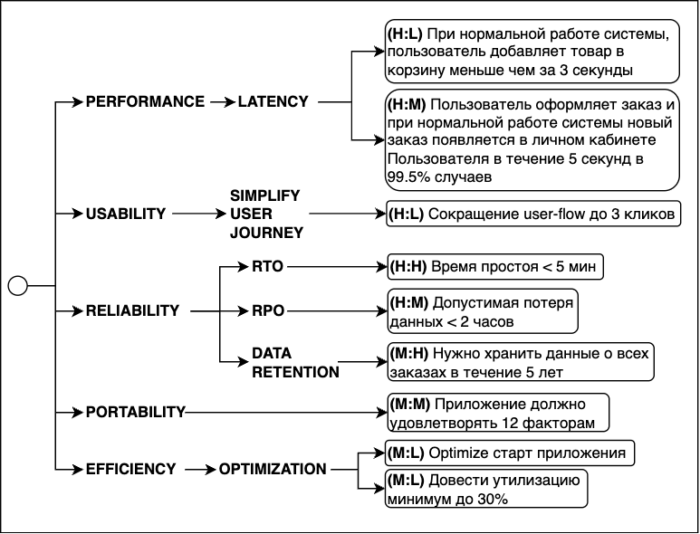

== Выделение архитектурно значимых требований

=== 1. Архитектурно значимые требования (ASR)

*_Архитектурно значимые требования (ASR)_* или *_Architectural significant requirements_* – это требования, оказывающие существенное влияние на выбор архитектурных решений системы. Они определяют критически важные аспекты архитектуры, необходимые для успешной реализации проекта. ASR включают в себя все наиболее важные требования, будь то нефункциональные требования или ограничения.

Хотя ключевые бизнес-процессы могут служить источником ASR, не рекомендуется включать в этот список функциональные требования, чтобы избежать путаницы в дальнейшем.

Для выявления ASR необходимо выделить:

1. *_Нефункциональные требования с высоким приоритетом:_* *HH* (High-High), *HM* (High-Medium) или *MH* (Medium-High).
2. *_Ограничения_*, оказывающие значительное влияние на архитектуру: уровня *H* (High) и *M* (Medium).

Итого: архитектурно значимыми являются нефункциональные требования HH, HM, MH, MM или ограничения H, M.

Эти требования и ограничения несут самые высокие риски для проекта и существенно влияют на архитектурные решения, поэтому и называются архитектурно значимыми.

Важно помнить следующее:

- Большое количество ASR указывает на высокий уровень риска проекта. *_Рекомендуется ограничивать их число 5-7 требованиями_*, чтобы избежать задержек и потенциального незапуска проекта.

- Требования, не влияющие на архитектуру, можно отложить или реализовать на более поздних этапах, например, после выпуска минимально жизнеспособного продукта (MVP).

- Нефункциональные требования с оценкой MH могут стать хорошей отправной точкой для переговоров с заказчиком (предмет торга). Они не являются критически важными для заказчика, но могут представлять значительные риски для проекта. Требования с оценкой LH, как правило, вообще не рассматриваются к реализации (на первых этапах уж точно).

=== 2. Пример выделения ASR

Рассмотрим нашу предыдущую диаграмму:

Вспоминаем, что нам нужны требования *HH*, *HM*, *MH* и выделяем их:

- *(H:H)* Время простоя < 5 мин
- *(H:M)* Пользователь оформляет заказ и при нормальной работе системы новый заказ появляется в личном кабинете Пользователя в течение 5 секунд в 99.5% случаев
- *(H:M)* Допустимая потеря данных < 2 часов
- *(M:H)* Нужно хранить данные о всех заказах в течение 5 лет

