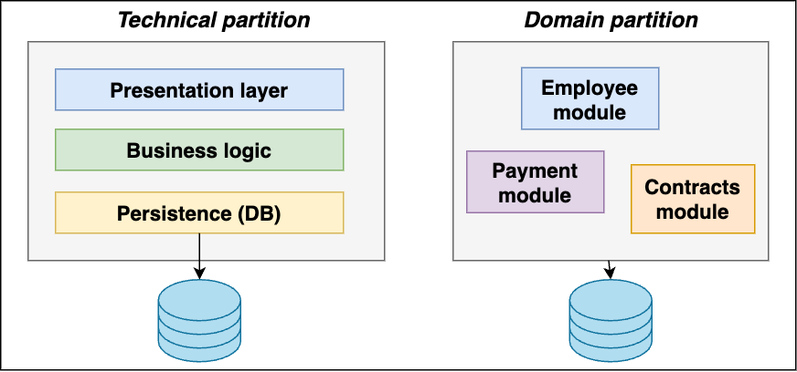

== Архитектурное разделение

=== 1. Два типа архитектурного разделения на модули или слои

Существует следующая классификация разделения архитектуры на модули верхнего уровня:

1. *Layered architecture* - *Техническое разделение* (разделение технологического стека). +
Это разделение архитектуры на основе технических особенностей, в частности, технологического стека.
2. *Modular architecture* - *Доменное разделение*. +
Основан на доменах и поддоменах концепции DDD (Domain-Driven Design), при котором происходит деление на поддоменные модули.

Зачастую выбор деления в том числе завязан на структуру самой компании. Например, в большой конторе бэкенд может существовать отдельно (команда сидящая в одной комнате), фронтенд отдельно (в другой комнате). То есть *_domain partition_* потенциально (но не всегда) потребует, например, фронтов и бэков в одной команде.

=== 2. Влияние разделения на систему. Плюсы и минусы

Из плюсов доменного разделения - при внесении изменений мы затрагиваем один модуль а не всю систему. Тогда как при техническом (слоевом) - придется доработать каждый слой. +
Из плюсов технического разделения - проще следить за техническим стеком, внося в него изменения и стандарты. Например, переехать на новую версию Angular/SpringBoot 3 в рамках одного слоя будет проще, чем переводить все доменные модули. Тем более в каждом доменном модуле будут уже свои сложившиеся практики к написанию кода и проектированию.