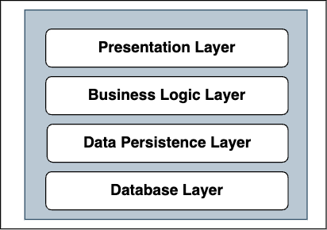

== Layered/Слоеная/Слоистая архитектура

[cols="2,1"]
|===
|Тип деления модулей |технический
|Кванты |1
|Deployability |[big red]#*1/5*#
|Эластичность |[big red]#*1/5*#
|Ремонтопригодность (Maintainability) |[big red]#*1/5*#
|Стоимость разработки/эксплуатации |[big lime]#*5/5*#
|Производительность |[big yellow]#*2/5*#
|Reliability (надежность) |[big olive]#*3/5*#
|Масштабируемость (Scalability) |[big red]#*1/5*#
|Простота |[big lime]#*5/5*#
|Тестируемость |[big yellow]#*2/5*#
|===

Простота и стоимость - вот самые сильные аспекты слоеной архитектуры. Однако при увеличении/усложнении она начинает терять свои преимущества. Надежность у нее средняя, т.к. нет сетевых вызовов как у распределенных архитектур, но при этом имеются высокие риски развертывания всего кванта.

=== 1. Определение

Слоистая (Layered) архитектура появляется когда система разбита на несколько логических технических слоев, например MVC или Presentation-BusinessLogic-Data. Каждый слой независимый и может изменяться без влияния на остальные. Принцип подхода в том, чтобы каждый слой представлял отдельные сервисы или функции.

*_Слой может вызывать только низлежащие слои, но не верхнеуровненые._* Слоеная архитектура может иметь архитектуру закрытого или открытого слоя:

- 1) *_Архитектура открытого слоя_* - когда слой может вызывать ЛЮБОЙ слой, расположенный НИЖЕ него.
- 1) *_Архитектура закрытого слоя_* - когда слой может вызывать ТОЛЬКО СЛЕДУЮЩИЙ слой, расположенный НИЖЕ него.

=== 2. Основные примеры слоев

Обычно слоеная архитектура состоит из трех основных слоев: Presentation Layer, Business logic layer и Data access layer. В некоторых случаях могут быть добавлены дополнительные слои. Например, мобильное приложение с БД SQLite может содержать следующие 4 уровня:

В целом, слоеная архитектура зачастую используется именно в мобильных приложениях.

=== 3. Плюсы и минусы

*Преимущества:*

1. *_Ограниченность контекста_*. В любом слое необходимо понимать только слои, которые лежат ниже.
2. *_Взаимозаменяемость_*. Любой слой можно заменить аналогичным расширением/библиотекой/другим слоем, не меняя работу с другими слоями. Например, заменив фронтенд-фреймворк слоя представления, мы никак не затронем другие слои.
3. *_Разделение задач_*: каждый уровень фокусируется на определенной функции, например, логике представления, бизнес-логике или хранении данных.
4. *_Простота реализации и поддержки_*. *_Изоляция разработки_*: изменения на одном уровне, как правило, не влияют на другие, что способствует независимой разработке и обслуживанию.
5. *_Стандартизация_*. Во-первых, внесение изменений в слой сервиса должно соответствовать стандартам разработки слоя. Можно создать отдельный стандарт для каждого слоя. Во-вторых, если на проекте уже есть сервисы, которые имеют слоеную архитектуру, то, создавая новый сервис, можно использовать стандарты из ранее созданных слоев при создании нового слоя (например, persistence-layer - стандарты разработки в нашем стандартном фреймворке или используем свою самописную библиотеку img-иконок везде).

*Недостатки:*

1. *_Избыточность кода_*. Иногда разделение на слои может спровоцировать повышенную сложность интеграции между слоями, а также написание излишнего кода (утилиты и пр).
2. *_Сложность интеграций_*. Интеграции между слоями нужно будет тщательно продумать, так как потом уже будет тяжело их изменить - высока вероятность ошибок, которые придется потом переделывать. Кроме того, сами интеграции могут быть очень сложными и даже избыточными.
3. *_Зависимость слоев_*. Возможно, что изменения верхнеуровневого слоя потребуют изменений в других слоях, а если дело касается данных - то вообще каскадных изменений.
4. *_Сложный процесс согласования изменений между командами_*. Если у вас 3 уровня - фронт, бэк и db, то условные изменения в команде фронта и соответствующие изменения в команде бэкенда (а мб даже в команде dba) нужно будет согласованно разрабатывать, тестировать и выводить на прод. Эта проблема появляется, если команды отдельные и продукт/проект достаточно большой.

=== 4. Советы по применению

Многослойная архитектура - хороший выбор в случае небольших приложений, так проще управлять одной командой, нежели чем делить архитектуру на микросервисы и страдать от накладных расходов. Даже если приложение потенциально большое - пока есть неопределенность в том, как проект будет развиваться, можно использовать данный подход.

Сравнение многослойной архитектуры и микросервисной: link:https://triglon.hashnode.dev/layered-architecture-vs-microservices-a-tradeoff-analysis[triglon.hashnode.dev].
