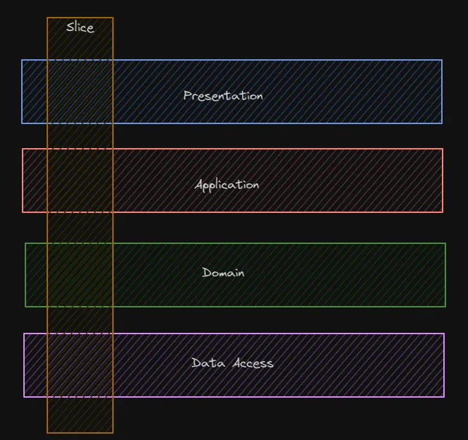
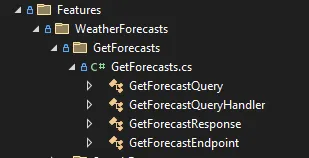
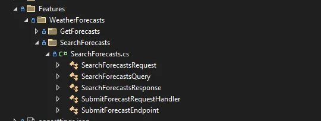
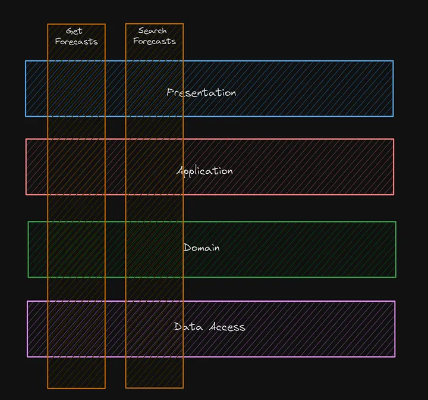
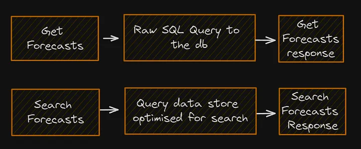

== Vertical Slices архитектура (VSA)

link:https://medium.com/@andrew.macconnell/exploring-software-architecture-vertical-slice-789fa0a09be6[ссылка 1], link:https://www.baeldung.com/java-vertical-slice-architecture[ссылка 2]

[cols="2,1"]
|===
|Тип деления модулей |домены
|Кванты |1
|Deployability |[big red]#*1/5*#
|Эластичность |[big red]#*1/5*#
|Ремонтопригодность (Maintainability) |[big olive]#*3/5*#
|Стоимость разработки/эксплуатации |[big olive]#*3/5*#
|Производительность |[big yellow]#*2/5*#
|Reliability (надежность) |[big olive]#*3/5*#
|Масштабируемость (Scalability) |[big red]#*1/5*#
|Простота |[big olive]#*3/5*#
|Тестируемость |[big green]#*4/5*#
|===

В отличие от слоеной архитектуры, выгода аспектов простоты и стоимости понижаются. Поскольку архитектура все еще монолитная, она имеет такие же показатели большинства аттрибутов качества. Из плюсов архитектуры - улучшенное тестирование и повышенная ремонтопригодность (внесение изменений будет меньше влиять на другие архитектуры).

=== 1. Определение

Предыдущая архитектура - link:sn006_layered_architecture.adoc[Layered] - имеет ряд недостатков, в том числе реализация вертикальной бизнес-логики может влиять на все слои архитектуры. Это так себе подход с точки зрения модульности приложения.

Поэтому появляется архитектура "вертикальных слайсов" - это когда у нас есть слои (представление, логика и т. д.), но все, что относится к определенной функции или запросу, помещается в один "слайс" - отдельный изолированный слой, проходящий через все необходимые горизонтальные слои:

*Срез* — это "запрос" или "функция", которая инкапсулирована в своей собственной вертикали и, если это необходимо, пересекает каждый (или почти каждый) горизонтальный слой в изоляции от других срезов. К сожалению, это обеспечивает *_high coupling_* зависимостей в пределах данного среза - далекие по функциональности слои (presentation & data access) становятся очень связанными, однако обеспечивается и *_high cohesion_* - высокая изменчивость нивелируется близким расстоянием и изолированностью одного slice от другого.

Да, по факту стремление к _high coupling_ - это то, что отличает VSA от других архитектур.
----
Минимизируйте связь между срезами и максимизируйте связь в срезе
----

Главное преимущество этого заключается в том, что каждый срез становится "хозяином своей судьбы" в отношении выполнения своих обязанностей. Теоретически это в конечном итоге дает команде разработчиков (или многим) возможность вводить изменения независимо и безопасно. Новые функции только добавляют код, вам не нужно менять общий код и беспокоиться о побочных эффектах

=== 2. Как это выглядит на практике? Пример из туториала

Предположим, что мы пишем приложение прогноза погоды. Как же нам сделать нашу архитектуру "кричащей"? +
Начнем с того, что будем хранить наши слайсы в специальном каталоги Features и добавим первый slice "GetForecast":

Здесь срез GetForecast содержит все необходимые компоненты, требуемые для выполнения получения прогнозов погоды. Мы определяем query, ее обработчик, endpoint и response для прогноза. Если мы захотим изменить любую часть этого среза, то все, что мы когда-либо будем искать, будет прямо в этой папке.

Давайте теперь добавим еще один срез для поиска прогнозов, в которых температура больше или равна той, которую определил пользователь:

Возвращаясь к описанию VSA, мы могли бы отобразить созданные выше срезы следующим образом:

Одним из главных преимуществ того, что каждый слайс слабо связан с другими слайсами, является то, что он допускает очень гибкую реализацию того, как он хочет выполнять свои обязанности. Если мы посмотрим на примерные реализации слайсов выше, мы могли бы представить их примерно следующим образом:

=== 3. Плюсы и минусы

*Преимущества:*

1. *_Изоляция разработки_*. Возможность создания нового фрагмента функциональности изолированно от других позволит разрабатывать функционал параллельно.
2. *_Простота разработки_*. Мы можем сосредоточиться на одном фрагменте при реализации функции, а не на разных уровнях, тем самым нам не нужно держать в голове контекст других частей проекта.
3. *_Безопасное изменение логики внутри среза_*. Поскольку каждый фрагмент изолирован от других, риск внесения дефекта или критических изменений в другой фрагмент практически отсутствует.
4. *_Новый код добавляется только для новых слайсов_*. После завершения работы над функцией для любой новой функции потребуется собственный код.

*Недостатки:*

1. *_Потенциальное дублирование между срезами_*. По мере роста приложения и списка функций дублирование идентичного кода может стать проблемой, если вовремя не проводить рефакторинг.
2. *_Сложнее стандартизировать шаблоны и подходы_*. Учитывая, что каждый срез решает свою собственную задачу, может быть сложно стандартизировать подходы и шаблоны при создании новых срезов.

=== 4. Sliced architecture и use-cases

В link:https://www.baeldung.com/java-vertical-slice-architecture[ссылка 2] приведен пример проекта, который в slices использует use-cases подход. Это тоже подход к организации кода, однако стоит разделять sliced architecture и use-cases. Поскольку use-cases относится больше к разделу clean architecture и представляет собой отдельный принцип организации слоев приложения и взаимодействия между ними. Однако в этой статейке мы его не рассматриваем.

Подробнее про use-cases в clean architecture - link:https://habr.com/ru/companies/mobileup/articles/335382/[habr], link:https://engineering.teknasyon.com/usecase-red-flags-and-best-practices-in-clean-architecture-76e2f6d921eb[medium]