== DDD

*Список ссылок:*

- link:https://www.youtube.com/watch?v=4rhzdZIDX_k[youtube 1]
- link:https://habr.com/ru/companies/jugru/articles/440772/[habr 1]
- link:https://habr.com/ru/companies/mobileup/articles/335382/[habr 2]
- link:https://habr.com/ru/articles/316438/[habr 3]
- link:https://www.infoq.com/articles/ddd-contextmapping/[ddd-contextmapping]
- link:https://habr.com/ru/articles/316890/[habr 4]
- link:https://habr.com/ru/articles/654245/[habr 5]
- link:https://www.youtube.com/watch?v=4rhzdZIDX_k[youtube 1 - база про DDD] + link:https://www.alexhyett.com/domain-driven-design/[текстовая расшифровка]
- link:https://www.youtube.com/watch?v=7LFxWgfJEeI[youtube 2 - про Event Storming]
- link:https://www.youtube.com/watch?v=oWirZWV6l6o[youtube 3 - Event Storming на русском]

*Content:*

- 1. Причины возникновения (link:#_1_причины_возникновения[тык])
- 2. Домены и субдомены (link:#_2_домены_и_субдомены[тык])
- 3. Стратегическое проектирование (link:#_3_стратегическое_проектирование[тык])
- 4. Bounded context (Ограниченный контекст) (link:#_4_bounded_context_ограниченный_контекст[тык])
- 5. Как выбрать правильный размер для bounded context? (link:#_5_как_выбрать_правильный_размер_для_bounded_context[тык])
- 6. Context map (link:#_6_context_map[тык])
  * 6.1 Типы связей между субдоменами (link:#_6_1_типы_связей_между_субдоменами[тык])
  * 6.2 Пример разработки context map(link:#_6_2_пример_разработки_context_map[тык])
  * 6.3 Anti-Corruption Layer для нашего примера с netflix(link:#_6_3_anti_corruption_layer_для_нашего_примера_с_netflix[тык])
- 7. Tactical design (link:#_7_tactical_design[тык])
  * 7.1 Entities (link:#_7_1_entities[тык])
  * 7.2 Value objects (link:#_7_2_value_objects[тык])
  * 7.3 Entity or value object? (link:#_7_3_entity_or_value_object[тык])
  * 7.4 Aggregate (link:#_7_4_aggregate[тык])
  * 7.5 Domain Service (Сервис Предметной Области) (link:#_7_5_domain_service_сервис_предметной_области[тык])
  * 7.6 Модуль. Пример именования модулей (link:#_7_6_модуль_пример_именования[тык])

=== 1. Причины возникновения

Основная цель Domain-Driven Design — это борьба со сложностью бизнес-процессов и их автоматизации и реализации в коде. "Domain" переводится как "предметная область", и именно от предметной области отталкивается разработка и проектирование в рамках данного подхода. Само программное обеспечение должно представлять бизнес, и из кода должно быть ясно, как функционирует бизнес.

С точки зрения Domain-Driven Design, абсолютно всё равно, какую архитектуру вы выберете. Domain-Driven Design не про это, *_Domain-Driven Design - это про язык и про общение_*. Иначе говоря, выбрав слоистую архитектуру или onion-архитектуру, вы в обоих случаях сможете построить DDD, просто где-то это будет тяжелее, где-то - легче. DDD привносит некоторые практики, которым можно следовать для улучшения качества общения между бизнесом и программистами.

В DDD есть множество аспектов, без которых этот подход не будет работать. Давайте разберем все их по порядку, а потом попробуем объединить в одну систему.

=== 2. Домены и субдомены

*Domain* — это глобальная штука, это глобальная предметная область, в которой данный конкретный бизнес зарабатывает деньги. Например, для «Гиппо» — это розничная торговля товарами. Это нечто глобальное и не может быть автоматизировано напрямую, даже исследовать это сложно. Для анализа *_Domain_* неизбежно делится на *_Subdomains_*, то есть на субдомены. Важно отметить, что иногда субдомены называют доменами, суть от этого не меняется, поскольку понятие глобального домена используется редко.

*Subdomain* или *субдомен* — это части бизнеса, которые обладают высокой связностью (high cohesion), то есть это какие-то обособленные логические процессы, которые взаимодействуют между собой на каком-то крупном уровне.

Давайте возьмем Netflix в качестве примера. Если бы мы создавали Netflix с нуля с помощью DDD, то какие домены у нас были бы? Скорее всего, мы бы имели как минимум следующие субдомены:

- 1. *Video Streaming* - это в целом сущность работы Netfix, это конкурентное преимущество компании.
- 2. *Recommendations* - механизм рекомендаций и связанное с ним машинное обучение, вероятно, являются еще одним поддоменом.
- 3. *Billing* - механизм выставления счетов и обработки ежемесячных подписок.

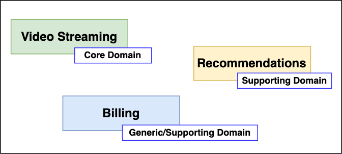

И вот здесь стоит остановиться подробнее на типах субдоменов. Выделяют 3 типа субдоменов: *_Core_*, *_Supporting_* и *_Generic_*.

- 1. *Core* — это основной Subdomain, это конкурентное преимущество компании, то, на чём эта компания зарабатывает деньги, чем она отличается от конкурентов, её ноу-хау, как ни назови. Очевидно, в нашем случае, *_Video Streaming_* - это Core Subdomain.
- 2. *Supporting* - это тоже важная вещь для зарабатывания денег, но это не является каким-то реальным конкурентным преимуществом. Это то, что поддерживает Core Subdomain. С точки зрения применения DDD это означает, что на Supporting Subdomain тратится меньше усилий, все основные силы бросаются на Core. В нашем примере *_Recommendations_* является Supporting Subdomain.
- 3. *Generic* - это некоторая типовая бизнес-задача, которая, как правило, может быть автоматизирована готовыми продуктами или отдана на аутсорс. Это не обязательно требует самостоятельной реализации нами, и может даже быть third-party продуктом или отдано на аутсорс. Не всегда эти субдомены присутствуют, но, например, если Billing не хранит в себе систему подписок и ежемесячного продления, то он может быть Generic субдоменом.

С учетом разделения, я бы представил субдомены таким образом: ввел бы Generic субдомен *Payment*, в который будет ходить Supporting субдомен Billing.

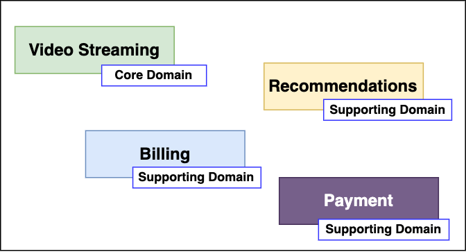

Это то, что поддерживает Core Subdomain. С точки зрения применения DDD это означает, что на Supporting Subdomain тратится меньше усилий, все основные силы бросаются на Core. В нашем примере *_Recommendations_* является Supporting Subdomain.

=== 3. Стратегическое проектирование

Первый шаг к созданию DDD-архитектуры - это *_стратегическое проектирование_*, где *домен* - бизнес - разбивается на *субдомены*. Хотя DDD можно использовать уже в существующих приложениях, это гораздо проще сделать, когда вы создаете его с нуля.

В рамках стратегического проектирования вам также стоит договориться о едином языке описания объектов как в вашем приложении, так и в бизнесе. То есть бизнес должен понимать программистов, а программисты - бизнес. Это называется *ubiquitous language* или *единый язык*. Единый он в том смысле, что все участники общаются на нём, всё обсуждение происходит в терминах единого языка и все артефакты максимально должны быть в терминах единого языка, то есть начиная от ТЗ и заканчивая кодом.

=== 4. Bounded context (Ограниченный контекст)

И доменная модель, и ubiquitous language ограничены контекстом, который в DDD называется *bounded context*. Он ограничивает доменную модель таким образом, чтобы все понятия внутри него были однозначными, и все понимали, о чём идёт речь. Каждый субдомен будет иметь свой собственный ограниченный контекст, позволяющий использовать разные языки для каждого субдомена.

К примеру, и у Video Streaming, и у Recommendations, и у Billing есть понятие "пользователь". Однако в каждом bounded context называться он будет по-разному - где-то это будет viewer, где-то - subscriber, а где-то - customer:

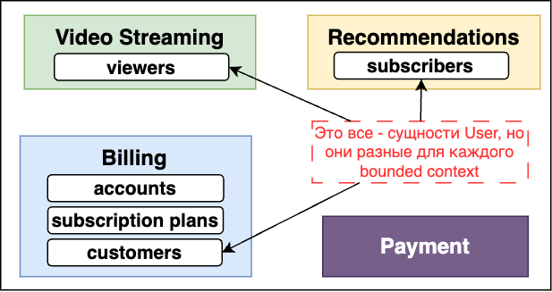

Вам не нужно пытаться заставить весь бизнес прийти к единому мнению о том, как называть "пользователей", вам просто нужно договориться о языке, который будет использоваться в этом субдомене.

При хорошем разделении прослеживается четкое различие между различными субдоменами и используемым языком. Каждый субдомен должен иметь по крайней мере несколько уникальных терминов/бизнес-объектов. Например, Billing будет содержать в себе subscription plan, которого, очевидно, не может быть в Video Streaming. Бизнес-объекты/элементы внутри домена называются Entities, которые мы рассмотрим несколько позже.

=== 5. Как выбрать правильный размер для bounded context?

Одна из важнейших из рекомендаций для bounded context:
----
В идеале один Subdomain должен маппиться на один bounded context (то есть автоматизироваться одним "bounded context"-приложением)
----
Звучит логично, потому что и там, и там есть ограничения какого-то обособленного бизнес-процесса, в обоих случаях какие-то бизнес-термины, фигурирует единый язык. Но это идеальная ситуация.

С одной стороны, Subdomain может быть достаточно крупным, и может получиться несколько приложений или сервисов, которые будут его автоматизировать, поэтому может получиться, что одному Subdomain будет соответствовать несколько bounded context.

Но бывает и обратная ситуация, как правило, это характерно для легаси. То есть когда есть огромное приложение, которое автоматизирует всё на свете на этом предприятии, тогда получится наоборот. Одно приложение — это один bounded context, там модель наверняка будет какая-то неоднозначная, но Subdomain’ы от этого никуда не делись, соответственно, нескольким Subdomain’ам будет соответствовать один bounded context. Поэтому и хорошо строить архитектуру DDD с нуля.

Еще можно вспомнить про микросервисы - там есть рекомендация "один bounded context на один микросервис". Причем это вполне себе реальные кейсы из практики. Потому что микросервис должен брать на себя какую-то чёткую функцию, которая внутри обладает высокой связностью (high cohesion), а с другими сервисами общается по сети/через брокер и т. п.

И последнее, но не менее важное замечание - DDD это про язык, а на нем общается ограниченное число людей. Поэтому 1 контекст равен X человек. Пока они продолжают понимать, о чем говорят, все окей. Из конкретных примеров - bounded context вполне себе реализуем внутри конкретной команды, отвечающей за конкретный микросервис.

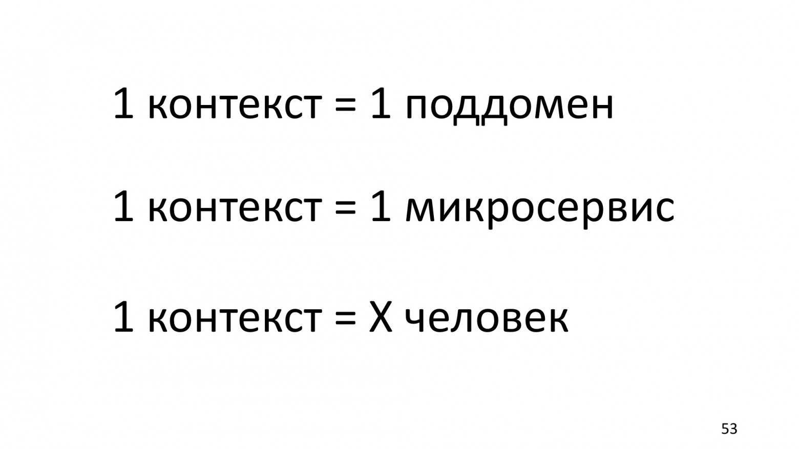

=== 6. Context map

После создания субдоменов мы выясняем, как они взаимодействуют и какие отношения существуют между ними, создавая так называемую *context map* - карту контекстов.

==== 6.1 Типы связей между субдоменами

После создания предварительной карты контекстов, ее можно детализировать путем определения отношений между контекстами. Существуют такие отношения между ограниченными контекстами и отдельными командами проекта. Наиболее важными (и, возможно, распространенными) являются пункты 1-5:

- 1. *Партнерство (Partnership)*. Когда команды в двух контекстах достигают успеха и терпят неудачу вместе, возникает отношение сотрудничества. Они должны сотрудничать в процессе эволюции своих интерфейсов, чтобы учитывать потребности обеих систем.
- 2. *Общее ядро (Shared kernel)*. Общая часть модели и кода образует тесную взаимосвязь. Обозначается четкая граница подмножества модели предметной области, которую команды согласны считать общей. Ядро должно быть маленьким. Оно не может изменяться без консультации с другой командой. Необходимо согласовывать единый язык команд.
- 3. *Заказчик-поставщик (Customer-supplier development)*. Когда две команды находятся в отношении "вышестоящий и нижестоящий" (northbound и southbound), и команды вышестоящие учитывают приоритеты нижестоящих команд.
- 4. *Конформист (Conformist)*. Когда две команды находятся в отношении "upstream и downstream", причем вышестоящая команда не имеет причин учитывать потребности нижестоящей команды. В таком случае один bounded context соответствует модели другого bounded context, и любые изменения в конформистской модели (downstream) должны соответствовать модели поставщика.
- 5. *Предохранительный уровень (Anticorruption layer)*. Если управление и коммуникация не соответствуют ни одному из вышеупомянутых пунктов, то трансляция является сложной. Нижестоящий клиент должен создать *_изолирующий слой_*, чтобы обеспечить адаптер вышестоящей системы в терминах своей модели предметной области. Этот уровень общается с другой системой с помощью существующего интерфейса, не требуя или почти не требуя модификаций другой системы.
- 6. *Служба с открытым протоколом (Open host service)*. Определяется протокол, который предоставляет доступ к системе как к набору служб. Для учета новых требований интеграции этот протокол расширяется и уточняется.
- 7. *Общедоступный язык (Published language)*. Трансляция между моделями двух ограниченных контекстов требует общего языка. В качестве среды для коммуникации используется хорошо документированный общий язык, который может выразить необходимую информацию о предметной области, выполняя при необходимости перевод информации с другого языка на этот.
- 8. *Отдельное существование (Separate ways)*. Если между двумя наборами функциональных возможностей нет важных отношений, их можно полностью отсоединить друг от друга. Интеграция всегда дорого стоит, а выгоды бывают незначительны.
- 9. *Большой комок грязи (Big ball of mud)*. Существуют части системы, в которых модели перемешаны, а границы стерты. Необходимо нарисовать границу такой смеси и назвать ее "big ball of mud".

==== 6.2 Пример разработки context map

Хороший пример в статье link:https://www.infoq.com/articles/ddd-contextmapping/[ddd-contextmapping] и в некотором разборе этой же статьи на link:https://habr.com/ru/articles/316438/[habr].

Следуя подходу DDD, определенная команда должна создать собственную context map, которая отражает пространство решений, в которой находится эта команда. Context map состоит из bounded contexts (что зачастую субдомен, но не всегда), а также связей между ними.

Давайте разберем пример context map для некоторого Personal Finance Management Application (PFM). Сначала рисуется простая карта контекстов с границами и связью между ограниченными контекстами:

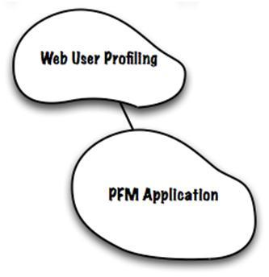

В этих двух контекстах есть различия в концепциях с одинаковым названием. Например, *_Account_* в Web User Profiling – это учетная запись пользователя (логин и пароль). В то же время, для PFM Application (персональное управление финансами) – это сводка, описывающая текущее состояние клиента с точки зрения банка. Иногда, как было указано выше, одна и та же концепция может использоваться в абсолютно разных контекстах, тем самым для них необходимо определить разные модели:

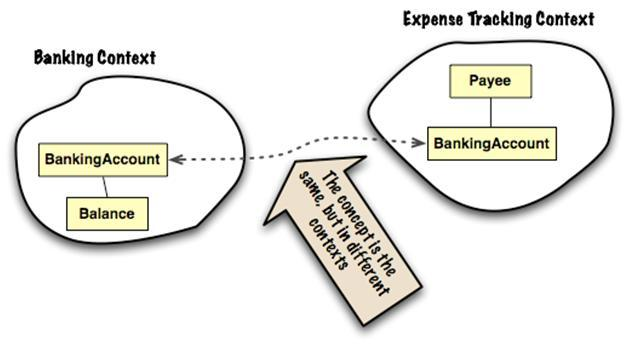

Например, PayeeAccount – это тот же BankingAccount, но с другим поведением (нельзя получить баланс). Таким образом будет создан отдельный контекст учета расходов (expense tracking). Также отдельно, в приведенном примере, создается контекст онлайн сервисов банка (on-line banking services) (такие сервисы, например, как распечатка выписок банка).

По мере того, как наши знания об окружающей среде будут увеличиваться, это будет отражаться на context map. Таким образом, мы добавляем внешние интеграции - контекст онлайн сервисов банка (on-line banking services), такие, как распечатка выписок банка, и контекст "Отслеживание расходов" (Expense Tracking):

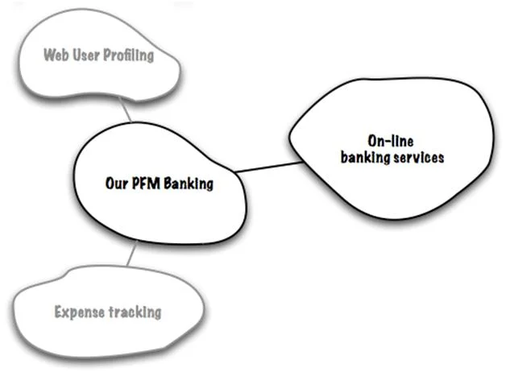

После первого шага создания context map, можно *_детализировать все отношения_*. У каждого отношения есть направление. *Вышестоящие (upstream)* влияют на *нижестоящие (downstream)*, но не факт, что обратное верно. Это может относиться как к коду (библиотекам, зависящим друг от друга), так и к менее техническим факторам, таким как расписание или скорость реагирования на внешние запросы.

В нашем примере у нас есть внешняя система "on-line banking services", которая не будет меняться под наши запросы, в то время как PFM Banking придется быстро обновлять, если внешняя система изменит свой API. Таким образом, наш контекст PFM будет "downstream", в то время как On-Line Banking Services - "upstream". +
Мы можем согласиться принять паттерн "конформист", но нам нужна какая-то защита от изменений, поступающих из upstream-контекста, чтобы сохранить концептуальную целостность нашего контекста. DDD описывает несколько организационных шаблонов, которые помогают нам описывать и/или управлять способом взаимодействия различных контекстов. Подходящий шаблон - Anti-Corruption Layer (ACL) - призывает к явному переводу на уровне кода между двумя контекстами или, лучше сказать, на внешней границе Banking PFM контекста как downstream-системы. Это может быть не только маппинг технологий, но и место, где можно управлять всеми различиями между моделями на обоих концах.

А как насчет других отношений? Допустим, что Expense Tracking разрабатывается сторонней командой нашего проекта - в этом случае два bounded contexts находятся в партнерских отношениях: они оба разрабатываются для достижения общей цели (и "upstream-downstream" не имеют особого смысла, поскольку контексты находятся на одном уровне). Если Web User Profiling суть внешний модуль, то мы, вероятно, будем использовать его "as is", то есть PFM Banking - "downstream-конформист" по отношению к Web User Profiling.

Итоговая детализированная context map выглядит вот так:

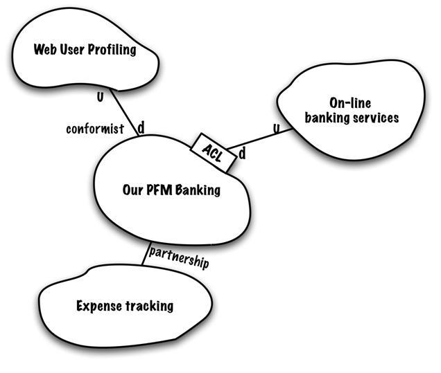

==== 6.3 Anti-Corruption Layer для нашего примера с netflix

В нашем примере, например, субдомену Video Streaming надо знать, какое качество видео транслировать пользователям, но это зависит от типа подписки, которая располагается в субдомене Billing. Video Streaming ничего не знает про подписки, а Billing без понятия, что такое качество видео. В таком случае можно ввести ACL-слой в Billing (считаем что Billing - это downstream-система). Очевидно, что ACL будет находиться непосредственно в приложении самого Billing где-нибудь в слое/перед слоем представления (если бы это была hexagon архитектура, то, очевидно, в adapter) - но речь не идет про архитектуру самого приложения (напоминаем, DDD не совсем про архитектуру, хотя влияет на нее):

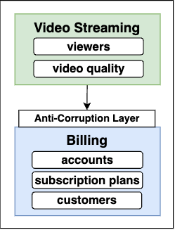

К слову, и со стороны upstream-системы тоже можно ввести ACL, но это в каких-то достаточно сложных случаях.

=== 7. Tactical design

Тактическое проектирование идет после стратегического. Если стратегическое проектирование имеет дело с "абстрактным всем" в рамках домена, то тактическое - имеет дело с классами и модулями. Оно направлено на то, чтобы усовершенствовать модель домена до стадии, на которой ее можно будет преобразовать в работающий код.

==== 7.1 Entities

*Entities* в DDD ссылаются на свои реальные аналоги (бизнес-объекты). Примером сущности может быть subscriber в нашем примере c netflix.

У каждой entity есть *_идентификатор_*, и именно этот идентификатор делает их уникальными. Две entity с одинаковыми свойствами будут считаться разными сущностями, если у них разные идентификаторы.

Entities изменяемы (*_mutable_*), и вы можете менять их свойства с течением времени. Например, subscriber может изменить свой адрес электронной почты, и это будет тот же subscriber, поскольку у него тот же идентификатор.

==== 7.2 Value objects

Другие важные объекты предметной области, которые следует учитывать, называются *объектами-значениями* или *value objects*. Очевидно, что такой объект представляет какое-то значение. Entities могут состоять из нескольких value objects. Для subscriber это может быть адрес электронной почты или дата рождения.

Объекты-значения не являются уникальными, и два объекта с одинаковым значением считаются равными. В отличие от Entities, Value Objects должны быть неизменяемыми. Вы не можете их обновлять, если вам нужно другое значение, вы просто создаете новый объект. Обычно это делается через запрет сеттеров.

Вы спросите: зачем мне нужно, например, делать value-object для адреса электронной почты, если я могу просто использовать строковый тип? Да, это верно, и причина создания value-object - это явное указание на то, что это не просто значение, а важная часть всего вашего домена. Т к это объект, то вы можете добавить дополнительную логику как в конструктор value-object, так и в целом добавить ему доплнительных методов в случае rich model. Объекты-значения могут стать отличным способом написания более чистого кода в ваших приложениях. Пример value-object адреса почты:

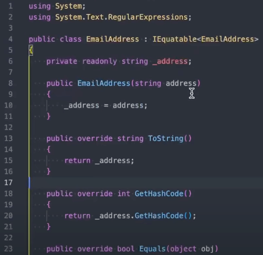

Чтобы выяснить, является ли какое-то понятие значением, необходимо выяснить, обладает ли оно большинством из следующих характеристик:

1. Оно измеряет, оценивает или описывает объект предметной области;
2. Его можно считать неизменяемым;
3. Оно моделирует нечто концептуально целостное, объединяя связанные атрибуты в одно целое;
4. При изменении способа измерения или описания его можно полностью заменить;
5. Его можно сравнивать с другими объектами с помощью отношения равенства значений;
6. Оно предоставляет связанным с ним объектам функцию без побочных эффектов.

Если у вас anemic (анемичная) model, то не факт, что вам понадобятся value objects.

==== 7.3 Entity or value object?

Рекомендация от DDD: Value-objects должно быть больше, чем Entities. Спорно, особенно в случае anemic (анемичной) model, но в случае rich model это вполне себе реально.

Как решить, является ли объект entity или value object? Это зависит от важности объекта в вашем домене. Например, во многих доменах адрес — это просто информация. Он является всего лишь частью платежных реквизитов. Но в случае, например, системы городского транспорта, адрес будет являться важным объектом, указывающим, например, местоположение остановки, который можно изменить или отобразить на карте. Или, в случае карты местности, адрес будет ключевым entity, возможно даже аггрегатом, который будет связывать места по адресу, время работы, отзывы к месту и пр.

==== 7.4 Aggregate

Обычно сущность включает в себя объекты-значения, но не так часть сущность включает в себя сущность. Для этого случае существуют особое понятие - *аггрегат* (aggregate). Он представляет собой группу из нескольких entities и value objects. Как и сущности, агрегат также имеет идентификатор, поэтому на них можно ссылаться из других частей вашего приложения.

Примером агрегата может быть CustomerOrder. Он состоит из сущности самого клиента, заказанных им продуктов, цены заказа и других деталей, таких как адрес доставки:

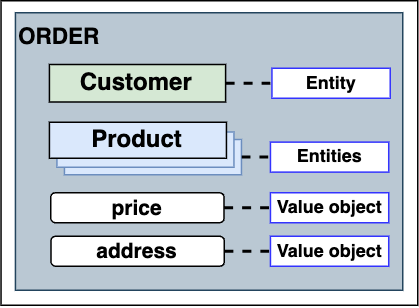

Агрегат является *транзакционной границей*, поэтому все изменения в аггрегате должны быть или зафиксированы или нет. Таким образом, агрегат всегда находится в согласованном состоянии.

Агрегат также отвечает за соблюдение бизнс-правил. Например, у вас может быть правило, что нельзя заказать больше продуктов, чем есть на складе или что общая сумма заказа должна быть суммой стоимости заказанных продуктов. Очевидно, что все это небесплатно. Чем больше правил вы добавляете в свой агрегат, тем больше времени потребуется на обновления, что может повлиять на user experience.

Так что обычно мы создаем некий компромисс между производительностью и согласованностью. В некоторых случаях имеет смысл добавить corrective policy - корректирующую политику (джобу), которая будет периодически вызываться и либо исправлять, либо помечать все, что некорректно в нашей системе.

==== 7.5 Domain Service (Сервис Предметной Области)

В предметной области обычно используются существительные и глаголы. Первые отображаются в объекты, вторые - в поведение этих объектов. Однако существуют глаголы или действия, которые нельзя отнести к какой-то entity или value object. В таком случае такую операцию объявляют как сервис. Доменные сервисы имеют 3 характеристики:

1. Операция, выполняемая сервисом, относится к концепции предметной области, которая не принадлежит ни одной из существующих сущностей;
2. Операция выполняется над различными объектами модели предметной области;
3. Операция не имеет состояния.

В DDD рекомендуется не злоупотреблять количеством domain service, если цель - rich-model, а не анемичная.

Для примера можно взять сервис перевода денег с одного счета плательщика в счет получателя. Совершенно неясно, в каком объекте хранить метод перевода, поэтому используется сервис:

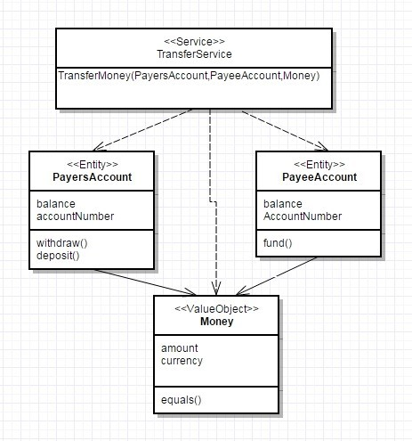

Место доменных сервисов в структуре приложения:

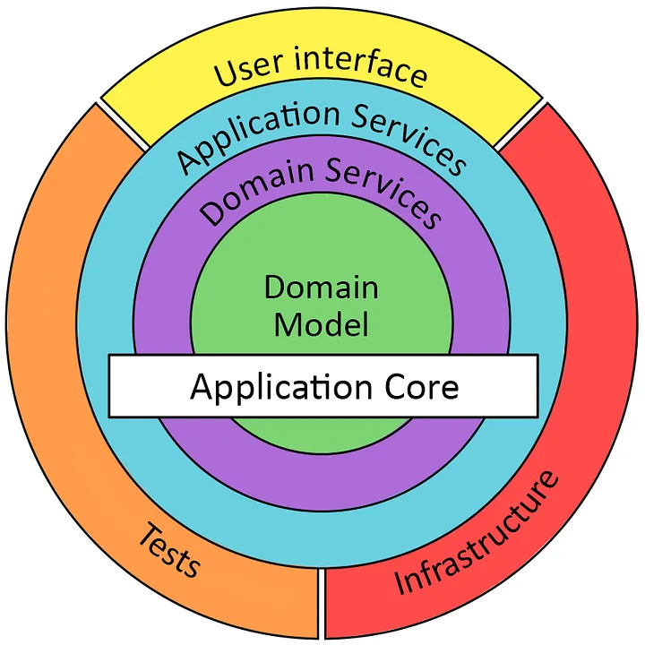

==== 7.6 Модуль. Пример именования

Модули внутри модели - это суть контейнеры для некоторой группы объектов проедметной области, которые тесно связаны друг с другом. Цель модулей – ослабление связей между классами в различных модулях, т. е. создание link:sn002_modularity.adoc#_4_баланс_между_всеми_тремя_параметрами[high cohesion]. Так как модули в подходе DDD – это неформальные или обобщенные разделы, их следует правильно называть.

Если связность модулей необходима, то нужно бороться за ациклические зависимости между *_одноранговыми_* модулями (одноранговыми называются модули, которые расположены на одном и том же уровне или которые имеют одинаковый вес в проекте).

Например, данное имя проекта идентифицирует ограниченный контекст pfm (Personal Finance Management Application). Ограниченные контексты часто охватывают несколько модулей, потому что обычно сначала объединяют все концепции в одной модели, если не существует четких границ контекстов:
----
com.bankingsystes.pfm
----

После имени проекта следует сегмент, который идентифицирует модуль именно данного bounded context:
----
com.bankingsystems.pfm.domain
----

Все модули модели (одноуровневые) можно поместить именно в этом разделе domain следующим образом:
----
com.bankingsystems.pfm.domain.account
  <<Entity>>BankingAccount
  <<ValueObject>>AccountId
----
