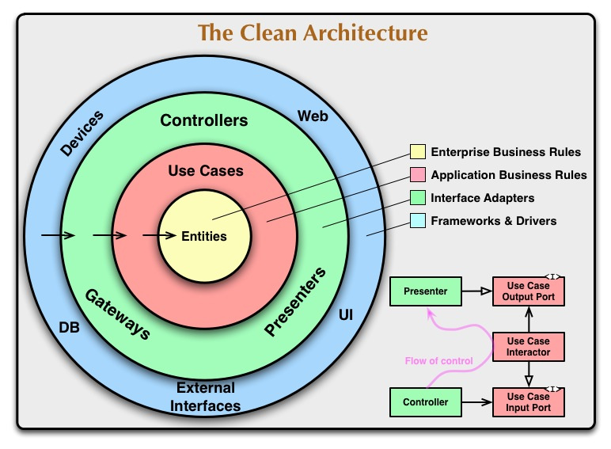

== DDD и Clean Architecture

Подробнее про данную тему написано на habr, link:https://habr.com/ru/companies/mobileup/articles/335382/["Заблуждения Clean Architecture"].

*Content:*

- 1. Введение в Clean Architecture (link:#_1_введение_в_clean_architecture[тык])
- 2. Вариант Clean Architecture от Fernando Cejas (link:#_2_вариант_clean_architecture_от_fernando_cejas[тык])
- 3. "Разворот" Onion/Clean-architecture (link:#_3_разворот_onionclean_architecture[тык])
  * 3.1 Транзакция в UseCases
  * 3.2 Entities и JPA - совместимы ли (rich vs anemic)?
- 4. Доступ к Repository/Gateway только через Interactor? link:#_4_доступ_к_repositorygateway_только_через_interactor[тык])
- 5. Маппинг между слоями - не всегда обязателен link:#_5_маппинг_между_слоями__не_всегда_обязателен[тык])
  * 5.1 Маппинг DTO на каждом слое
  * 5.2 Использование DTO из слоя Enitities
- 6. Маппинг в Interactor’e недопустим - внутренний слой должен получать "удобные" данные link:#_6_маппинг_в_interactore_недопустим__внутренний_слой_должен_получать_удобные_данные[тык])

=== 1. Введение в Clean Architecture

В 2011-12 годах Robert Martin (также известный как Uncle Bob) описал принцип "чистой архитектуры". И ввел свою схему для clean architecture:

Uncle Bob выделяет 4 слоя:

- *Frameworks*. Внешний слой, тут лежит все остальное: UI, БД, http и т.п.
- *Interface Adapters*. Адаптеры между Use Cases и внешним миром. Сюда попадают Presenter’ы из MVP, а также Gateways/Repositories.
- *Use Cases (Interactors)*. бизнес-логика, юзкейсы приложения.
- *Entities*. Бизнес-объекты с бизнес-логикой внутри.

Данная архитектура подчиняется следующими правилам:

- 1) Слои подчиняются Dependency Rule, то есть внутренние слои не должны зависеть от внешних. Имена сущностей (классов, функций, переменных, чего угодно), объявленных во внешних слоях, не должны встречаться в коде внутренних слоев. Это правило позволяет строить системы, которые будет проще поддерживать, потому что изменения во внешних слоях не затронут внутренние слои.
- 2) Переходы между слоями осуществляются через Boundaries. Это нужно, чтобы внутренний слой не зависел от внешнего. Оба интерфейса относятся к внутреннему слою (внимание на цвет). Чтобы зависимость была направлена в сторону обратную потоку данных, применяется принцип инверсии зависимостей (буква D из аббревиатуры SOLID). То есть, вместо того чтобы UseCase напрямую зависел от Presenter’a (что нарушало бы Dependency Rule), он зависит от интерфейса в своём слое, а Presenter должен этот интерфейс реализовать. Та же схема работает и в других местах, например, при обращении UseCase к Gateway/Repository, первый использует интерфейс, который лежит в его слое. *_Таким образом, Repository Interfaces могут лежать в слое "Use Cases"_*:

- 3) Данные, передаваемые между слоями, должны быть в форме более удобной для внутреннего слоя. Т е маппинг для слоя "Use Cases" должен происходить в "Interface Adapters", например. Маппинг для Domain Services/Entities - в Use Cases.

=== 2. Вариант Clean Architecture от Fernando Cejas

В В Android-сообществе Clean Architecture стала достаточно популярной после статьи Fernando Cejas link:https://fernandocejas.com/2014/09/03/architecting-android-the-clean-way/[Architecting Android...The clean way?]. Вот только Fernando приводит вовсе не "луковый" стиль clean-архитектуры, а, скорее, похожий на "слоистый":

Это уже более похоже на более простые веб-приложения, чей поток взаимодействия выглядит как "Request-Logic-DB-Logic-Response".

Глядя на схему, можно подумать, что автор уменьшил количество слоев до трёх. Но это не так. Если разобраться, то в Domain Layer находятся как Interactors (это другое название UseCase’ов), так и Entities. Кроме того, видится, что между Data Layer и Domain Layer находятся Boundaries. Это очень хорошо подходит к правилу 2 clean architecture из предыдущего пункта (предыдущая картинка).

=== 3. "Разворот" Onion/Clean-architecture

Если рассмотреть представления архитектуры из 1 и 2 пунктов выше, то получится очень интересная штука. Оказывается, "слоистую" clean-architecture можно получить из луковой clean-architecture путем разворота ее "луковичных колец":

Цвета обозначают слои, стрелка внизу - Dependency Rule. На получившейся схеме уже проще представить себе течение данных от UI к БД или серверу и обратно. Но давайте сделаем еще один шаг к линейности, расположив слои по категориям:

Если сравнить получившуюся схему со link:#_2_вариант_clean_architecture_от_fernando_cejas[схемой Fernando], то мы понимаем что они во многом схожи. И тогда получается, что в Domain части у нас находятся и UseCases и Entities.

Такая схема воспринимается проще, поскольку обычно данные/запросы/события в приложениях ходят от UI к backend’у или БД и обратно. В случае clean architecture на переходах между слоями (отмеченными разным цветом) используются Boundaries (в виде пунктирных линий), описанные ранее. Давайте отобразим этот процесс:

В видео выступлении Uncle Bob’a появляется схема, отдаленно напоминающая нашу. Но если на нашей схеме изображены слои, то в схеме Robert Martin - классы и зависимости. Это делает более понятным, что "пихать" в тот или иной слой:

- Двойные линии на его схеме - суть границы между слоями.
- Разделение между слоями Entities и UseCases/Interactor не показаны, так как в видео основной упор делался на том, что вся логика (приложения и бизнеса) отгорожена от внешнего мира.
- Bondaries и Gateway это опять же те же самые границы между слоями.
- Request/ResponseModel – обычное DTO для передачи данных между слоями. Согласно dependency rule они должны лежать во внутреннем слое, что мы и видим на картинке.
- Controller - для работы с рест api
- Presenter - слой для работы с UI, обычно не нужен на бэке. Актуален для десктоп/мобильных приложений, где фронт и бэк могут лежать в одном месте (ViewModel и View).

В слое UseCases находятся не только Interactor’ы, но также и Boundaries для работы с Controllers, интерфейс для работы с Repository, DTO для запроса и ответа.

==== 3.1 Транзакция в UseCases

И здесь же мы получаем ответ на еще один вопрос - если идет взаимодействие с БД, то где писать транзакции? Да, хорошо если транзакция начинается в слое Controllers - в ControllerService или чем-то подобном. Но а если транзакционность определяется только во внутренних слоях? Не нарушает ли это принцип dependency rule? И здесь можно всопмнить, что UseCase - вариант использования - вполне может быть транзакционным. Банальный пример - обновление аггрегата. И в этом плане писать *_@Transactional_* внутри UseCase’а - это не нарушение правил а вполне себе следование бизнес-требованиям.

==== 3.2 Entities и JPA - совместимы ли (rich vs anemic)?

Вообще, если более глубокий слой не знает о менее глубоком, и Entities якобы не зависит от рализации БД, то на практике это как минимум плохо вяжется с JPA/Hibernate. И, в действительности, если приложение не очень сложное, то нет ничего плохого в аннотациях JPA в классах-entities.

C другой стороны, изначально Entity - это бизнес объект _(ага, POJO из БД)_, который может быть объектом с методами или набором структур и функций _(а это уже нифига не POJO)_. То есть получается, что, по задумке Uncle Bob’а, *_Entities - не просто объекты с данными. Entities могут содержать ссылки на объекты с данными, но основное их назначение в том, чтобы реализовать методы бизнес-логики, которые могут использоваться в различных приложениях_*.

Однако не предыдущей картинке Gateways возвращают Entities, так в чем проблема-то? Оказывается, реализация Gаteway получает данные из БД, и использует их, чтобы создать *структуры данных*, которые будут *переданы* в Entities, которые Gateway вернет. Реализовано это может быть композицией или наследованием (где MyDbDataStructure имеет id и прочие аннотации JPA):
----
class MyEntity { private MyDbDataStructure data; }

class MyEntity extends MyDbDataStructure {...}
----

И в таком виде и JPA и Entities совместимы, однако появляется дополнительный слой абстракции. Все это - для создания Rich-модели, и в таком виде она видится более гибкой и актуальной. Получается, что внешний слой через интерфейс передает данные из БД и конструирует Entities. Dependency rule соблюдено, все отично. Кроме того, надо стараться находить и выделять в Entities высокоуровневую логику из слоя UseCases, где зачастую она оседает по ошибке.

Другое дело, когда Rich-модель вам в проекте не нужна и вы используете anemic (анемичную) model. В этом случае обертка в виде MyEntity над MyDbDataStructure не имеет смысла и вы можете напрямую работать с классами-entities, содержащими аннотации JPA и не содержащими никакой логики в себе. А всю core-логику можете отдать на откуп DomainServices.

=== 4. Доступ к Repository/Gateway только через Interactor?

В идеале использовать Repository нужно только через Interactor. Но нет ничего такого, чтобы в простых случаях, когда не нужно никакой логики обработки данных, попросту вызывать Repository из Controller’а, минуя Interactor/Domain Service. Это не нарушает dependency rule, поскольку оба компонента находятся в одном слое Interface Adapters. Не сложно добавить Interactor при необходимости, а иметь много UseCases, который просто проксирует запрос от Controller’а к Repository, - такая себе идея.

Другой случае, если интерфейс репозитория находится в доменном слое (пример - Spring JPA интерфейсы). Тогда в любом случае получется обращение к доменному слою.

=== 5. Маппинг между слоями - не всегда обязателен

Есть утверждение, что каждый слой имеет свои DTO и маппить нужно обязательно. Но это может выродиться в дублирование одних и тех же классов. А можно использовать DTO из слоя Entities везде во внешних слоях. Это не нарушает Dependency Rule. Каждый вариант имеет как плюсы, так и минусы.

===== 5.1 Маппинг DTO на каждом слое

1. *(+)* Изменения данных в каком-то слое не затрагивает другие
2. *(+)* Специфические аннотации какой-то библиотеки (Jpa, Spring Validator) не попадут в другой слой
3. *(-)* Может быть много дублирования данных
4. *(-)* При изменении данных все равно приходится менять маппер в другом слое

===== 5.2 Использование DTO из слоя Enitities

1. *(+)* Не дублируется код
2. *(+)* Меньше усилий на разработку
3. *(-)* Присутствие специфических аннотаций, не нужных для других слоев
4. *(-)* При изменении DTO, возможно, придется менять код в других слоях

=== 6. Маппинг в Interactor’e недопустим - внутренний слой должен получать "удобные" данные

В оригинальной статье Uncle Bob'а присутствует принцип:

----
Когда мы передаем данные между слоями, они должны быть в форме наиболее удобной для внутреннего слоя.
----

Поэтому в Interactor данные должны попадать уже в нужном ему виде.
Маппинг происходит в слое Interface Adapters, то есть в Controller и Repository.
