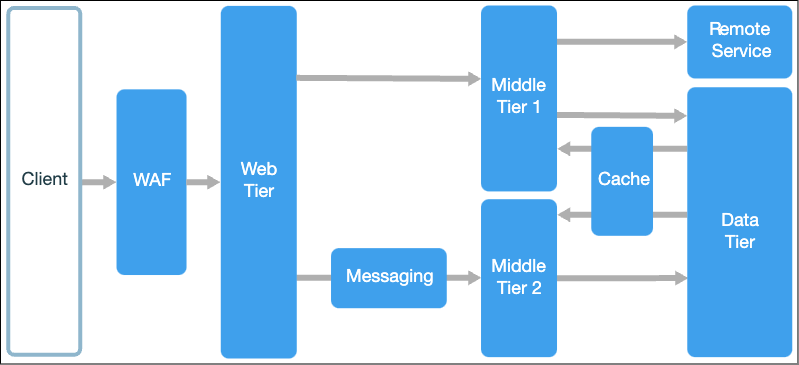
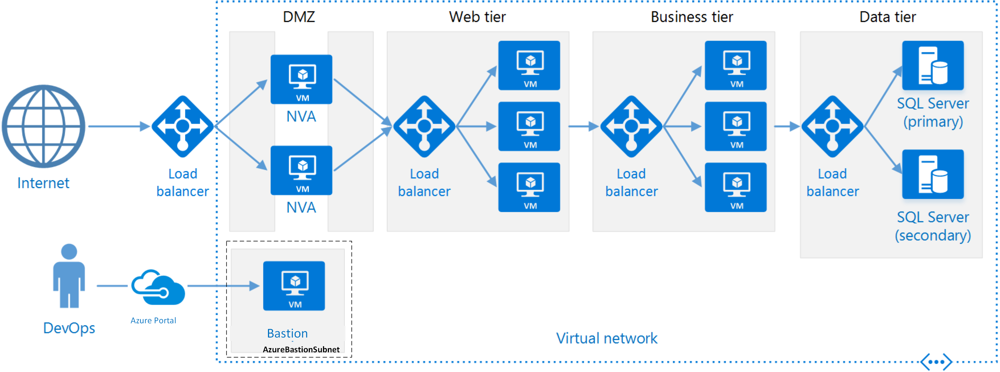

== N-tiered (N-уровневая) Architecture

link:https://learn.microsoft.com/ru-ru/azure/architecture/guide/architecture-styles/n-tier[microsoft]

[cols="2,1"]
|===
|Тип деления модулей |технический
|Кванты |Много
|Deployability |[big yellow]#*2/5*#
|Эластичность |[big yellow]#*2/5*#
|Ремонтопригодность (Maintainability) |[big yellow]#*2/5*#
|Стоимость разработки/эксплуатации |[big green]#*4/5*#
|Производительность |[big yellow]#*2/5*#
|Reliability (надежность) |[big olive]#*3/5*#
|Масштабируемость (Scalability) |[big yellow]#*2/5*#
|Простота |[big green]#*4/5*#
|Тестируемость |[big red]#*1/5*#
|===

Достаточно сложно давать оцентку данной архитектуре, поскольку она стоит несколько особняком. В любом относительно комплексном продукте этот тип архитектуры будет представлен в виде инфраструктурных слоев. Он достаточно прост и не очен дорог, так как стиль активно используется и обычно не вызывает трудностей. Однако сквозной функционал с большим трудом поддается тестированию.

=== 1. Введение

В Layered-архитектуре приложение делится на логические слои. В это же время в *_n-уровневой архитектуре_* приложение разделяется на:

1. И *логические слои*,
2. и *физические уровни*.

Иногда это может быть физически нарезанная Layered-архитектура, но зачастую это инфраструктурные слои.

Слои — это способ распределения функционалом и управления зависимостями. Каждый слой имеет определенный функционал. В более высоком слое могут использоваться службы из более низкого слоя, но не наоборот (*_dependency rule_*).

Уровни разделяются физически путем запуска на разных компьютерах. Каждый уровень может вызывать другой уровень синхронно или асинхронно. Каждый слой можно разместить на отдельном уровне, но вы также можете разместить несколько слоев на одном уровне. Физическое разделение уровней улучшает масштабируемость и устойчивость, но также приводит к увеличению задержки из-за сети.

N-уровневое приложение может иметь архитектуру закрытых и открытых уровней - используется один из следующих типов:

- *Закрытые (строгие) слои* могут отправлять вызовы только к слою, расположенному непосредственно под ним.
- *Открытые (нестрогие) слои* иогут вызывать любые нижнеуровневые слои.

Традиционное трехуровневое приложение содержит уровень представления, средний уровень и уровень базы данных. Средний уровень является необязательным. В более сложных приложениях может быть больше трех уровней. На схеме ниже показано приложение с двумя средними уровнями, которые заключают в себе разные области функций (Tier1/Tier2):

=== 2. Как это выглядит на практике?

В этом разделе описана рекомендуемая n-уровневая архитектура, выполняющаяся на виртуальных машинах. В нашем примере это веб-приложение:

Каждый уровень состоит из нескольких виртуальных машин, размещенных в группе доступности или масштабируемом наборе виртуальных машин. Наличие нескольких виртуальных машин обеспечивает устойчивость в случае сбоя одной виртуальной машины. Для распределения запросов по виртуальным машинам на уровне используются подсистемы балансировки нагрузки. Уровень можно масштабировать горизонтально путем добавления виртуальных машин в пул.

Каждый уровень также размещается в собственной подсети, то есть внутренние IP-адреса подсетей находятся в одном диапазоне адресов. Это упрощает применение правил группы безопасности сети и маршрутизации таблиц к отдельным уровням.

На веб- и бизнес-уровнях состояние не отслеживается. Любые виртуальные машины могут обрабатывать любые запросы для этих уровней. Уровень данных должен состоять из реплицированной базы данных. Для Windows рекомендуется использовать группы доступности AlwaysOn для обеспечения высокого уровня доступности. Для Linux выберите базу данных, которая поддерживает репликацию, например Apache Cassandra.

Группы безопасности сети ограничивают доступ к каждому уровню. Например, к уровню базы данных можно получить доступ только с бизнес-уровня. На схеме выше мы запрещаем прямой доступ по RDP/SSH к виртуалкам. Вместо этого сипользуется специальный узел-Bastion - виртуальная машина в сети, которую администраторы используют для подключения к другим виртуальным машинам.

=== 3. Плюсы и минусы

*Преимущества:*

1. *_Ограниченность контекста_*. При работе над уровнем нужно понимать только нижние уровни и слои.
2. *_Взаимозаменяемость_*. Любой уровень можно заменить эквивалентной  реализацией, не меняя работу с другими уровнями.
3. *_Стандартизация_*. Внесение изменений в уровень может соответствовать стандартам разработки уровня. Можно создать отдельный стандарт для каждого уровня.
4. *_Повторное использование_*. Каждый слой может использоваться несколькими слоями более высокого уровня.
5. *_Относительно низкая стоимость_* т к не происходит перепроектирование имеющихся решений.
6. *_Небольшая кривая обучения_* для большинства разработчиков.
7. Естественный процесс перехода от традиционной модели приложений.

*Недостатки:*

1. Можно легко спроектировать средний уровень, который просто проксирует   CRUD-операции к базе данных, что добавляет дополнительную сетевую задержку без видимых преимуществ.
2. На управление приложением IaaS требуется больше усилий, чем на управление приложением, в котором используются только управляемые службы.
3. Монолитные конструкции препятствуют независимому развертыванию компонентов.
4. Управление сетевой безопасностью в больших системах мжет быть сложным.
5. Доп слои, особенно физически на разных уровнях, снижают производительность.
