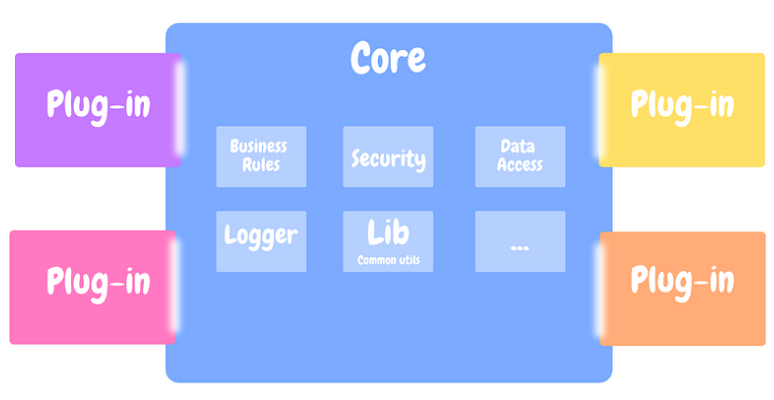
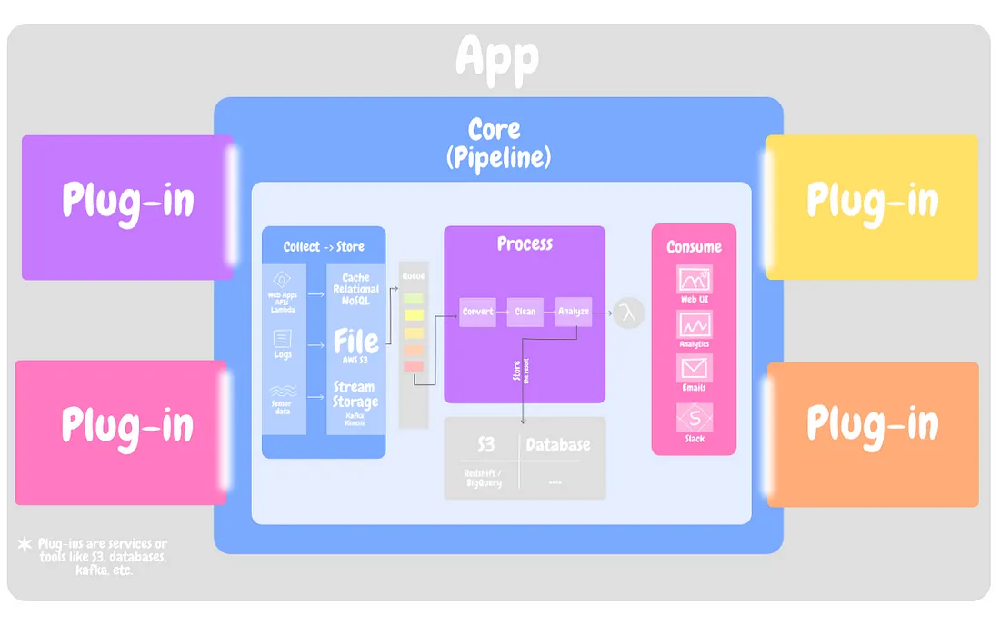

== Microkernel/Plug-in Architecture

*Content:*

- 1. Определение (link:#_1_определение[тык])
- 2. Core System (link:#_2_core_system[тык])
- 3. Plug-In Components (link:#_3_plug_in_components[тык])
- 4. Взаимодействие "Ядро-Плагины"(link:#_4_взаимодействие_ядро_плагины[тык])
- 5. Конфигурации (link:#_5_конфигурации[тык])
- 6. Примеры из реального мира (link:#_6_примеры_из_реального_мира[тык])
- 7. Плюсы и минусы (link:#_7_плюсы_и_минусы[тык])
- 8. Как построить хорошее ядро, Data Pipelines (link:#_8_как_построить_хорошее_ядро_data_pipelines[тык])

link:https://medium.com/omarelgabrys-blog/plug-in-architecture-dec207291800[medium]

[cols="2,1"]
|===
|Тип деления модулей |технический & домены
|Кванты |1
|Deployability |[big olive]#*3/5*#
|Эластичность |[big red]#*1/5*#
|Ремонтопригодность (Maintainability) |[big olive]#*3/5*#
|Стоимость разработки/эксплуатации |[big lime]#*5/5*#
|Производительность |[big olive]#*3/5*#
|Reliability (надежность) |[big olive]#*3/5*#
|Масштабируемость (Scalability) |[big red]#*1/5*#
|Простота |[big green]#*4/5*#
|Тестируемость |[big olive]#*3/5*#
|===

Простота и очень низкая стоимость, но низкая масштабируемость и эластичность - эти аспекты унаследованы от монолитной архитектуры. За счет системы плагинов имеет среднюю производительность/deployability/возможность к развитию. При этом проектировании ядра должно выполняться максимально аккуратно для совместимости с плагинами. Плагины разрабатываются и разворачиваются независимо.

=== 1. Определение

Данный тип архитектуры сам по себе довольно прост в описании - простая монолитная архитектура, состоящая из *ядра системы* (core system, core kernel) и *комонентов-плагинов*. Бизнес-логика разделена между kernel и плагинами, что обеспечивает расширяемость и адаптивность. Также это приводит к изоляции функций приложения (корневой логики) и польовательской логики (плагинов):

=== 2. Core System

Формально, Core System - базовая и даже минимальная функциональность для запуска системы. Нет слшком конкретной реализации функционала, много абстракций. Core System для VsCode, например, - это просто базовый текстовый редактор, который позволяет открывать файлы и изменять текст внутри себя.

В Core System может быть некоторый *"общий рабочий процесс"*, который может, допустим, определять поток данных внутри приложения. Но шаги, которые выполняются внутри этого рабочего процесса, зависят от плагинов. И поэтому все расширяющие плагины будут следовать этому общему потоку, предоставляя свою настраиваемую реализацию.

Если копнуть немного глубже, то ядро также:

- обрабатывает исключительные случаи
- применяет правила
- применяет сложную условную (conditional) обработку.

Это те вещи, которые должны быть реализованы независимо от расширяющего плагина. Например, для VsCode это поддержка кодировок и, в принципе, ввод текста с клавиатуры.

Кроме того, ядро содержит общий код, который может использоваться (или должен использоваться) несколькими плагинами, что позволяет избавиться от дублирующегося кода и иметь "one single source of truth". Например, если два плагина логируют (log) транзакции и сбои, Core System должна предоставлять *_logger_*. Не говоря уже о таких вещах, как безопасность, управление версиями, UI-компоненты, доступ к БД, кэширование и т. д.

=== 3. Plug-In Components

Плагины представляют собой автономные, независимые компоненты, содержащие специализированную обработку, дополнительные функции и пользовательский код, предназначенный для улучшения или расширения базовой системы с целью создания дополнительных возможностей.

Как правило, плагины должны быть независимы от других плагинов. Хотя некоторые подключаемые модули требуют общения с другими плагинами или предполагают их наличие. В любом случае важно, чтобы взаимодействие и зависимость между плагинами были как можно минимальными.

=== 4. Взаимодействие "Ядро-Плагины"

Core System должна знать о (1) расширяемых подключаемых модулях и (2) о том, как к ним получить доступ. Core System объявляет *точки расширения* , к которым могут подключаться плагины. Эти точки расширения, эти хуки часто представляют собой жизненный цикл основной системы.

Каждый плагин регистрируется в ядре, передавая некоторую информацию, такую как имя, протокол связи, обработчики входных/выходных данных, формат данных и подключается к этим точкам расширения.
----
Между ядром и плагинами должен быть четко определенный интерфейс.
----

То, как основная система подключается к этим плагинам, полностью зависит от типа создаваемого приложения (небольшой продукт или крупное бизнес-приложение) и ваших конкретных потребностей (например, единичное развертывание или распределенное развертывание).

=== 5. Конфигурации

Плагинам необходимо объявить о себе базовой системе, подключиться к точкам расширения и передать некоторую информацию.

Это приводит нас к идее *конфигураций*, с помощью которых мы прикрепляем плагин к базовой системе, где определяется все упомянутое выше (точки расширения, протокол связи и т. д.).

----
// Этот плагин подключается к жизненному циклу ядра системы
// и сохраняет события ежедневной деятельности,
// генерируемые ядром, в базе данных.
core.registerPlugin({
   name: 'track-my-activities',
   port: 8081,
   hooks: {
     wakeup: function (time) {
        saveTime("Проснулся в: " + time);
     },
     work: function (time) {
       saveTime("Начал работу в: " + time);
     },
     exercise: function (time) {
       saveTime("Тренируюсь в: " + time);
     }
    }
});
----

Конфигурации не только обеспечивают нам гибкость, но и позволяют визуализировать работу каждого плагина и, возможно, поток данных.

Конфигурации могут находиться в самом коде, быть переданы в CLI-инструмент, либо сохранены в базе данных. Он может быть написан на различных языках, таких как YAML, TOML, JS, JSON, XML и т. д. Кроме того, сама система может поддерживать сложные настройки конфигураций, такие как циклы или условия.

Если интеграция плагина с Core System вызывает проблемы из-за несовместимого интерфейса, то обычно создают *адаптер* между плагином и базовой системой. В этом случае ядру не нужен специализированный код для каждого несовместимого плагина.

=== 6. Примеры из реального мира

Инструменты разработки - Intelij IDEA, Jira, Jenkins и т. д. и Интернет-браузеры, по типу Chrome, являются еще одним примером microkernel-архитектуры: плагины (тот же AdBlock) добавляют дополнительные возможности.

В продуктовой разработке встречается редко.

=== 7. Плюсы и минусы

*Преимущества:*

1. *_Минимальное пространство kernel_*, где находятся самые важные/критические процессы (по сравнению с большим монолитом). Это делает систему более безопасной и повышает ее отказоустойчивость.
2. *_Расширяемость_*. Не изменяя ядро, функционал можно расширить плагинами.
3. *_Надежность_*. При неисправности какого-либо плагина-модуля, система может продолжать работу, так как все критические функции (ввод-вывод текста) - это ответственность ядра.

*Недостатки:*

1. *_Проблемы со скоростью работы_*. Зачастую в microkernel-приложении используется система обмена сообщениями, да и в целом из-за сложного проесса коммуникации с плагинами эта архитектура медленнее стандартных монолитов.
2. *_Сложность разработки и отладки_*. Плагины могут конфликтовать руг с другом. Изменения в kernel могут сломать все интеграции или всю систему целиком.
3. *_Не всегда можно обеспечить приемлемый уровень безопасности_*, поскольку плагины могут иметь доступ к внутренним функциям ядра.
4. *_Ограниченность базовых функций_*. Микроядра ограничены набором базовых функций, а дополнительный функционал (доп функции) реализовать может быть тяжело (несовместимые изменения и проч).

=== 8. Как построить хорошее ядро, Data Pipelines

Core System - это большая проблема данной архитектуры. Ее изменение может сломать или изменить поведение плагина. Поэтому требуется очень продуманный дизайн.

Все, что мы упомянули, начиная с определения возможных *_точек расширения_*, подключения ядра к плагину, управления версиями и обеспечения соблюдения бизнес-правил ядром, — все это усложняет реализацию этого шаблона. В итоге вы получите сложную базовую систему, полную множества условий if-else, независимость плагинов больше не будет характерной чертой, а изменение одной строки кода потребует целого арсенала аналитиков, разработчиков и тестировщиков.

Поэтому для построения ядра можно использовать *Data Pipelines*, они же *_конвейеры данных_*.

Мы также можем воспользоваться преимуществами plugin-архитектуры, инкапсулирующей три этапа конвейера: хранение, обработка, потребление. Эти три этапа составляют ядро системы, в то время как источник данных, хранилище, процессоры, потребители, - все эти сервисы и инструменты могут быть подключены к конвейеру.

Это значит, что каждый конвейер настраивается. Мы определяем, откуда поступают данные, предоставляем код для их обработки и определяем, кто будет потреблять конечный результат. Это очень хорошо работает, если нам нужно работать с разными типами данных, поступающих из разных источников, и обрабатывать их по-разному:

