== Event-Driven Architecture

*Content:*

- 1. Определение
- 2. Модели реализации EDA
- 3. Уникальные возможности EDA
  * 3.1 Broadcast
  * 3.2 Отзывчивость для пользователя
- 4. Топология рабочего процесса EDA
  * 4.1 Топология брокера. Плюсы и минусы
  * 4.2 Топология медиатора. Плюсы и минусы
- 5. Технические практики EDA
- 5.1 Обработка ошибок. DLQ и Workflow Processor. Пример DLQ Kafka (с кодом)
- 5.2 Предотвращение потери данных (data loss)
- 5.3 Транзакционное отправление сообщений
- 5.4 Claim-Check (Проверка утверждения)
- 5.5 Event-Carried State Transfer (Передача состояния через события)

link:https://learn.microsoft.com/en-us/azure/architecture/guide/architecture-styles/event-driven[ссылка - microsoft]

[cols="2,1"]
|===
|Тип деления модулей |технический
|Кванты |1 - Много
|Deployability |[big olive]#*3/5*#
|Эластичность (резкая нагрузка) |[big olive]#*3/5*#
|Ремонтопригодность (Maintainability) |[big lime]#*5/5*#
|Стоимость разработки/эксплуатации |[big olive]#*3/5*#
|Производительность |[big lime]#*5/5*#
|Reliability (надежность) |[big lime]#*5/5*#
|Масштабируемость (Scalability) |[big lime]#*5/5*#
|Простота |[big red]#*1/5*#
|Тестируемость |[big yellow]#*2/5*#
|===

Архитектура достаточно сложна в использовании и тестировании - поэтому оценка этих аттрибутов качества на низком уровне. Нужно учитывать много проблем: согласованность в конечном счете (и как с ней работать), идемпотентность, обработка ошибок и т. д. Тестирование асинхронного потока будет очень сложным.

Зато мы получаем максимальную производительность, масштабируемость и отказоустойчивость.

=== 1. Определение

*_Event-Driven Architecture_*, или *_архитектура, управляемая событиями_*, - это стиль архитектуры, который используется для создания высокомасштабируемых и производительных приложений. Это распределенная асинхронная архитектура - она состоит из сильно развязанных компонентов, общающихся через события. Эта архитектура может быть частью другой - например, микросервисной.

Архитектура, управляемая событиями, состоит из *поставщиков событий* (event producers), которые генерируют поток событий, и *потребителей событий* (event consumers), которые прослушивают события.

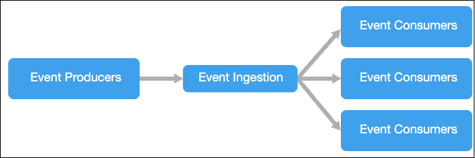

События доставляются практически сразу же, поэтому потребители мгновенно реагируют на события по мере их возникновения. Производители отделены от потребителей — производитель не знает, какие потребители его слушают. Потребители независимы, и каждый потребитель видит все события. Это отличается от шаблона *_"Конкурирующие потребители"_*, где потребители извлекают сообщения из очереди, и сообщение обрабатывается только один раз одним потребителем.

=== 2. Модели реализации EDA

Event-Driven architecture может использовать модель "публикации и подписки" (также называемая pub/sub) или модель потока событий (Event streaming). Также существует менее распространенный шаблон Queue, он же "конкурирующие потребители":

1. *Pub/sub*. Инфраструктура обмена сообщениями отслеживает подписки. Каждое новое событие отправляется всем подписчикам, после чего исчезает из памяти. После получения события его нельзя повторно воспроизвести, а новые подписчики не видят старые события. Потребители получают собственную копию сообщения для обработки (в отличие от queue, где сообщения извлекаются из очереди), но после потребления сообщения всеми потребителями оно удаляется. +
+
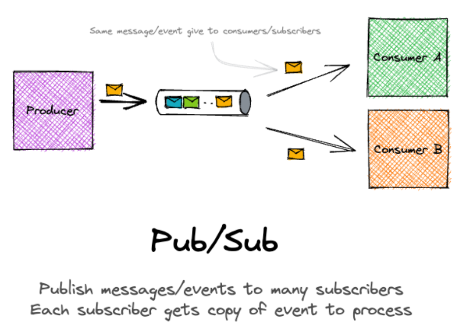

2. *Event streaming*. События записываются в журнал. События строго упорядочены в пределах каждого раздела (партиции, секции) и сохраняются в течение определенного времени (н-ко дней или часов). Клиенты не подписываются на поток, вместо этого они считывают события из любой его части. Каждый клиент самостоятельно управляет своей позицией (оффсетом, смещением) в потоке. Это означает, что новый клиент может потребить старые события или старый клиент может получить уже обработанные события повторно. +
+
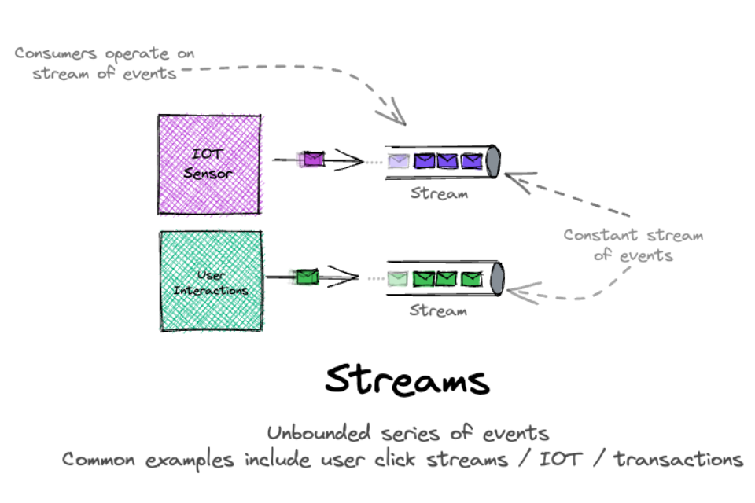

3. *Queue (конкурирующие потребители)*. Сообщения помещаются в очередь, и потребители используют сообщения для их обработки. Сообщения подтверждаются по мере их получения и удаляются после обработки. Сообщения могут потребляться многими потребителями, что дает вам возможность обрабатывать сообщения параллельно (конкурирующие потребители). Реальным примером данного шаблона может служить очередь в магазине. +
+
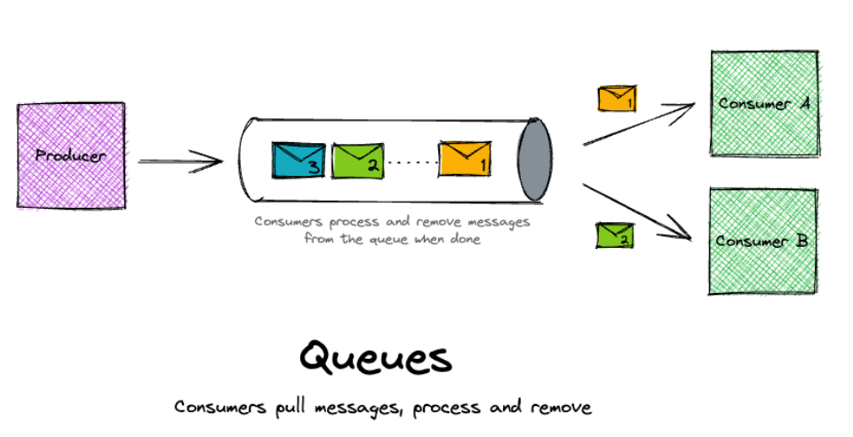

С точки зрения *_потребителя_* есть несколько популярных вариантов реализации:

1. *Простая обработка событий*. Событие немедленно запускает действие в потребителе. Например, вы можете использовать Azure Functions с триггером Service Bus, чтобы функция выполнялась всякий раз, когда сообщение публикуется в теме Service Bus.

2. *Базовая корреляция событий* (зависимость событий друг от друга). Потребителю необходимо обработать небольшое количество дискретных бизнес-событий, обычно связанных некоторым идентификатором, сохраняя некоторую информацию из более ранних событий для использования при обработке более поздних событий. Этот шаблон поддерживается библиотеками, такими как NServiceBus и MassTransit.

3. *Обработка сложных событий*. Потребитель обрабатывает ряд событий, ища закономерности в данных событиях. Например, вы можете саггрегировать показания некоторого устройства за определенный промежуток времени и сгенерировать уведомление, если скользящее среднее выше порогового значения. Пример технологии - Azure Stream Analytics.

4. *Обработка потока событий*. Event Stream Processing состоит из двух технологий. Первая технология — это система для хранения событий, вторая — ПО для обработки этих событий. В качестве первого зачастую используется платформа потоковой передачи данных, например Azure IoT Hub или Apache Kafka, как конвейер приема событий и передачи их потоковым обработчикам. Потоковые процессоры (это могут быть отдельные микросервисы) - вторая часть архитектуры - обрабатывают или преобразуют поток. Этот подход хорошо подходит для рабочих нагрузок IoT.

=== 3. Уникальные возможности EDA

==== 3.1 Broadcast

Уникальная возможность EDA - это возможность транслировать события без знания того, кто получает сообщение и как оно далее обрабатывается. Добавление нового консьюмера не влияет на продюсера. Это очень эффективный уровень развязанности.

Broadcast, наверное, один из самых эффективных видов развязанности. Производитель ничего не знает о том, кто будет читать его данные и, что с ними делать. Добавление нового потребителя ни как не повлияет на производителя.

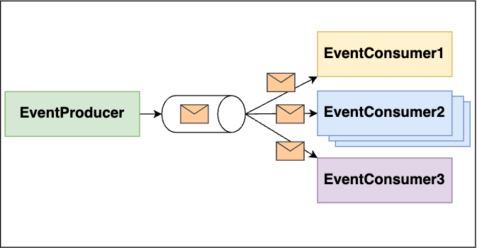

==== 3.2 Отзывчивость для пользователя

EDA предлагает уникальную (в сравнению с другими стилями архитектуры) возможность - опору исключительно на асинхронную связь как для обработки *_fire and forget_* (ответ не требуется), так и для обработки *_request/replay_* (ответ требуется от потребителя события) коммуникации. И это может сделать систему более отзывчивой для пользователя. Рассмотрим пример двух запросов - через REST и через Kafka:

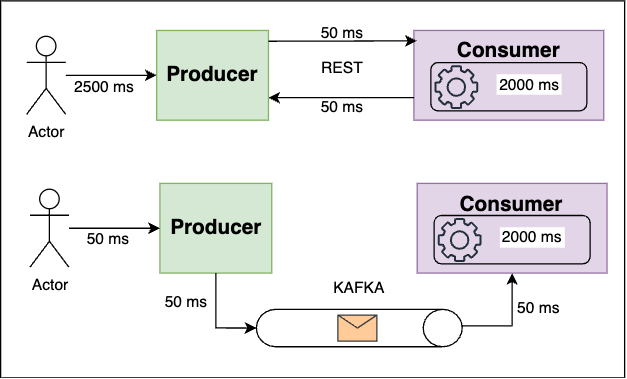

В случае REST-эндпоинта мы ждем 2.1 секунды, в случае Kafka - 0.1 секунду. При этом итоговая производительность не изменилась. Консьюмер-сервис как обрабатывал комментарий за 2000 миллисекунд так и обрабатывает. Но UX заметно улучшился.

Но у всего есть недостатки - и в случае с таким подходом пользователь не увидит или не сразу увидит итоговый результат. Что если сообщение не прошло валидацию или не смогло быть обработано из-за проблем на консьюмер-сервисе? Обработка ошибок в событийной архитектуре - это вызов для архитектора.

=== 4. Топология рабочего процесса EDA

В EDA можно построить рабочий процесс по разному. Существует два основных подхода к топологии рабочего процесса - топология брокера и топология медиатора. Первая - наиболее распространенная и используется в случае, когда нужна высокая степень производительности и быстрый отклик. Ее очень просто реализовать через обычный брокер сообщений (Kafka). Вторая топология используется в случаях, когда требуется определенный контроль над событиями и их распределением между потребителями/получением из консьюмеров.

==== 4.1 Топология брокера. Плюсы и минусы

Главное отличие от топологии медиатора - нет центрального медиатора событий, поток событий распредееляется по разным топикам. Это хорошо в случае простого потока событий (см пункт 3.1 Broadcast). Но если поток данных сложный, то управлять рабочим процессом тоже становится нетривиальной задачей, и получается что вся логика процесс разнесена по всем компонентам:

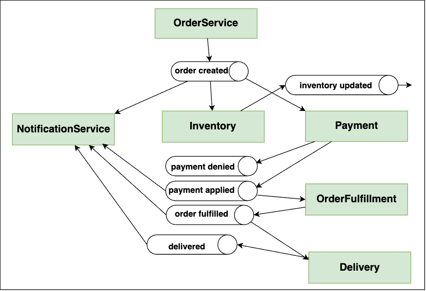

*Преимущества:*

1. *_Сильная развязанность обработчиков событий_*.
2. *_Производительность_*.
3. *_Масштабируемость_*.
4. *_Отказоустойчивость_*.
5. *_Отзывчивость для пользователя_*.

*Недостатки:*

1. *_Сложная обработка ошибок_*.
2. *_Контроль над процессом слабый_*.
3. *_Неконсистентность/несогласованность данных_*.
4. *_Восстанавливаемость низкая_* (если много связанных событий).
5. *_Способность к перезапуску низкая_*.

==== 4.2 Топология медиатора. Плюсы и минусы

Данная топология устраняет некоторые недостатки топологии брокера. Основой служит  *event mediator - посредник событий*, который управляет потоком событий. Медиатор отвечает за инициацию событий, обрабатывает ошибки и т. д. В отличие от топологии брокера, компоненты транслируют события как команды, передающиеся по каналам событий, реализованных согласно модели queue (конкурирующие потребители). Медиатор обеспечивает больший контроль, лучшую распределенную обработку ошибок и потенциально лучшую согласованность данных, но вносит высокую связь между компонентами, и медиатор может стать bottleneck-ом архитектуры.

Основные составляющие данной архитектуры:

- инициирующее событие
- очередь событий
- медиатор (посредник событий)
- каналы (очереди) событий
- обработчики событий

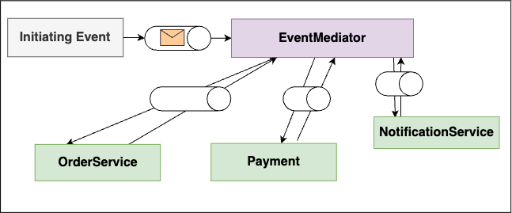

Выбор между медиатором и брокером сводится к компромиссу между управлением рабочим процессом и возможностью обработки ошибок, с одной стороны, и высокой производительностью и масштабируемостью, с другой. Очевидно, что у медиатора масштабируемость и производительность не так хороши, как у брокера, хотя все еще на высоком уровне.

Медиатор можно реализовать разными технологиями:

1. Для простых бизнес-процессов: *_Apache Camel_*, *_Spring Integration_*, *_Mule ESB_*
2. Для сложных бизнес-процессов на основе BPM (с наличием ручных шагов): *_Camunda_*, *_jBPM_*
3. Для сложных бизнес-процессов на основе link:https://habr.com/ru/companies/softmart/articles/273281/[BPEL] (BPEL - xml-язык - устарел, вытесняется BPMN-ом): *_Apache ODE_*

Если выбрать Apache Camel для сложных бизнес-процессов с ручными шагами, то можно получить много головняка в разработке (многое придется писать самим). А если для простых рабочих процессов выбрать BPM - это будет перебор, т к много времени будете разбираться с самим инструментом.

Реализации топологии медиатора обычно дают возможность создавать несколько медиаторов, а также вложенные медиаторы. Обычно вложенные медиаторы связаны с определенным доменом/группой событий. Это уменшает риски единой точки сбоя и увеличивает общую производительность/пропускную способность системы:

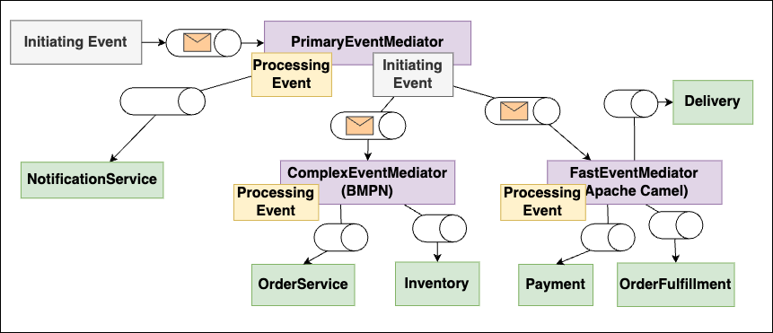

*Преимущества:*

1. *_Высокий контроль бизнес-процесса_*.
2. *_Обработка ошибок_*.
3. *_Восстанавливаемость высокая_*.
4. *_Способность к перезапуску_*.
5. *_Согласованность данных лучше, чем в случае с брокером_*.

*Недостатки:*

1. *_Более связанная архитектура_*.
2. *_Производительность ниже_*.
3. *_Масштабируемость ниже_*.
4. *_Отказоустойчивость ниже_*.

=== 5. Технические практики EDA

=== 5.1 Обработка ошибок. DLQ и Workflow Processor. Пример DLQ Kafka (с кодом)

Произошла ошибка обработки сообщения - что дальше? Допустим мы попытаемся обработать ее консьюмером - но тогда остальные соощения в очереди станут. Хороший паттерн - workflow processor. Консьюмер делегирует обработку ошибки ему и переходит к дальнейшему потреблению событий.

В свою очередь, WP разбирается с ошибкой. Возмжно, замораживает сообщение на определенный срок (пример - ошибки 503 от внешнего сервиса). Также он может поправить сообщение. После чего WP отправляет сообщение обратно в очередь потребителю. +
Если коррекция или ожидание невзможно - то сообщение отправляется в  dlq для разбора:

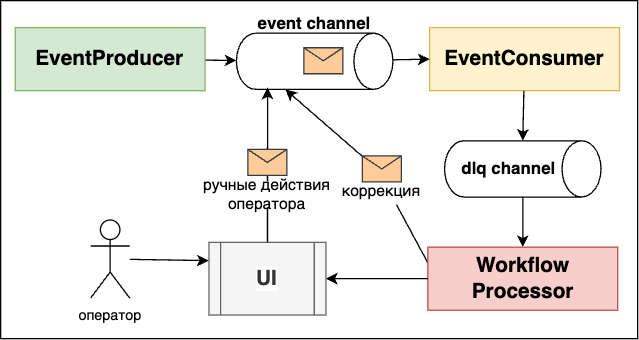

Хотя зачастую вместо workflow processor используется прямая отправка в dlq, и потом dlq consumer вытаскивает эти сообщения и обрабатывает в отрыве от основного консьюмера:

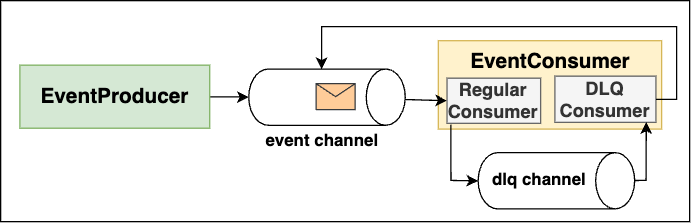

Пример работы dlq в той же kafka - есть некоторый delay между обработкой сообщений из dlq. Если к нам пришли сообщения слишком рано, то мы вызываем "negative acknowledge" со временем засыпания. При этом проставляется header количества retry при отправке сообщения в dlq-топик (или инкрементится уже существующий header), чтобы количество повторных обработок было ограниченным:

[source, java]
----
acknowledgment.nack(0, dlqDelay);
----

Пример с пачкой сообщений (можно и с одним сообщением, тогда вызывается `nack(Duration sleep)` - см link:https://docs.spring.io/spring-kafka/docs/current/api/org/springframework/kafka/support/Acknowledgment.html[доку]):

[source, java]
----
void processDlqMessages(
    List<ConsumerRecord<String, T>> records,
    Acknowledgment acknowledgment) {

    // ищем самое новое сообщение в пачке
    Instant lastAttempt = records.stream()
        .min(Comparator.comparingLong(ConsumerRecord::timestamp))
        .map(record -> Instant.ofEpochMilli(record.timestamp()))
        .orElseThrow(() -> new RuntimeException("No messages!"));

    // рано ли еще обрабатывать эту пачку или нет?
    if (Instant.now().minus(dlqDelay).isBefore(lastAttempt)) {
        // вызываем "negative acknowledgement" - пачка будет повторно
        // доставлена после периода ожидания, равного dlqDelay
        acknowledgment.nack(0, dlqDelay);
        return;
    }

    // фильтруем сообщения, у которых кол-во retry выше лимит
    records = filterRecordsByAttemptsCountHeader(records);

    // Если опять ошибка - инкрементим хидер в сообщении
    process(records); // и опять отправляем в dlq
    acknowledgment.acknowledge();
}
----

Вариант с DLQ и временем ожидания, например, хорошо ложится на ситуации с недоступностью той или иной системы. В headers сообщения записывается количество ретраев, которые произошли, если оно меньше чем лимит, то в случае неудачной обработки dlq-процессором сообщение опять отправляется в dlq.

=== 5.2 Предотвращение потери данных (data loss)

Существует четыре проблемы работы с сообщениями:

1. Сообщение не попадает в очередь из продюсера и продюсер продолжает слать сообщения. +
*РЕШЕНИЕ:* *Synchronous send*. Очередь блокируется, пока брокер не подтвердит, что сообщение получено.

2. Брокер не гарантирует отправку сообщения консьюмеру (pod брокера умер) +
*РЕШЕНИЕ:* *Persistent queues*. Брокер сохраняет сообщения не только в оперативную память, но и на диск. При выходе пода брокера из строя сообщения не будут потеряны.

3. Консьюмер забирает сообщение из очереди и умирает (pod) в процессе обработки события +
*РЕШЕНИЕ:* *Client acknowledge mode*. Консьюмер должен дать подтверждение, что сообщение обработано, и пока он не подтвердит это, он не берет в обработку следующие сообщения. +
Кроме того, существует протокол "*LSP*" - *last participant support*. В чем смысл: при вычитке сообщения из очереди последняя блокируется за консьюмером, который сообщение прочитал. При подтверждении обработки консьюером происходит смещение на новое сообщение (offset) либо же сообщение удаляется из очереди.

4. Консьюер не может сохранить сообщение в БД из-за какой-то ошибки. +
*РЕШЕНИЕ:* Используются ACID-транзакции. Но что если мы сообщение сохранили, а коммит оффсета не произошел. В этом случае нам поможет *идемпотентность консьюмера*. В случае прихода дубликата мы узнаем об этом и не обрабатываем сообщение.

=== 5.3 Транзакционное отправление сообщений

Есть два способа транзакционной отправки сообщения. Первый состоит из трех паттернов. Рассмотрим их:

Существует два способа сохранения сообщений в БД:

- *Transactional outbox*
- *Database triggers*. Триггер БД вставляет события в таблицу EVENTS, которая вытаскивается отдельным процессом отпраки событий. Работает точно так же, как и transactional outbox, просто события мы не сами сохраняем в таблицу в нашей же транзакции, а БД сама вставляет их. Плюсы и проблемы такие же.

Эти два способа комбинируются с *Polling publisher* - процесом опрашивания таблицы исходящих сообщений БД.

Также есть второй, независимый способ обеспечения транзакционности сообщений:

- *Transaction log tailing*

Мы ничего дополнительно не сохраняем ни в какую outbox-таблицу. Вместо этого происходит чтение transaction log БД и ретрансляция вычитанных сообщений в брокер сообщений. Это требует отдельного механизма, и решение обычно уникальное для каждой БД.

=== 5.4 Claim-Check (Проверка утверждения)

link:https://learn.microsoft.com/ru-ru/azure/architecture/patterns/claim-check[ссылка - microsoft]

Брокеры оптимизированы для управления множеством небольших по объему сообщений и часто имеют ограничения на размер сообщения. Большие данные (изображения, звуковые файлы и т. д.) могут снизить производительность системы или выйти за лимиты размера. +
Вместо отправки байтовых данных в сообщении - отправьте ссылку на данные в БД, например. Ил ссылку на данные в S3. Заинтересованная система при необходимости сама сходит в БД и выкачает всю информацию.

image:img/asdasda.png[]

Расшифровка изображения:

1. Полезная нагрузка
2. Сохранение полезных данных в хранилище данных.
3. Создайте ссылку и отправьте сообщение с ним (claimcheck token, маркер проверки утверждений).
4. (4, 5) Получение сообщения из БД.
6. Обработка полученных данных.

=== 5.5 Event-Carried State Transfer (Передача состояния через события)

link:https://prateek-ashtikar512.medium.com/microservices-design-patterns-event-carried-state-transfer-c4b66a58df00[ссылка - medium]

В традиционной монолитной архитектуре у нас есть единая БД. Когда мы переходим к микросервисам, мы также ереходим на несколько БД. Появляется проблема - как поддерживать согласованность данных среди всех микросервисов, когда один из них изменяет данные. Идея шаблона Event Carried State Transfer заключается в том, что когда микросервис вставляет/изменяет/удаляет данные, он создает соответствующее событие. После чего Поэтому заинтересованные микросервисы потребляют его и обновляют свою копию данных соответствующим образом.

Опять же, если данные большие, например, Order, мы можем использовать данный шаблон для повышения производительности. Каждый компонент хранит копию данных. Тот, кто изменяет данные, отправляет события с измененной инфой для апдейта. В результате данные в конечном счете согласованные, а все сервисы обращаются к своим данным, без необходимости ходить по сети в другие сервисы.

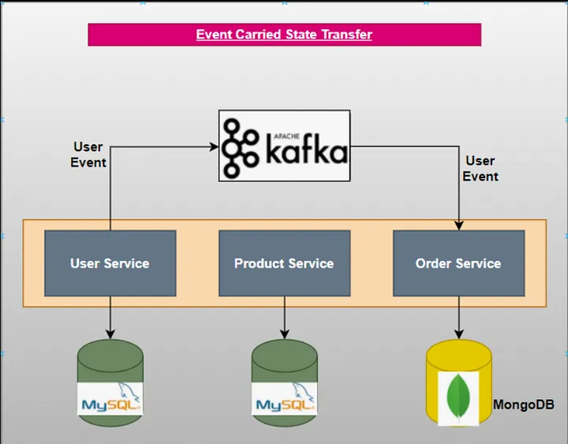