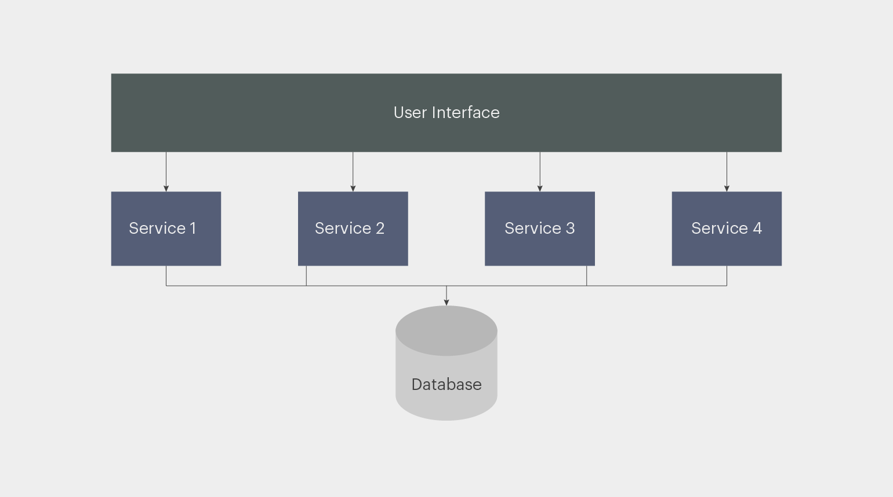
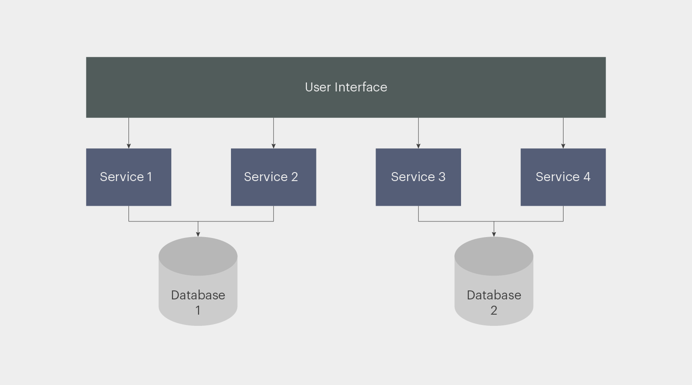
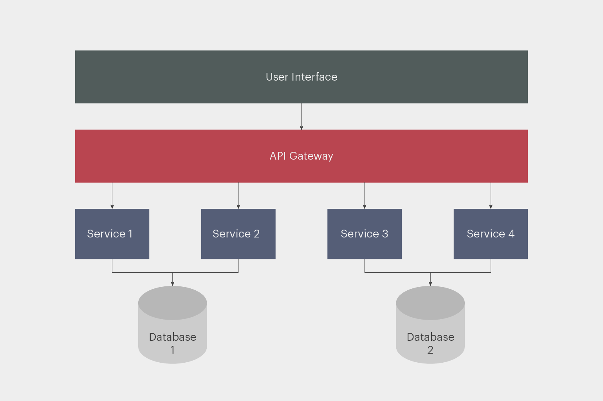

== Service-Based Architecture

link:https://skillbox.ru/media/code/servicebased-architecture-sem-raz-otmer-odin-raz-popili-monolit/[ссылка - skillbox]

[cols="2,1"]
|===
|Тип деления модулей |Доменный
|Кванты |1 - Много
|Deployability |[big green]#*4/5*#
|Эластичность (резкая нагрузка) |[big yellow]#*2/5*#
|Ремонтопригодность (Maintainability) |[big olive]#*3/5*#
|Стоимость разработки/эксплуатации |[big green]#*4/5*#
|Производительность |[big olive]#*3/5*#
|Reliability (надежность) |[big green]#*4/5*#
|Масштабируемость (Scalability) |[big olive]#*3/5*#
|Простота |[big olive]#*3/5*#
|Тестируемость |[big green]#*4/5*#
|===

Service-based архитектура лишена некоторых слабостей микросервисов, но проигрывает в эластичности. А ещё она менее масштабируемая и гибкая. При этом крупные гранулы обеспечивают лучшую согласованность и дают возможность использовать ACID-транзакции вместо BASE-транзакций.

=== 1. Определение

Архитектура на основе сервисов (service-based) является гибридом стиля архитектуры микросервисов и считается одним из самых прагматичных стилей архитектуры, в основном из-за своей архитектурной гибкости. Она не имеет такого же уровня сложности и стоимости, как другие распределенные архитектуры, такие как микросервисы или EDA, что делает ее очень популярным выбором для многих бизнес-приложений.

Основные отличия service-based от microservice — меньшая гранулярность сервисов и отсутствие коммуникации между ними. Количество сервисов, как правило, варьируется от 4 до 12, а их границы совпадают с границами доменов. Микросервисы же исчисляются десятками или сотнями и разделены гораздо детальнее.

Рассмотрим как пример систему заказа билетов в кинотеатре. У нас есть три операции:

- инициализация заказа;
- оплата билетов;
- отмена заказа.

В MSA за каждую из операций мог бы отвечать отдельный микросервис, а в service-based вся логика реализуется в рамках одного сервиса. В service-based архитектуре коммуникация между сервисами сведена к минимуму.

=== 2. Топологии SOA

Базовая топология service-based - это распределенная макроуровневая структура, состоящая из отдельно развернутого UI, отдельно развернутых крупнозернистых сервисов и общей базы данных:

Ипользование централизованной БД - это одна из важнейших постулатов service-based архитектуры. Это позволяет сервисам использовать SQL-запросы и соединения как в монолите, пользуясь преимуществами ACID.

Т.к. сервисная архитектура не накладывает строгих ограничений на топологию развертывания, существует огромное количество вариантов реализации такой архитектуры. На рисунке выше видно, что база данных в базовой топологии — общая. Но для некоторых сервисов или групп иногда выделяют отдельные БД:

Если сервисы вашей системы используют общую базу данных, работающую по принципу ACID, то стоит разделять их схемы. В противном случае вы не сможете развивать их изолированно. Если, дорабатывая один сервис, вы будете обновлять схему БД, это может повлиять на другие сервисы.

Сервисная архитектура позволяет реализовать ACID-транзакции в рамках домена — чего нельзя сказать о микросервисах. Балансировать нагрузку можно с помощью reverse proxy (обратного прокси-сервера), API gateway (шлюза API) или даже на стороне клиента.

К SBA очень легко перейти от монолита. Особенно если при проектировании монолита вы логически выделили модули, которые станут сервисами.

=== 3. Плюсы и минусы

*Преимущества:*

1. *_Хорошая эволюционность_*. Благодаря доменной направленности можно переходить от данной архитектуре к микросервисам или n-tiered архитектуру. где находятся самые важные/критические процессы (по сравнению с большим монолитом). Это делает систему более безопасной и повышает ее отказоустойчивость.
2. *_Изоляция разработки_*. Доменная направленность функционала естественно изолирует части системы и позволяет разделить команды так, чтобы над одним сервисом аботала одна команда. теория ограниченности контекстов (bounded context) в действии!
3. *Отказоустойчивость*. Из-за малого количества (или отсутствия) интеграций надежность на неплохом уровне. Недоступность одного сервиса не влияет (или не сильно влияет) на доступность других. Но всё же, если откажет сервис, будет больнее, чем если откажет микросервис.

*Недостатки:*

1. *_Плохая эластичность_*. Новые экземпляры поднимаются медленно (медленнее микросервисов). Реплицируется больше функциональности, чем при более мелкозернистых микросервисах.
2. *_Изоляция разработки иногда в минус_*. внутри крупнозернистого домена возможно разделение функционала на разные команды: вертикальные, горизонтальные. Сложность взаимодействия между ними растет.
3. *_Масштабируемость гораздо меньше, чем у микросервисов_*.

=== 4. Рассуждения о характеристиках, плюсах и минусах Service-Based Architecture

Архитектура на основе сервисов — это архитектура с *_разделением на домены_*. Каждый сервис ограничен определенным доменом. Изменения, внесенные в этом домене, влияют только на конкретную услугу, соответствующий пользовательский интерфейс и соответствующую базу данных.

*Отказоустойчивость* и *общая доступность* приложений также имеют высокие показатели. Несмотря на то, что доменные сервисы, как правило, крупнозернистые, они обычно автономны и не используют межсервисное взаимодействие из-за совместного использования БД и кода. В результате, если один доменный сервис выходит из строя, это не влияет ни на один из других сервисов.

*Масштабируемость* и *эластичность* — низкие, поскольку при таком архитектурном стиле, реплицируется больше функциональности, чем при более мелкозернистых микросервисах. Не каждая функциональность в одном сервисе должна быть масштабирована. Обычно сервисы существуют в единичном экземпляре, если только нет необходимости в лучшей пропускной способности или отказоустойчивости. Это упрощает поддержку кэширования в памяти и работу с базой данных.

Простота и общая стоимость — два других фактора, отличающих этот архитектурный стиль от других, более дорогих и сложных распределенных архитектур, таких как микросервисы, event-driven architecture или даже space-based architecture. Это делает service-based architecture одной из самых простых и экономически эффективных распределенных архитектур, реализованных в настоящее время.

Архитектуры на основе сервисов, как правило, более надежны, чем другие распределенные архитектуры, из-за *_крупнозернистой природы доменных сервисов_*. Более крупные сервисы означают меньший сетевой трафик между ними, меньше распределенных транзакций и меньший bandwidth в сети, что повышает ее общую надежность.

Архитектура на основе сервисов является естественным решением при проектировании на основе домена. Поскольку сервисы являются крупнозернистыми и имеют область действия домена, каждый домен прекрасно вписывается в отдельно развернутую службу домена. Каждая служба в архитектуре на основе сервисов охватывает определенную область (например, переработку в приложении по переработке электронных материалов), тем самым разделяя эту функциональность в единый блок программного обеспечения, что упрощает внесение изменений в эту область.

Наконец, архитектура на основе сервисов является хорошим выбором для достижения хорошего уровня архитектурной модульности без необходимости запутываться в сложностях и подводных камнях детализации. По мере того, как сервисы становятся более мелкозернистыми, мы используем оркестрацию и хореографию, если несколько сервисов должны быть скоординированы для завершения определенной бизнес-транзакции. Поскольку в текущей архитектуре сервисы, как правило, более крупнозернистые, они не требуют координации так сильно, как другие распределенные архитектуры.