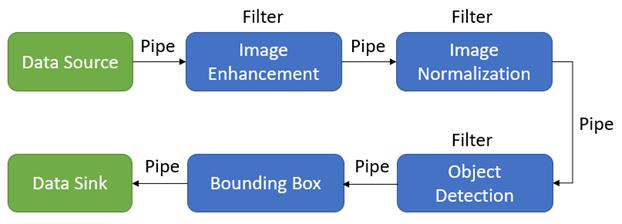
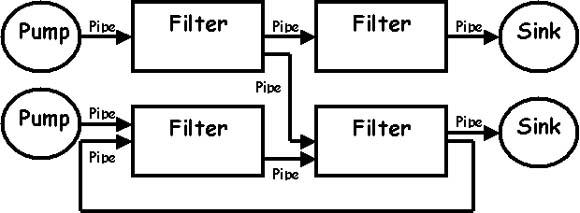
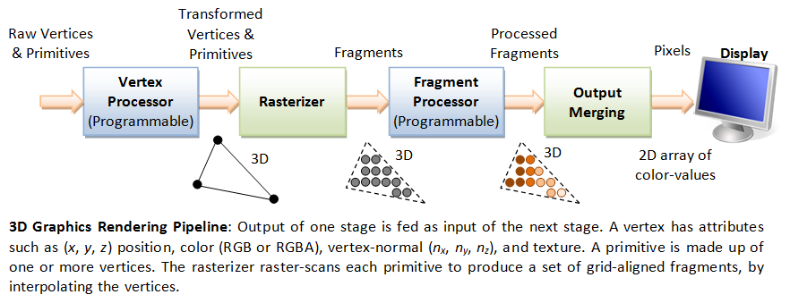
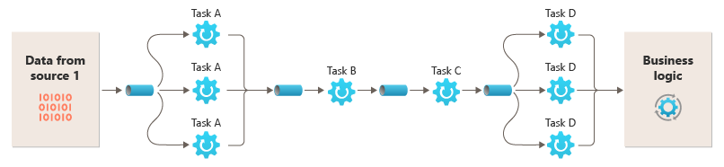
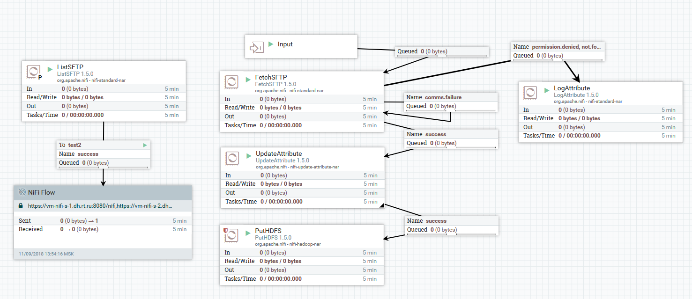

== Pipe & Filter Architecture

*Список ссылок:*

- link:https://learn.microsoft.com/ru-ru/azure/architecture/patterns/pipes-and-filters[microsoft]
- link:https://syedhasan010.medium.com/pipe-and-filter-architecture-bd7babdb908[medium]
- link:https://www.geeksforgeeks.org/pipe-and-filter-architecture-system-design/[geeksforgeeks]
- link:https://medium.com/@tanyuryan/software-architecture-pipe-and-filter-899a7e00c1eb[medium 2]

[cols="2,1"]
|===
|Тип деления модулей |Доменный
|Кванты |1 - Много
|Deployability |[big yellow]#*2/5*#
|Эластичность (резкая нагрузка) |[big red]#*1/5*#
|Ремонтопригодность (Maintainability) |[big olive]#*3/5*#
|Стоимость разработки/эксплуатации |[big lime]#*5/5*#
|Производительность |[big yellow]#*2/5*#
|Reliability (надежность) |[big olive]#*3/5*#
|Масштабируемость (Scalability) |[big red]#*1/5*#
|Простота |[big lime]#*5/5*#
|Тестируемость |[big olive]#*3/5*#
|===

Здесь мы говорим о монолитном pipe & filter приложении. Простота и очень низкая стоимость - эти аспекты унаследованы от монолитной архитектуры. Надежность средняя из-за отсутствия сетевого траффика, но монолит по-прежнему имеет определенные риски развертывания. Эволюционность достигается за счет разделения проблем между различными типами фильтров. Каждый фильтр может быть изменен или заменен без влияния на другие. Развертываемость и тестируемость хорошая из-за модульности фильтров.

=== 1. Определение

Архитектура Pipes and Filter - структурный шаблон, который разбивает процесс на последовательность шагов, называемых *"фильтрами"*, соединенных каналами, называемыми *"трубами"*. Каждый *Filter* отвечает за определенную задачу обработки, например, валидация, аггрегация или преобразование данных. Данные проходят через эти фильтры по *Pipes*, которые *_транспортируют выход одного фильтра на вход следующего_*.

- Эта архитектура повышает модульность, поскольку каждый filter работает независимо и фокусируется на одной функции. Она также способствует повторному использованию, позволяя использовать один фильтр в разных местах (приложения, системы приложений (если речь о микросервисах-фильтрах)).
- Кроме того, архитектура является гибкой и масштабируемой: фильтры можно добавлять, удалять или переставлять с минимальным влиянием на общую систему, а несколько экземпляров фильтров могут работать одновременно для обработки больших объемов данных.
- Данная структура изолирует проблемы внутри одного Pipe, а также относительно проста в обслуживании.

Благодаря организованному и систематическому подходу архитектура Pipe and Filter пользуется популярностью для задач обработки данных, компиляторов и приложений, требующих структурированного и последовательного преобразования данных.

Это специфичный вид монолитной архитектуры будет хорошим выбором в случаях высокой модульности и переиспользования, например, в случаях когда результат работы одного модуля может стать входом другого. Вы уже используете Pipe & Filter, если пишите в функциональном стиле, .

Данная архитектура хорошо совмещается с Event-Driven архитектурой. Хорошей областью применения для такого гибрида может стать обработка  big data. Архитектура позволяет разделить задачи с разным профилем нагрузки: cpu-bound, io bound, ram bound, gpu bound и тд.

=== 2. Структура конвейера и виды фильтров. Примеры

Базовый пример структуры данной архитектуры выглядит вот так:

Более систематезированный и строгий вариант - вот так:

Что мы здесь видим? Во-первых, в этой архитектуре мы можем выделить четыре основных компонента:

1. *Data Source (Pump)* - источник данных. Они вводят данные в систему, запуская поток по pipes.
2. *Data Sink* - приёмник данных. Это конечные точки конвейера, где обработанные данные собираются или используются. Примером может быть вывод на сайт, вызов какой-то внешней системы или сохранение в БД.
3. *Filter* - фильтры, которые выполняют свою независимую задачу (фильтрация, преобразование, аггрегация).
4. *Pipes* - трубы или каналы, по которым данные передаются от одного фильтра к другому. Они соединяют каждый компонент в последовательности, обеспечивая плавную и упорядоченную передачу данных. На схеме pipes показаны в виде стрелок между компонентами.

Во-вторых, на второй схеме также показана параллельная структура, в которой два независимых конвейера идут бок о бок. Каждый конвейер начинается со своего pump, обрабатывает данные через ряд фильтров и заканчивается в отдельном приемнике. Это указывает на то, что архитектура поддерживает параллельную обработку, позволяя обрабатывать различные потоки данных одновременно без помех.

Примером использования такой архитектуры является конвейер рендеринга графики:

=== 3. Принципы проектирования Pipe & Filter Architecture

Архитектура Pipe and Filter придерживается некоторых фундаментальных принципов проектирования, которые обеспечивают ее эффективность, надежность и ремонтопригодностьв:

1. *Каждый фильтр отвечает за одну конкретную задачу*. Изолируя задачи, систему легче разрабатывать, тестировать и поддерживать. Этот принцип гарантирует, что изменения в одной части системы будут иметь минимальное влияние на другие части.
2. *Модульность*. Система разделена на отдельные модули-фильтры. Каждый фильтр представляет собой независимый блок обработки, который может разрабатываться, тестироваться и обслуживаться независимо. Также это модульность упрощает отладку.
3. *Конвейерный параллелизм*. Архитектура поддерживает параллельную обработку, позволяя нескольким экземплярам фильтров работать одновременно. Это повышает производительность системы, позволяя обрабатывать большие объемы данных.
4. *Stateless filters*. Фильтры, как правило, не имеют состояния, то есть они не сохраняют данные между этапами обработки. Это упрощает проектирование и реализацию фильтров и повышает масштабируемость. Фильтры без сохранения состояния можно легко размножить для параллельной обработки.
5. *Обработка ошибок и изоляция неисправностей*. Каждый фильтр должен обрабатывать ошибки внутри себя и обеспечивать передачу на следующий этап только допустимых данных. Неисправности в одном фильтре не должны распространяться по конвейеру, что гарантирует надежность и отказоустойчивость системы. Такая изоляция неисправностей повышает надежность системы. Кроме того, каждый фильтр должен определить, что делать в случае критической ошибки - остановить pipeline или выкинуть исключение наружу.
6. *Надежность данных*. Используйте инфраструктуру, которая гарантирует, что поток данных между фильтрами в канале не теряется.
7. *Message tolerance*. Фильтры должны работать с допустимыми данными, но если данные не подходят для обработки фильтром - фильтр игнорирует эти данные и передает их без изменений в выходном сообщении.
8. *Идемпотентность*. Если фильтр в конвейере завершается сбоем после получения сообщения, а job также выполняется на другом экземпляре фильтра, часть работы может быть завершена. Если job обновляет некоторое глобальное состояние (например, сведения в БД), апдейт может произойти несколько раз. Аналогичная проблема может возникнуть, если фильтр завершается сбоем после публикации результатов в следующий фильтр, но до того, как он указывает, что он успешно завершил свою работу. В таких случаях другой экземпляр фильтра может повторить эту работу, что приводит к тому, что те же результаты будут опубликованы дважды, и следующие фильтры тоже будут работать повторно и бессмысленно. Таким образом, фильтры в конвейере должны быть идемпотентны. Дополнительные сведения про идемпотентность можно посмотреть по ссылке link:https://blog.jonathanoliver.com/idempotency-patterns/[Idempotency Patterns].
9. *Повторяющиеся сообщения*. Если фильтр в конвейере завершается сбоем после того, как он отправляет сообщение на следующий этап конвейера, может быть запущен другой экземпляр этого же фильтра, и он будет публиковать копию того же сообщения в конвейер. Этот сценарий может привести к передаче двух экземпляров одного сообщения следующему фильтру. Чтобы избежать этой проблемы, конвейер должен обнаруживать и устранять повторяющиеся сообщения.

=== 4. Параллельная обработка. Фильтры вместо распределенной транзакции

Возможность запускать фильтры в разных вычислительных экземплярах позволяет масштабировать их независимо и использовать эластичность, которую обеспечивают многие облачные среды. Фильтр, который вычислительный и ресурсоемкий, может работать на высокопроизводительном оборудовании, а другие менее требовательные фильтры могут размещаться на менее дорогих серверах. Фильтры даже не обязаны находиться в одном ЦОДе или иметь единое географическое расположение. Для этих возможностей требуются определенные методы проектирования, такие как обмен сообщениями, многопоточное использование и т. д. для максимальной эластичности каждого канала или фильтра. На этой схеме показан пример, параллельного конвейера:

Если входные и выходные данные фильтра структурированы как поток, вы можете выполнять обработку для каждого фильтра параллельно. Первый фильтр в конвейере может начать работу и вывести результаты, которые передаются следующему фильтру в последовательности.

Использование шаблона каналов и фильтров вместе с шаблоном компенсирующих транзакций является альтернативным подходом к реализации распределенных транзакций. Вы можете разбить распределенную транзакцию на отдельные задачи, способные к компенсации, каждая из которых может быть реализована с помощью фильтра, который также реализует шаблон компенсирующей транзакции. Фильтры можно реализовать в конвейере в виде отдельных размещенных задач, которые выполняются близко к данным, которые они поддерживают.

=== 5. Плюсы и минусы

*Преимущества:*

1. *Улучшенная обработка данных*. Архитектура хорошо подходит для приложений, требующих последовательной обработки данных, таких как преобразование данных, проверка и агрегация.
2. *Простота понимания*. Ясный и линейный поток данных от одного фильтра к другому делает систему простой для понимания и визуализации. Эта простота помогает в проектировании, документировании и коммуникации.
3. *Изоляция неисправностей*. неисправности в одном фильтре изолируются и не распространяются по конвейеру, что гарантирует надежность и отказоустойчивость системы.
4. *Улучшенное тестирование*. каждый фильтр можно тестировать независимо, что упрощает выявление и устранение проблем. Это повышает качество системы и сокращает время, необходимое для тестирования и отладки.
5. *Стандартизация*. Единые интерфейсы для фильтров и pipes способствуют согласованности в проектировании и реализации.
6. *Оптимизация ресурсов*. разбивая обработку на более мелкие, управляемые задачи, система может оптимизировать использование ресурсов. Фильтрам можно выделять ресурсы на основе их конкретных потребностей, что повышает общую эффективность системы.

*Недостатки:*

1. *Накладные расходы на производительность*. Передача данных между фильтрами через каналы может привести к накладным расходам на производительность, особенно если фильтров много или если данные требуют частых преобразований. Это может замедлить общую скорость обработки.
2. *Задержка*. Последовательная природа конвейера обработки может вызывать задержку, особенно в приложениях обработки в реальном времени или с низкой задержкой. Каждый фильтр увеличивает общее время обработки, что может не подходить для задач, чувствительных ко времени обработки.
3. *Обработка сложных ошибок*. хотя изоляция неисправностей является преимуществом, управление ошибками в нескольких фильтрах может стать сложным. Обеспечение того, чтобы каждый фильтр правильно обрабатывал и сообщал об ошибках, может потребовать дополнительных усилий и координации.
4. *Управление состоянием*. Фильтры без состояния проще в реализации, но могут не подходить для всех приложений. Когда необходимо управление состоянием, это может усложнить проектирование и реализацию фильтров, требуя осторожного обращения для поддержания согласованности данных и состояния.
5. *Использование ресурсов*. Эффективное управление ресурсами, такими как память и ЦП, может быть сложной задачей. Фильтры могут иметь различные требования к ресурсам, и их балансировка по всей системе для избежания узких мест и обеспечения эффективного использования может быть сложной.

=== 6. Распространенные варианты использования и применения

- Конвейеры обработки данных
  * _Обработка текста_: конвейеры Unix (например, grep, awk, sed) позволяют объединять команды в цепочку для эффективной обработки и преобразования текстовых данных.
  * _Компиляторы_: используют ряд фильтров для лексического анализа, синтаксического разбора, семантического анализа, оптимизации и генерации кода.

- Потоковая обработка
  * _Аналитика в реальном времени_: такие системы, как *_Apache Flink_*, *_Apache Storm_* и *_Apache Kafka Streams_*, обрабатывают непрерывные потоки данных в реальном времени.
  * _Обработка мультимедиа_: такие фреймворки, как *_GStreamer_*, обрабатывают аудио- и видеопотоки, выполняя такие операции, как декодирование, фильтрация и кодирование.

- Процессы ETL (extract, transform, load)
  * _Интеграция данных_: такие инструменты, как *_Apache NiFi_* и *_Talend_*, выполняют извлечение, преобразование и загрузку данных между различными источниками данных и пунктами назначения.
  * _Очистка данных_: преобразование и очистка данных на нескольких этапах перед загрузкой в базу данных или хранилище данных.

- Микросервисы и сервисно-ориентированные архитектуры (SOA)
  * _Автоматизация рабочих процессов_: микросервисы действуют как фильтры, которые обрабатывают и преобразуют данные при их прохождении через ряд сервисов.
  * _Управление бизнес-процессами (BPM)_: реализация рабочих процессов в виде последовательности этапов обработки, связанных очередями сообщений или API.

=== 7. Примеры из реальной жизни

- Командная строка Unix/Linux:
  * Конвейеры оболочки: оболочки Unix и Linux (например, Bash) позволяют пользователям объединять команды в цепочку с помощью каналов. Например, `cat file.txt | grep «pattern» | sort | uniq` обрабатывает файл с помощью серии команд для фильтрации, сортировки и удаления дубликатов.
- Compilers:
  * GCC (GNU Compiler Collection): GCC обрабатывает исходный код на нескольких этапах, включая предварительную обработку, синтаксический анализ, оптимизацию и генерацию кода. Каждый этап представляет собой фильтр, преобразующий код из одной формы в другую.
- Data Processing Frameworks - фреймворки обработки данных:
  * Apache Flink и Apache Storm: Эти фреймворки обрабатывают потоки данных в реальном времени. Каждый компонент в топологии обработки (map, filter, reduce) действует как фильтр в конвейере.
  * Apache NiFi: инструмент интеграции данных, который автоматизирует поток данных между системами, используя процессоры (фильтры) для преобразования, маршрутизации и управления потоком данных. +

- Media Processing - обработка медиа:
  * GStreamer: мультимедийный фреймворк, который обрабатывает аудио- и видеопотоки с помощью конвейера элементов (фильтров) для таких задач, как декодирование, кодирование и фильтрация.
- Web Development Frameworks - фреймворки веб-разработки:
  * Express.js (Node.js): Middleware в Express.js действует как фильтры, обрабатывающие HTTP-запросы и ответы. Например, ведение журнала, аутентификация и разбор запросов обрабатываются отдельными функциями middleware.
  * ASP.NET Core Middleware: подобно Express.js, ASP.NET Core использует компоненты промежуточного программного обеспечения для обработки HTTP-запросов в конвейере.
- ETL (Extract, Transform, Load) Tools:
  * Talend: инструмент ETL, который использует ряд компонентов для извлечения данных из различных источников, преобразования их в соответствии с бизнес-правилами и загрузки в целевые системы.
  * Apache Hop: платформа интеграции данных с открытым исходным кодом, которая обрабатывает данные с помощью ряда этапов преобразования, обеспечивая сложные рабочие процессы ETL.