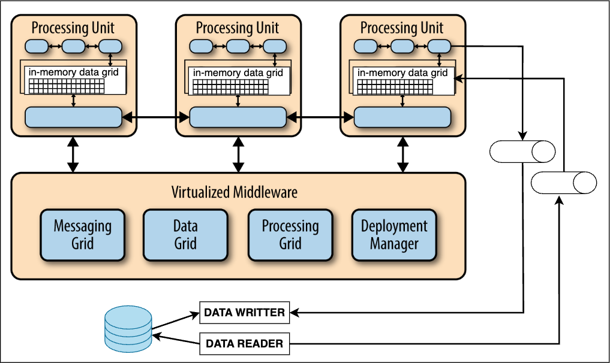
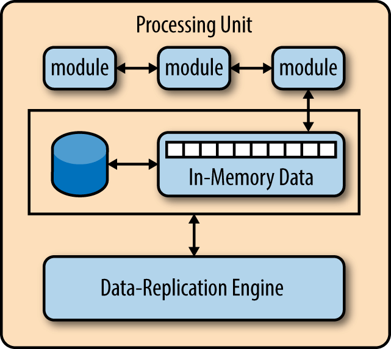

== Space-Based Architecture

*Список ссылок:*

- link:https://www.gigaspaces.com/blog/space-based-data-hub[gigaspaces.com]
- link:https://www.linkedin.com/pulse/software-architecture-space-based-pattern-shanoj-kumar-v-5nknc/[linkedin - хорошая статья, где не все смог внести к себе]
- link:https://www.oreilly.com/content/software-architecture-patterns/[oreilly - общее описание архитектур, хорошие комменты про компоненты Space-Based]

[cols="2,1"]
|===
|Тип деления модулей |Доменный
|Кванты |1 - Много
|Deployability |[big olive]#*3/5*#
|Эластичность (резкая нагрузка) |[big red]#*1/5*#
|Ремонтопригодность (Maintainability) |[big olive]#*3/5*#
|Стоимость разработки/эксплуатации |[big yellow]#*2/5*#
|Производительность |[big lime]#*5/5*#
|Reliability (надежность) |[big green]#*4/5*#
|Масштабируемость (Scalability) |[big lime]#*5/5*#
|Простота |[big red]#*1/5*#
|Тестируемость |[big red]#*1/5*#
|===

$${\color{red}Тестируемость}$$

Эластичность, производительность и масштабируемость максимизированы, т. к. для этих целей подобная архитектура и используется. Простота практически на нуле - система очень сложная. Тестируемость тоже низкая - подать на тестовом контуре нагрузку, аналогичную продовой, сложно. Стоимость большая как из-за лицензирования (vendor lock), так и из-за требований к железу.

=== 1. Причины возникновения. Определение

Space-Based архитектурный стиль - это стремление к максимальной производительности системы:

- Если вы достигли потолка производительности, то сначала вы скейлите приложение, но потом упираетесь в ресурсы БД.
- Вы можете масштабировать БД, но и у нее есть предел.
- Вы начинаете использовать кеш, но он вымывается и становится неэффективным на больши объемах данных.

Space-Based архитектура специально разработана для решения проблем, связанных с высокой масштабируемостью, эластичностью и высоким параллелизмом. Она удаляет БД как главное синхронное ограничение и использует что-то вроде реплицированных сеток данных в памяти. По факту получается распределенное хранилище в памяти для управления и обработки больших объемов данных.

Данные реплицируются между всеми активными обработчиками или *processing unit* (процессорами, серввисами и т. д.). Когда processing unit обновляет данные, он отправляет их в очередь, где они асинхронно попадают в БД. Space-based приложение может динамически масштабироваться по мере увеличения и уменьшения нагрузки пользователя. Поскольку нет центральной БД - присутствует почти бесконечная масштабируемость приложения - вот где появляется максимальная эластичность или устойчивость к резкой нагрузке из аттрибутов качества архитектуры (таблички сверху).

=== 2. Топология Space-Based

Space-Based архитектурв содержит в себе несколько ключевых компонентов:

1. *Processing unit*. Содержит код самого приложения. Каждый PU отвечает за выполнение бизнес-логики и может быть реплицирован или разделен для масштабируемости и отказоустойчивости. Обычно они включают веб-компоненты, бэкэнд-бизнес-логику, memory data grid и механизм репликации.
2. *Virtualized middleware*. Используется для управления и координации processing units.
3. *Data pumps*. Используются для асинхронной отправки обновленных данных в БД (обычно это что-то вроде очередей). "Насосы данных" распределяют данные между базой данных и PU, обеспечивая согласованное обновление данных на всех узлах.
4. *Data writers/readers*. Интерфейсы взаимодействия с БД - записывают или вычитывают что-то из БД. Обычно если в data writer что-то пришло, оно потом распространяется через data reader в другие processing units.

Хотя Space-based архитектура не требует централизованного хранилища данных, его обычно включают для выполнения начальной загрузки сетки данных в памяти и асинхронного сохранения обновлений данных, выполненных процессорами. Также распространенной практикой является создание отдельных разделов, которые изолируют изменчивые и широко используемые транзакционные данные от неактивных данных, чтобы уменьшить объем памяти сетки данных в памяти в каждом процессоре.

*_Virtualized Middleware_* также состоит из нескольких компонентов:

1. *Data Grid*: критически важный компонент, который позволяет назначать запросы любому доступному процессору, обеспечивая высокую производительность и надежность. Data Grid отвечает за синхронизацию данных между процессорами путем построения пространства кортежей.
2. *Messaging Grid* (сетка обмена сообщениями): управляет потоком входящих транзакций и коммуникацией между сервисами.
3. *Processing Grid* (сетка обработки): обеспечивает параллельную обработку событий между различными сервисами на основе шаблона "master/worker".
4. *Deployment Manager* (диспетчер развертывания): управляет запуском и завершением работы PU, запускает новые PU для обработки дополнительной нагрузки и завершает работу PU, когда они больше не нужны. Этот компонент постоянно отслеживает время отклика и пользовательские нагрузки, запуская и отключая PU. Это критически важный компонент для достижения потребностей в переменной масштабируемости в приложении.

Можем поближе рассмотреть структуру самого *_processing unit_*. Как видно, за общение с БД отвечает Data-Replication engine, который получает данные из БД data readers и кладет их в память:

Каждое перемещение данных в космической архитектуре в конечном итоге становится согласованным , а репликация между экземплярами IMDG происходит чрезвычайно быстро, обычно в течение десятых или сотых долей секунды.

Space-based архитектура подходит для случаев экстремальной нагрузки. Зачастую используется для приложений, которым требуется сверхбыстрый доступ к данным, например, для обработки данных в реальном времени, оперативной аналитики и использования моделей машинного обучения в производственных процессах. +
Этот шаблон нередко используется в финтехе в целях информационной безопасности, в транспорте - данные, связанные с безопасностью, логистикой, планированием и другими эксплуатационными вопросами, в платформах соцсетей - данные, связанные с поведением, контентом и вовлеченностью пользователей, часто связанные с целевой рекламой. +
Это хороший выбор архитектуры для небольших веб-приложений с переменной нагрузкой (например, сайты социальных сетей, сайты торгов и аукционов). Однако он не очень подходит для традиционных крупномасштабных приложений РСУБД с большими объемами операционных данных.

=== 3. Особенности. Vendor lock и RPS

Для начала стоит отметить, что SBA использует модель "согласованность в конечном счете", где обновления асинхронно распространяются по узлам. Т е минимальный уровень задержек все-таки будет присутствовать. Архитектуру с большим количеством транзакций будет сложно реализовать в SBA.

Во-первых, обычно такую архитектуру мало кто реализует сам. С большой вероятностью будет взято уже готовое решение по типу Hazelcast, Apache Ignite или Oracle Coherence. И это будет ваш vendor lock, потому что попробуй еще переехать на нового вендора, особенно в стадии продакшна.

Если вы решите строить такую архитектуру сами, то вы можете реализовать многие компоненты архитектуры в этом шаблоне с помощью сторонних продуктов, таких как GemFire, JavaSpaces, GigaSpaces, IBM Object Grid, nCache и Oracle Coherence. Поскольку реализация этого шаблона сильно различается по стоимости и возможностям (особенно по времени репликации данных), как архитектор, вы должны сначала определить свои конкретные цели и потребности, прежде чем делать какой-либо выбор продукта (или выбор писать этот компонент самим).

Во-вторых, Space-Based архитектура основана на двунаправленном потоке событий для data writers - на запись и data readers - на чтение. Оба потока идут через промежуточный кэш. Т е с вероятностью 100% вам гарантированы коллизии и неконсистентность, если вы сами будете ее реализовывать.

Практика применения данной архитектуры показала, что она работает только с собственным хранилищем. Пример - эволюция Apache Ignate. Там изначально была любая внешняя БД, но со временем они пришли к своему собственному persistent store.

Данная архитектура заточена под следующие цифры:

- *RPS: 100 000 - 1 000 000*
- *zero latency*. Система обрабатывает read-запросы из реплик с нулевой задержкой, write-запросы с околонулевой.

Т е если у вас система уже требует подобный RPS - то зачастую у вас попросту не будет выбора. Для сравнения: производительность Redis - link:https://habr.com/ru/articles/64917/[habr] - 74239 запросов SET в секунду, 79239 запросов GET в секунду. Postgres link:https://habr.com/ru/companies/avito/articles/525294/[разгоняли] с 50 до 5000 RPS.

=== 4. Плюсы и минусы

*Преимущества:*

1. *Производительность read/write максимальная в данном типе архитектуры*.
2. *Масштабируемость*. Благодаря распределенной структуре processing units и хранению данных в памяти хорошо масштабируется.
3. *Эластичность*. Нет общей БД, пропускная способность очередей зачастую очень большая - поэтому очень хорошо масштабируется.

*Недостатки:*

1. *Сложность*. Space-Based архитектура очень сложна в реализации, поддержке и понимании, что приводит к использованию уже существующих решений.
2. *Высокая стоимость лицензирования*. Как следствие первого минуса.
3. *Vendor lock*. Подобных решений на рынке немного, и выбранного вендора сменить сложно.
4. *Возможны конфликтующие записи*. Зависит от скорости и нагрузки.
5. *Сложное тестирование*. Подать на тестовом контуре нагрузку, аналогичную продовой, сложно.

=== 4. Конвейеры данных и Space-Based

Конвейер данных — это набор процессов, которые перемещают данные из одной системы в другую, как правило, для интеграции или репликации данных. Шаблон Space-Based может использоваться для реализации эффективных и отказоустойчивых конвейеров данных, используя распределенный кэш и хранилище данных в памяти. Сервисы могут гарантировать, что их данные эффективно и надежно реплицируются в разных системах, что позволяет осуществлять бесшовную интеграцию и аналитику данных. Это может быть особенно полезно для приложений, которым требуется доступ в реальном времени к консолидированным данным из нескольких источников, таких как розничная торговля, страховые технологии, производство, образовательные учреждения и многие другие.