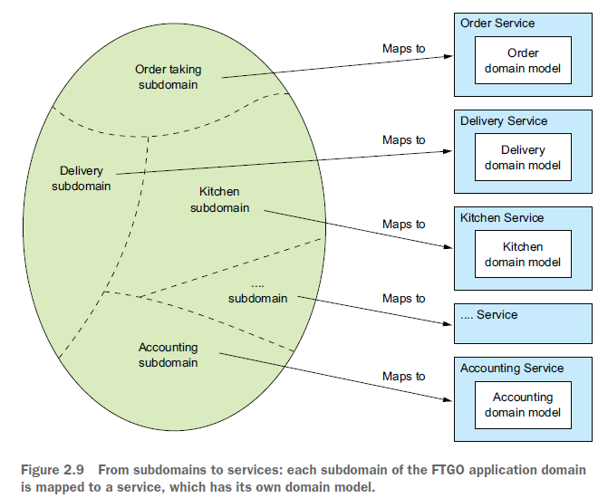
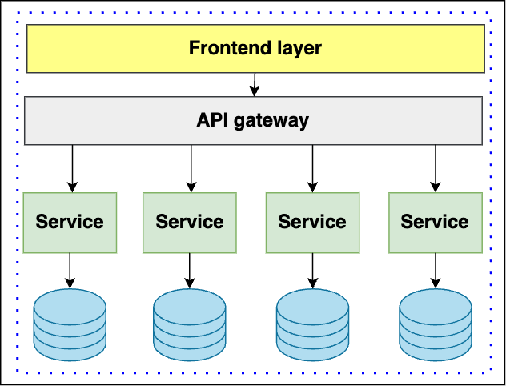
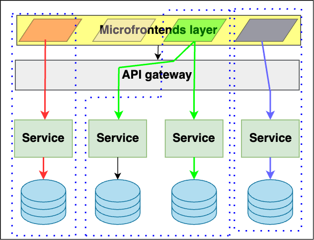
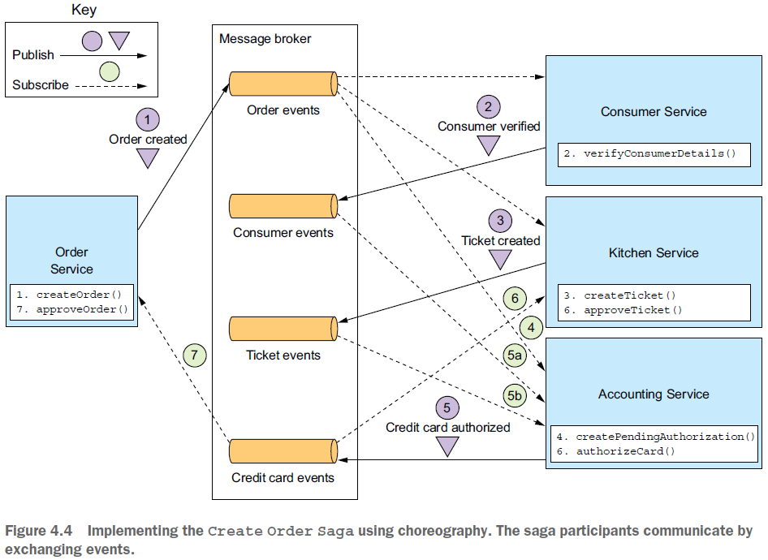
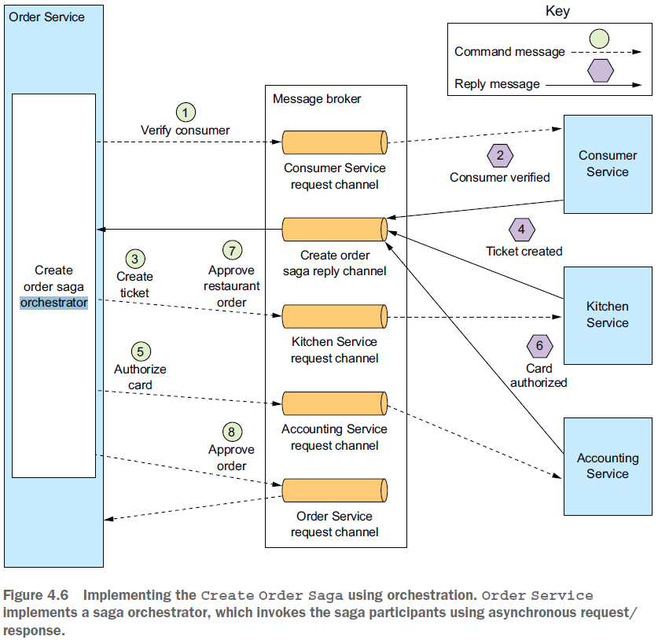

== Микросервисная архитектура

В целом, часть информации о данной архитектуре и ее шаблонах уже описаны в разделе link:../ch4_architecture/[ch4_architecture]. По ходу данной статьи будут приводиться соответствующие ссылки на те или иные документы в вышеупомянутом разделе.

=== 1. Введение

Микросервисы предполагают функциональную декомпозицию, когда некоторый продукт представляет собой набор сервисов. Важно, чтобы у каждого сервиса был свой связный и сфокусированный набор обязанностей. Зачастую микросервисная архитектура приводит к возможности развертывания нескольких инстансов того или иного сервиса, но это не обязательно - так как нужно реализовывать синхронизацию и/или блокировки в базе, etc. Ещё есть принцип двух пицц - над каждым микросервисом может работать команда, которую можно накормить "двумя пиццами" - 3-4 человека. link:../ch4_architecture/p0_microservices_notes.adoc[См p0_microservices_notes.adoc]

Микросервисы подходят для комбинации с разными типами архитектур, в частности, могут хорошо ложиться на понятие *_boundary context_* из DDD. Для этого применяется *шаблон декомпозиции* - link:../ch4_architecture/p051_decomposition_pattern.adoc[см p051_decomposition_pattern.adoc]. Например, вот subdomain-декомпозиция приложения готовки и доставки еды:

=== 2. Топология микросервисов

link:../ch4_architecture/p040_what_is_a_SERVICE.adoc[См p040_what_is_a_SERVICE.adoc]

Каждый сервис должен включать в себя все компоненты для работы, включая БД, специфические библиотеки и др.

Одна из проблем термина "микросервис" заключается в том, что, судя по названию, сервис должен быть очень маленьким. На самом деле размер не является useful metric. Лучше определить хорошо спроектированный service как service, который может разработать и поддерживать небольшая команда с минимальными затратами времени и с минимальным сотрудничеством с другими командами (2-pizza team, 5-6 человек). Теоретически команда может отвечать только за один service, так что этот service не обязан быть "микро". link:../ch4_architecture/p040_what_is_a_SERVICE.adoc[См p040_what_is_a_SERVICE.adoc]

=== 3. Слой API и интерфейсов

link:../ch4_architecture/p259_API-gateway_pattern.adoc[См p259_API-gateway_pattern.adoc]

Пользовательский интерфейс - это зачастую отдельное монолитное приложение (api-gateway), которое не поддерживает принципы boundary context. То есть такая реализация будет единым монолитным квантом, несмотря на микросервисы:

Поэтому одной из практик в WEB-разработке стало использование microfrontends. Вместе с тем непонятно, как реализовать такой подход в мобильной разработке:

Про API-gateway и шаблон "Backends for Frontends" стоит почитать в документе link:../ch4_architecture/p259_API-gateway_pattern.adoc[См p259_API-gateway_pattern.adoc]

Документ про архитектурные кванты - link:sn005_arch_quantum.adoc[]

=== 4. Управление рабочим процессом. Saga

Документ про шаблон Saga - link:../ch4_architecture/p110_Saga_pattern.adoc[p110_Saga_pattern.adoc]

Если нужна какая-то сквозная операция/процесс между сервисами, особенно транзакционная в том или ином смысле - есть два варианта - хореография и оркестровка. Подробнее про саги можно почитать в документе link:../ch4_architecture/p110_Saga_pattern.adoc[p110_Saga_pattern.adoc]. Здесь же мы отметим самое важное.

В *хореографии* один сервис вызывает другой по мере необходимости, без какого-либо медиатора (центрального посредника). Но использовать ее стоит в случае небольших рабочих процессов. Два-три сервиса - это предел для данного подхода, поскольку при дальнейшем увеличении числа учатсников хореографии сложность обработки ошибок и понимания всего flow процесса становится очень большой. В результате логика процесса размазывается по разным сервисам что затрудняет:

- *разработку*, поскольку требуется координация среди dev-команд
- *тестирование*, так как нужно сквозное тестирование всех сервисов
- *отладку*, поскольку сложно найти, на каком этапе и в каком сервисе что пошло не так. Логи и трейсинг несколько улучшают положение.

Поэтому для сложных процессов вводится *Saga Orchestrator*, который общается с участниками саги, используя взаимодействие в стиле _async request/response_. Он отправляет _command message_ сервису с указанием операции. После того, как этот участник саги выполнил операцию, он отправляет _reply message_ оркестратору. Затем оркестратор обрабатывает сообщение и определяет, какой шаг саги следует выполнить следующим.

Воспринимайте Saga Orchestrator, да и шаблон Saga в целом *_не как отдельный сервис_*, а как шаблон, который решает проблему управления сложным рабочим процессом. Вы можете реализовать медиатор как модуль внутри какого-то сервиса, так и как отдельный микросервис управления сагой:

Saga также может бытьиспользована как хорошая замена распределенных транзакций. Данный механизм разбивает один процессс/транзакцию на несколько локальных. Если локальная транзакция терпит неудачу, Saga выполняет серию компенсирующих транзакций, которые откатывают изменения, сделанные предыдущими транзакциями.

Таблица ниже показывает все варианты Saga и их характеристики в рамках аттрибутов качества ПО:

[cols="3,3,2,2,2,2"]
|===
|Тип коммуникации |Тип Saga |Coupling |Сложность |Отывчивость/доступность |Масштабируемость/эластичность

|synchronous |orchestrated |$\color{red}{HIGH}$ |$\color{green}{VERY \space LOW}$ |$\color{Dandelion}{MEDIUM}$|$\color{YellowGreen}{HIGH}$

|synchronous |choreographed |$\color{Dandelion}{MEDIUM}$ |$\color{YellowGreen}{LOW}$ |$\color{Dandelion}{MEDIUM}$|$\color{YellowGreen}{HIGH}$

|asynchronous |orchestrated |$\color{YellowGreen}{LOW}$ |$\color{red}{LOW}$ |$\color{YellowGreen}{HIGH}$|$\color{YellowGreen}{HIGH}$

|asynchronous |choreographed |$\color{green}{VERY \space LOW}$ |$\color{YellowGreen}{HIGH}$ |$\color{YellowGreen}{HIGH}$|$\color{green}{VERY \space HIGH}$
|===

Выбор типа саги это всегда компромисс между перечисленными аттрибутами качества.
