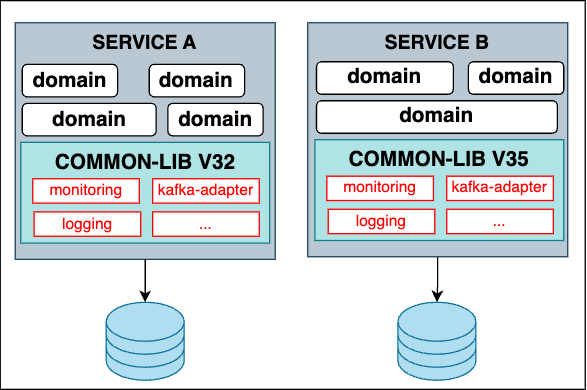
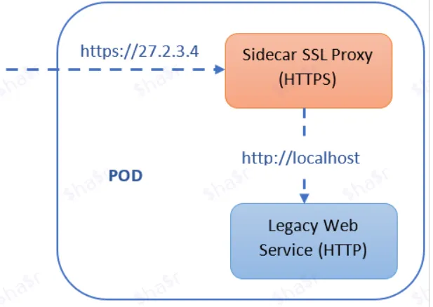
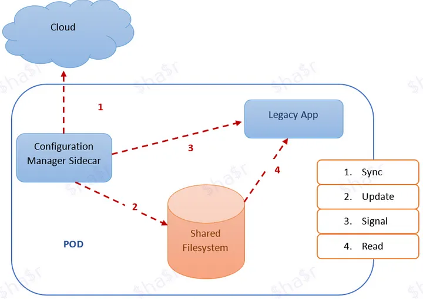
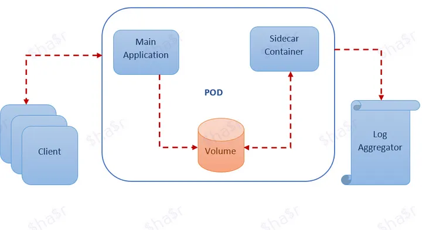
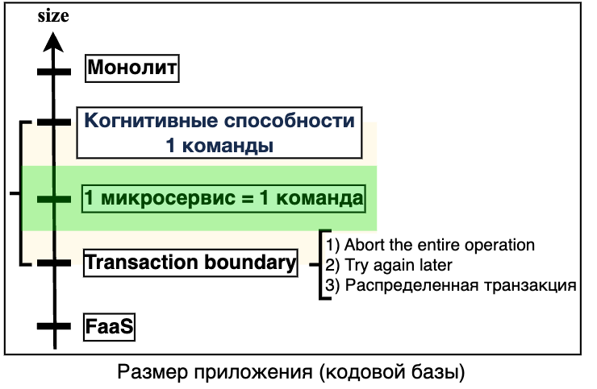
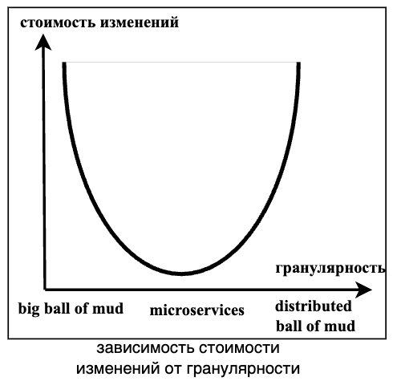
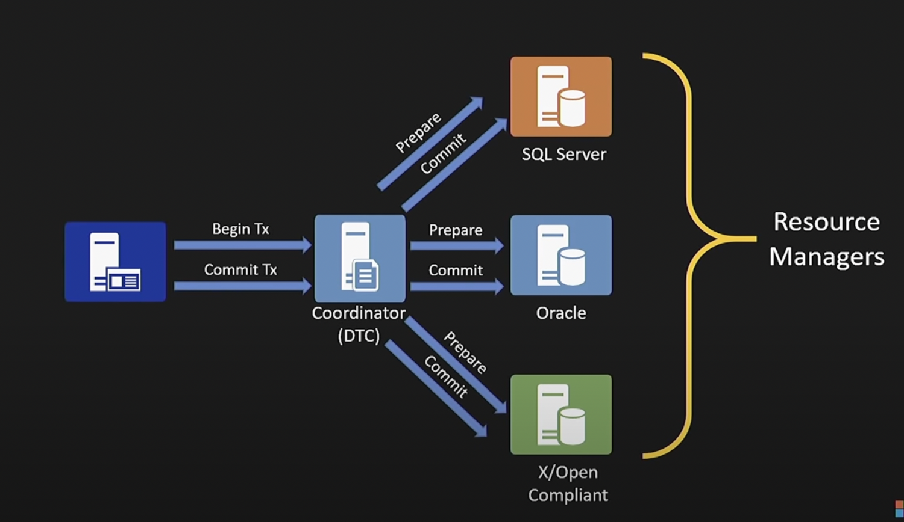
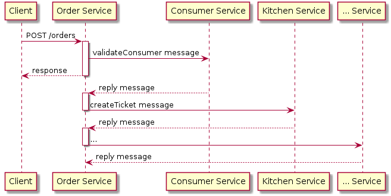

== Микросервисная архитектура

В целом, часть информации о данной архитектуре и ее шаблонах уже описаны в разделе link:../ch4_architecture/[ch4_architecture]. По ходу данной статьи будут приводиться соответствующие ссылки на те или иные документы в вышеупомянутом разделе.

*Content:*

- 1. Введение
- 2. Топология микросервисов
- 3. Слой API и интерфейсов
- 4. Управление рабочим процессом. Saga
- 5. Общая кодовая база. Common library & Sidecar pattern
  * 5.1 Добавление HTTPS к легаси-сервису
  * 5.2 Динамическая конфигурация с помощью Sidecar
  * 5.3 Агрегатор логов с помощью Sidecar
- 6. Приемлемые размеры сервиса. Гранулярность
- 7. Как справиться с transaction boundary
- 8. Loose Coupling и микросервисы
- 9. Плюсы и минусы
- 10. Продолжение - link:sn018_designing_microservices_with_business.adoc[sn018_designing_microservices_with_business.adoc]

[cols="2,1"]
|===
|Тип деления модулей |Доменный
|Кванты |1 - Много
|Deployability |[big green]#*4/5*#
|Эластичность (резкая нагрузка) |[big lime]#*5/5*#
|Ремонтопригодность (Maintainability) |[big lime]#*5/5*#
|Стоимость разработки/эксплуатации |[big red]#*1/5*#
|Производительность |[big yellow]#*2/5*# - [big green]#*4/5*#
|Reliability (надежность) |[big green]#*4/5*# - [big lime]#*5/5*#
|Масштабируемость (Scalability) |[big lime]#*5/5*#
|Простота |[big red]#*1/5*#
|Тестируемость |[big green]#*4/5*#
|===

Архитектура очень эластична (благодаря современным devops-практикам), эволюционна (при использовании bounded contexts) и масштабируема (поскольку нет общей БД). Из минусов - это сложная распределенная система, которая еще и довольно дорогая в поддержке. Отказоустойчивость и производительность можно улучшить через асинхронную коммуникацию и шаблон  link:https://medium.com/@dmosyan/3-data-access-design-patterns-in-distributed-system-861d59e21c6e[Column Schema Replication].

=== 1. Введение

Микросервисы предполагают функциональную декомпозицию, когда некоторый продукт представляет собой набор сервисов. Важно, чтобы у каждого сервиса был свой связный и сфокусированный набор обязанностей. Зачастую микросервисная архитектура приводит к возможности развертывания нескольких инстансов того или иного сервиса, но это не обязательно - так как нужно реализовывать синхронизацию и/или блокировки в базе, etc. Ещё есть принцип двух пицц - над каждым микросервисом может работать команда, которую можно накормить "двумя пиццами" - 3-4 человека. link:../ch4_architecture/p0_microservices_notes.adoc[См p0_microservices_notes.adoc]

Микросервисы подходят для комбинации с разными типами архитектур, в частности, могут хорошо ложиться на понятие *_boundary context_* из DDD. Для этого применяется *шаблон декомпозиции* - link:../ch4_architecture/p051_decomposition_pattern.adoc[см p051_decomposition_pattern.adoc]. Например, вот subdomain-декомпозиция приложения готовки и доставки еды:

image:../ch4_architecture/img/decompose-by-subdomain-second-example.png[]

=== 2. Топология микросервисов

link:../ch4_architecture/p040_what_is_a_SERVICE.adoc[См p040_what_is_a_SERVICE.adoc]

Каждый сервис должен включать в себя все компоненты для работы, включая БД, специфические библиотеки и др.

Одна из проблем термина "микросервис" заключается в том, что, судя по названию, сервис должен быть очень маленьким. На самом деле размер не является useful metric. Лучше определить хорошо спроектированный service как service, который может разработать и поддерживать небольшая команда с минимальными затратами времени и с минимальным сотрудничеством с другими командами (2-pizza team, 5-6 человек). Теоретически команда может отвечать только за один service, так что этот service не обязан быть "микро". link:../ch4_architecture/p040_what_is_a_SERVICE.adoc[См p040_what_is_a_SERVICE.adoc]

=== 3. Слой API и интерфейсов

link:../ch4_architecture/p259_API-gateway_pattern.adoc[См p259_API-gateway_pattern.adoc]

Пользовательский интерфейс - это зачастую отдельное монолитное приложение (api-gateway), которое не поддерживает принципы boundary context. То есть такая реализация будет единым монолитным квантом, несмотря на микросервисы:

image:img/quant_microservices_2.png[]

Поэтому одной из практик в WEB-разработке стало использование microfrontends. Вместе с тем непонятно, как реализовать такой подход в мобильной разработке:

image:img/quant_microservices_3.png[]

Про API-gateway и шаблон "Backends for Frontends" стоит почитать в документе link:../ch4_architecture/p259_API-gateway_pattern.adoc[См p259_API-gateway_pattern.adoc]

Документ про архитектурные кванты - link:sn005_arch_quantum.adoc[]

=== 4. Управление рабочим процессом. Saga

Документ про шаблон Saga - link:../ch4_architecture/p110_Saga_pattern.adoc[p110_Saga_pattern.adoc]

Если нужна какая-то сквозная операция/процесс между сервисами, особенно транзакционная в том или ином смысле - есть два варианта - хореография и оркестровка. Подробнее про саги можно почитать в документе link:../ch4_architecture/p110_Saga_pattern.adoc[p110_Saga_pattern.adoc]. Здесь же мы отметим самое важное.

В *хореографии* один сервис вызывает другой по мере необходимости, без какого-либо медиатора (центрального посредника). Но использовать ее стоит в случае небольших рабочих процессов. Два-три сервиса - это предел для данного подхода, поскольку при дальнейшем увеличении числа учатсников хореографии сложность обработки ошибок и понимания всего flow процесса становится очень большой. В результате логика процесса размазывается по разным сервисам что затрудняет:

- *разработку*, поскольку требуется координация среди dev-команд
- *тестирование*, так как нужно сквозное тестирование всех сервисов
- *отладку*, поскольку сложно найти, на каком этапе и в каком сервисе что пошло не так. Логи и трейсинг несколько улучшают положение.

image:../ch4_architecture/img/CreateOrder_choreography_saga_sunny_day_scenario.png[]

Поэтому для сложных процессов вводится *Saga Orchestrator*, который общается с участниками саги, используя взаимодействие в стиле _async request/response_. Он отправляет _command message_ сервису с указанием операции. После того, как этот участник саги выполнил операцию, он отправляет _reply message_ оркестратору. Затем оркестратор обрабатывает сообщение и определяет, какой шаг саги следует выполнить следующим.

Воспринимайте Saga Orchestrator, да и шаблон Saga в целом *_не как отдельный сервис_*, а как шаблон, который решает проблему управления сложным рабочим процессом. Вы можете реализовать медиатор как модуль внутри какого-то сервиса, так и как отдельный микросервис управления сагой:

image:../ch4_architecture/img/CreateOrder_orchestration_saga_sunny_day_scenario.png[]

Saga также может бытьиспользована как хорошая замена распределенных транзакций. Данный механизм разбивает один процессс/транзакцию на несколько локальных. Если локальная транзакция терпит неудачу, Saga выполняет серию компенсирующих транзакций, которые откатывают изменения, сделанные предыдущими транзакциями.

Таблица ниже показывает все варианты Saga и их характеристики в рамках аттрибутов качества ПО:

[cols="3,3,2,2,2,2"]
|===
|Тип коммуникации |Тип Saga |Coupling |Сложность |Отывчивость/доступность |Масштабируемость/эластичность

|synchronous |orchestrated |$\color{red}{HIGH}$ |$\color{green}{VERY \space LOW}$ |$\color{Dandelion}{MEDIUM}$|$\color{YellowGreen}{HIGH}$

|synchronous |choreographed |$\color{Dandelion}{MEDIUM}$ |$\color{YellowGreen}{LOW}$ |$\color{Dandelion}{MEDIUM}$|$\color{YellowGreen}{HIGH}$

|asynchronous |orchestrated |$\color{YellowGreen}{LOW}$ |$\color{red}{LOW}$ |$\color{YellowGreen}{HIGH}$|$\color{YellowGreen}{HIGH}$

|asynchronous |choreographed |$\color{green}{VERY \space LOW}$ |$\color{YellowGreen}{HIGH}$ |$\color{YellowGreen}{HIGH}$|$\color{green}{VERY \space HIGH}$
|===

Выбор типа саги это всегда компромисс между перечисленными аттрибутами качества.

=== 5. Общая кодовая база. Common library & Sidecar pattern

У микросервисов могут быть некоторые общие функции, которые теоретически можно реализовать в одном модуле и подключать во все сервисы, вместо того чтобы писать свои велосипеды в каждом сервисе.

Основной вариант решения проблем - общая библиотека (common library). Плюсы очевидны - общий код компилируется вместе с основным, что снижает количество runtime-ошибок, изменения могут быть гибкими, если код изменяется совместно как в сервисе, так и в CL. Еще есть плюс версионирования библиотек, который позволяет гибко подстаиваться под изменения, но приносит свои минусы - хранение большого количества версий библиотеки может зспутать все карты если какая-то версия будет очищена хранилищем снепшотов/артифактов. Также сложно сделать версию устаревшей - часто будут сервисы, которым нет нужны поднимать свою версию библиотеки. Зависимости могут быть сложны, чтобы ими управлять, да и не все зависимости в CL всем сервисам нужны. А еще это может привести к дублированию кода CL (созданию нескольких независимых CL), если разработка ведется на разных языках программирования/платформах.

Есть еще один вариант решения этой проблемы - *sidecar pattern*. Он так назван, потому что напоминает коляску, прикрепленную к мотоциклу. link:https://medium.com/nerd-for-tech/microservice-design-pattern-sidecar-sidekick-pattern-dbcea9bed783[См ссылку], где шаблон разбирается более подробно.

Шаблон представляет собой два контейнера в одном pod-е, работающих параллельно. Первый — это контейнер самого приложения микросервиса, без общей логики, второй - контейнер Sidecar, содержащий расширения/общие функции для основного приложения. Поскольку sidecar работает на том же Pod, что и основной контейнер приложения, он разделяет ресурсы — файловую систему, диск, сеть и т. д. Он также позволяет развертывать компоненты (реализованные с помощью разных технологий) одного и того же приложения в отдельные, изолированные контейнеры.

Когда полезен шаблон Sidecar?

- Когда сервисы/компоненты реализованы с использованием нескольких языков или технологий.
- Сервис/компонент должны быть размещены в той же группе контейнеров (pod) или на том же хосте, где запущено основное приложение.
- Сервис/компонент принадлежит другой команде или другой организации.
- Сервис, который может обновляться независимо от основного приложения, но имеет тот же жизненный цикл, что и основное приложение.
- Если нам нужен контроль над ограничениями ресурсов для компонента или услуги.

Рассмотрим примеры использования Sidecar:

==== 5.1 Добавление HTTPS к легаси-сервису

Рассмотрим легаси-сервис, который работает только по HTTP. У нас есть требование улучшить устаревшую систему для обслуживания запросов с HTTPS в будущем. Легаси обслуживает запросы исключительно на localhost, что означает, что только сервисы, которые делят локальную сеть с сервером, могут получить доступ к устаревшему приложению. В дополнение к основному контейнеру мы можем добавить контейнер Nginx Sidecar, который работает в том же network namespace, что и основной контейнер. Nginx принимает HTTPS-трафик на внешнем IP-адресе модуля и делегирует этот трафик устаревшему сервису:

==== 5.2 Динамическая конфигурация с помощью Sidecar

При запуске устаревшего приложения оно загружает свою конфигурацию из файловой системы. Мы хотим динамически обновлять конфиг, поэтому мы создаем sidecar-конфигуратор, который проверяет различия между конфигурацией в локальной файловой системе, и конфигурацией в облаке. Если есть различия, менеджер конфигурации загружает новую конфигурацию в локальную файловую систему и уведомляет устаревшее приложение о необходимости перенастроить себя с новой конфигурацией. Это напоминает ситуацию с blackbox-exporter и prometheus.

==== 5.3 Агрегатор логов с помощью Sidecar

Предположим, у нас есть веб-сервер, который генерирует логи, которые не так уж и критичны для сохранения в том (volume) пода в течение длительного промежутка времени. Однако логи помогают в отладке приложения. Мы можем реализовать шаблон Sidecar, развернув отдельный контейнер для сбора и передачи логов с веб-сервера в агрегатор логов. Поскольку контейнеры работают на одном поде, мы можем использовать общий том (volume) для чтения/записи логов:

=== 6. Приемлемые размеры сервиса. Гранулярность

Мы уже говорили о том, как можно делить сервисы по-разному в документе про шаблон декомпозиции - link:../ch4_architecture/p051_decomposition_pattern.adoc[см p051_decomposition_pattern.adoc]. Далее мы расширим понимание декомпозиции на примере переговоров с бизнесом. Здесь же мы рассмотрим, какой размер может быть у микросервиса. Спойлер: определение *_service per team_* - наиболее подходящее.

Рассмотрим рисунок выше. На оси координат отобразим минимальное (FaaS) и масимальное (монолит) значения размера сервиса приложения. Давайте сузим эти границы.

Нижней границей можно взять границы транзакционности (transaction boundary). Если при дальнейшем уменьшении сервиса транзакции выходят за его рамки и получается распределенная/сквозная транзакция - наверное, пора остановиться. +
Кроме того, стоит обратить внимение на рабочий процесс - суть конечная пользовательская услуга. Если он разнесен по разным сервисам, то это может вылиться в частые сквозные изменения сервисов, даже если рабочему процессу не нужна транзакционность или он согласован в конечном смысле.

Верхнюю границу стоит определить как "когнитивные способности команды". Если объем кода не укладывается в голове человека, то при внесении изменений в другую часть сервиса разаботчик вынужден "выгружать" из памяти то, что он помнит про один кусок монолита и "загружать" знания о другом куске. Происходит сильное переключение контекста (и это в рамках одного сервиса!) - страдает time to market. Это можно сравнить с нехваткой оперативной памяти, когда надо выгружать новую инфу из медленного жесткого диска. Процесс поднятия знаний в память достаточно долгий, а знания постоянно вымываются переключением контекста. Соответственно time to market ухудшается. +
Кроме того, вторая проблема - это мертвый функционал, когда никто не помнит, как он работает, но его страшно выпиливать. Код банально протухает, а на рефакторинг надо потратить очень много времени, чтобы по итогу получить все то же обилие кода, которое рано или поздно после череды изменений превратится в спагетти.

И получается, что команда должна более-менее хорошо разбираться в своем сервисе. Так мы и приходим к достаточно новой и актуальной идее - *_service per team_*. Если сервис "помещается" в головах команды, она становится более продуктивной. Это делает ее автономной и она может следить за деплоем и в целом за жизненным циклом сервиса.

*_Гранулярность сервиса_* влияет на стоимость внесения изменений в код, причем зависимость получается параболическая. В монолите и в очень гранулярных сервисах, внося изменения, можно зацепить близлежащие модули.

=== 7. Как справиться с transaction boundary

Опять посмотрим на рисунок из предыдущего пункта:

И заметим, что пункт *_transaction boundary_* содержит в себе три подпункта. Это суть способы борьбы со сквозной транзакционностью. Давайте рассмотрим их все по порядку.

- *Abort the Entire Operation*. Это такой механизм Saga, который откатывает весь процесс в случае ошибки. Он использует механизмы компенсации, но могут быть проблемы, если падают компенсирующие операции. Подробнее см. пункт 4 и документ про шаблон Saga - link:../ch4_architecture/p110_Saga_pattern.adoc[p110_Saga_pattern.adoc].
- *Try Again Later*. Целевой сервис обновляет операию атомарно, остальные сервисы - постепенно с течением времени. Получается что-то вроде согласованности в конечном счете. Но этот механим не имеет компенсации в случае ошибок на стороне нецелевых сервисов.
- *Распределенная транзакция*. Также иногда назывется 2 Phase Commit - 2PC.   Для этого понадобится транзакций, например Narayana, хранилище транзакционных логов, все бд, к которым подключены микросервисы должны иметь совместимость со стандартном DTP XA (distributed transaction processing) (XA - extended architecture), а все очереди и кеши должны поддерживать XA драйвер. Кроме того, у вас должен быть задеплоен только 1 экземпляр менеджера распределенных транзакций. Транзакционный менеджер должен быть всегда доступен и для него всегда должен быть обеспечен доступ к транзакционным логам. +
Механизм 2PC работает так: приложение в первую очередь обращается к координатору, получает номер транзакции. С этим номером обращается к остальным системам, например к нескольким разным микросервисам, просит их внести изменения с указанным идентификатором транзакции Затем приложение обращается к координатору с просьбой закоммитить транзакцию, после чего координатор сначала отправляет всем сигнал prepare, если все сервисы ответили успехом (они захватили write locks на своих бд), то им посылается сигнал commit. Теперь транзакция завершена. Визуализация данного процесса:

2PC предлагает те же гарантии что и единая транзакция в монолите, но возможны ошибки в данных при падении самого транзакционного менеджера. Много бд его поддерживают. Минусов много: сложная конфигурация, низкая производительность, невозможно масштабировать, менеджер транзакций не может быть просто так пересоздан, что, например, сложно в условиях k8s.

Подробнее про 2PC link:https://habr.com/ru/articles/769102/[см habr].

=== 8. Loose Coupling и микросервисы

Одна из важнейших задач архитектора в контексте микросервисов - стремиться к loose coupling. Но что делать, если декомпозиция завершена, а связанность все равно присутствует?

1. Можно заменить синхронные связи между сервисами на асинхронные, если это возможно
2. Использоать шаблон Column Schema Replication в связке с Event-Carried State Transfer (обычно работает в EDA)
3. Использовать шаблон link:https://microservices.io/patterns/decomposition/self-contained-service.html[Self-Contained service] - это когда один сервис нуждается в вызове других, но вместо синхронного вызова он делает асинхронные, а ответ пользователю возвращает сразу: +

4. Тестовые окружения и тест-кейсы не должны влиять на структуру сервисов

=== 9. Плюсы и минусы

Смтори также докуент link:../ch4_architecture/p011_microservices_intro.adoc[p011_microservices_intro.adoc], где раскрыты некоторые преимущества и недостатки.

*Преимущества:*

1. *_Высокая масштабируемость и эластичность, независимость масштабирования_*
2. *_Хорошая эволюционность_*
3. *_В комбинации с Event-driven дает высокую надежность и производительность_*
4. *_Простота тестирования_*
5. *_Continuous delivery and deployment of large, complex applications_*
6. *_Архитектура микросервисов позволяет командам быть автономными_*
7. *_Архитектура микросервисов позволяет легко экспериментировать и внедрять новые технологии_*
8. *_Хорошая fault isolation (изоляция неисправностей)_*

*Недостатки:*

1. *_Сложность создания системы микросервисов. Не все понимают, чо такое микросервис. Найти правильный набор сервисов сложно_*.
2. *_Стоимость поддержки_*. Требуется сложная система логирования, мониторинга, оркестрации.
3. *_Развертывание функций, охватывающих несколько сервисов, требует тщательной координации_*
4. *_Трудно решить, когда переходить на микросервисную архитектуру_*. Обычно все начинают с монолита. Когда же приходит время переходить на микросервисную архитектуру, рефакторинг может быть затруднен запутанными зависимостями и размытыми бизнес-доменами.
