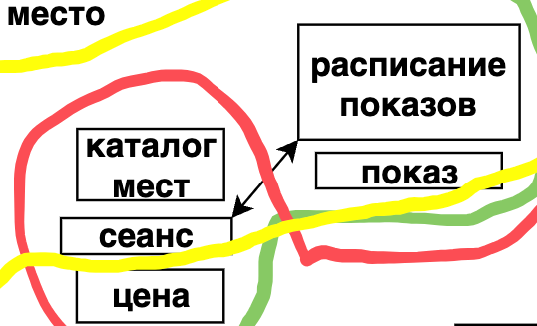
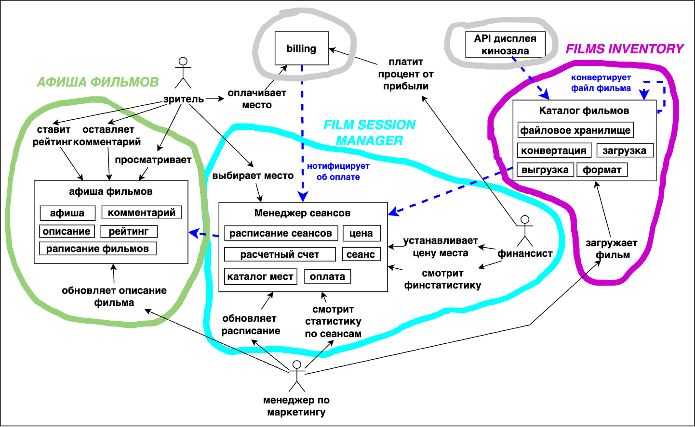

== Decompose by business capability (бизнес-возможности). Разработка структуры микросервисов совместно с бизнесом (стейкхолдерами). Моделируем карту контекстов enterprise-приложения кинотеатра

*Content:*

- 1. Декомпозиция по бизнес-возможностям
- 2. Анализ бизнеса
- 3. Бизнес-возможности как согласованные варианты использования
- 4. Формируем непротиворечивую модель предметной области и формируем модули системы
  * 4.1 Тот же термин, но разное значение
  * 4.2 Та же концепция, но разное использование
  * 4.3 Внешние системы
  * 4.4 Строим карту контекстов - карту модулей
- 5. Выделение микросервисов из карты контекстов

=== 1. Декомпозиция по бизнес-возможностям

Как определить, какой бизнес-функционал должен быть в микросервисе?

Вообще, существует несколько вариантов шаблона декомпозиции - link:../ch4_architecture/p051_decomposition_pattern.adoc[см p051_decomposition_pattern.adoc] - например, *_decompose by business capability_* (декомпозиция по бизнес-возможностям) или *_decompose by subdomain_*. Второй вариант декомпозиции хорошо подходит к DDD, здесь же мы рассмотрим первый.

Итак, рассмотрим *декомпозицию по бизнес-возможностям*. Что такое бизнес возможность? Это то, что бизнес делает для создания ценности. Обычно бизнес-вможность соответствует некоторому бизнес-объекту, например (рассмотрим сайт интернет-магазина):

- Product Management: отвечает за добавление новых товаров, обновление сведений о продуктах и классификацию продуктов — все, что связано с ведением каталога продукции.
- Order Management: контролирует обработку и доставку заказов клиентов. Включает возвраты, обработку платежей и отслеживание заказов.
- Customer Management: Отвечает за ведение данных клиентов, таких как профили, предпочтения и история покупок. Также отвечает за сущность клиента.
- Inventory Management: обеспечивает доступность товаров для покупки, отслеживая уровень запасов, процедуры пополнения запасов и информацию о поставщиках.
- Marketing and Sales: Охватывает любую деятельность, связанную с продвижением продукции, такую как рекламные акции, маркетинг по электронной почте и реклама в целом.

Преимущества такого подхода:

- *Стабильная архитектура*. Поскольку бизнес-возможности меняются реже, чем технологические элементы, это приводит к более стабильной конструкции.
- *Кросс-функциональные команды разработки*. Каждая комада отвечает за предосталвение конкретной ценности бизнесу и автономна, а не связана техническими функциями.
- *Сервисы являются loosely coupled* - услуги становятся более целенаправленными и слабо связанными, что упрощает обслуживание и ускоряет улучшение и развитие.

=== 2. Анализ бизнеса

Для декомпозиции по бизнес-возможносям необходимо понимание, как устроен сам бизнес. Хорошим пунктом для анализа являюется *оргструктура*. Группы внутри организации могут соответствовать бизнес-возможностям. Например, рассмотренная выше оргструктура интернет-магазина включает в себя отдел по работе с клиентами, отдел склада, отдел обработки и доставки заказов и пр.

У данного подхода есть две проблемы. Во-первых, бизнес-возможности часто соответствуют объектам предметной области высокого уровня, т е быть основным доменом. И определения крупнозернистых бизнес-возможностей зачастую будет недостаточно для разделения системы на микросервисы - домены будут слишком большие, и сервис - вместе с ними - тоже большим. +
Во-вторых, есть проблема, что предприятия, следующие только *закону Конвея* (о выстраивании архитектуры на основе оргструктуры) могут впоследствии столкнуться с проблемой масштабирования. Что если складов магазина станет много, они будут распределены по всей стране - а наш домен не в состоянии оперировать более чем 10 складами? В этом случае можно использовать *обратный маневр Конвея* - придумать лучшую архитектуру системы, а потом реорганизовать саму оргструктуру предприятия. Но нужно понимать, что такие изменения происходят на очень высоких уровнях, например, на уровне CTO.

=== 3. Бизнес-возможности как согласованные варианты использования

Бизнес-возможности также напоминают наборы взаимосвязанных и согласованных вариантов использования. Они обычно включают в себя одного и того же участника и манипулируют ограниченным набором бизнес-объектов. При этом с "распилом" бизнес-возможностей на сервисы стоит быть аккуратным - неудачно распилив их, вы получите набор сиьно связанных компонентов (чего надо избегать).

Таких вариантов использования может быть много, и сразу выделить из них какие-то микросервисы не представляется возможным. Тогда стоит посмотреть на требования, а потом взять и выписать их в формате пользовательских историй/сценариев взаимодействий. Причем мы должны выделить разным цветом:

- действующих лиц (акторов)
- существительные (потенциально это могут быть бизнес-объекты)
- действия над существительными

Для выделения бизнес-возможностей также можно использовать шаблон Event Storming, но это тема для отдельного документа.

Давайте разберем путь от выделения бизнес-возможностей до определения микросервисов на примере кинотеатра:

----
Менеджер по маркетингу загружает фильм в систему
Менеджер по маркетингу создает описание фильма
Менеджер по маркетингу смотри на статистику посещаемости фильма
Менеджер по маркетингу определяет/меняет расписание для показа фильма
Менеджер по маркетингу обновляет афишу фильмов

Система сохраняет исходный файл фильма
Система конвертирует файл фильма в актуальный формат для показа
Система запускает фильм в нужное время согласно расписанию
Система бронирует купленное место за пользователем

Зритель просматривает афишу фильмов
Зритель выбирает сеанс
Зритель смотрит на доступные места на сеансе
Зритель выбирает место в зале на сеанс
Зритель производит оплату
Зритель может посмотреть купленные места в зале
Зритель ставит рейтинг к фильму
Зритель оставляет комментарий к фильму

Финансист устанавливает цену билета
Финансист смотрит финстатистику по фильмам
Финансист платит процент от прибыли кинопрокатчику
----

И отобразим полученное на доске:

Бизнес-возможности включают в себя одного и того же участника, ограниченный набор бизнес-объектов и манипуляция тесно связанным набором данных. Давайте выделим бизнес-возможности на нашей схеме:

У нас получается 4 бизнес-возможности:

- Интерфейс взаимодействия со зрителем
- Управление фильмами и сеансами
- Хранилище фильмов
- Финансовая часть

Видно, что в модели также присутствуют некоторые бизнес-объекты, которые скорее будут entities или value objects, но не могут быть, условно говоря, модулями монолита (если бы мы строили монолит). Этот такие объекты, как "комментарий", "описание фильма", "место" и т. д. Этим объектам не место на нашей схеме - мы должны схлопнуть их в какие-то модули нашей системы, чтобы суметь построить прототип нашего бизнес-процесса от одного модуля/сервиса к другому. +
Предлагаю определить модуль для показа пользователю списка фильмов, возможности оставлять комментарии и пр. Назовем этот модуль афишей фильмов. +
Еще один модуль можно выделить из центральной части, которая входит во все бизнес-возможности целиком или частично - это будет модуль менеджера сеансов. Я решил не разделять финансовую составляющую сеанса (цены на места) и расписание, поскольку цены зависят от данного расписания.

=== 4. Формируем непротиворечивую модель предметной области и формируем модули системы

В предыдущем пункте мы уже сделали часть работы по формированию "сервисов", таких как афиша фильмов и менеджер сеансов. Это было сделано в рамках определения бизнес-услуг, потому что доменные объекты были лишними на первых картинках, но вместе с тем мы уже начали формирования ограниченных контекстов. И тут стоит остановиться подробнее над понятием непротиворечивости модели. Есть пару проблем, которые могут сделать модель противоречивой и не дать сформировать единый язык (подробнее про данные термины см в документе link:sn009_ddd_p1_architecture.adoc[sn009_ddd_p1_architecture.adoc]).

==== 4.1 Тот же термин, но разное значение

Довольно понятная ситуация - одно и то же слово используется в двух ограниченных контекстах. Например, "список фильмов" - это может быть как каталог хранимых файлов фильмов, так и афиша фильмов со списком актуальных фильмов. В этом случае термин был бы перегружен инвариантами и имел бы высокую хрупкоать. Именно поэтому в нашем примере мы не используем данный термин.

==== 4.2 Та же концепция, но разное использование

В данном случае мы можем рассмотреть первую версию схемы и обнаружить такие понятия как сеанс и показ. В данном случае под "показом" имеется в виду фильм во временных рамках расписания, а "сеанс" это аналогия "зала", т е теоретически к каждому сеансу должен быть прикреплен зал с местами, и в дальнейшем финотчетность ведется по заполняемости мест на сеансах. В этом случае может возникуть логичный вопрос - а почему одна и та же вещь называется по-разному? Это издержки непротиворечивости модели - слыша "сеанс" или "показ", бизнес сразу должен понимать о чем идет речь. К слову в модуле "Finstat system" тоже может быть свое название "сеанса".

==== 4.3 Внешние системы

Системы обычно не быают замкнуты в себе и зачастую общаются со внешним миром. В нашей системе такими внешними системами будут биллинг и API дисплея кинозала. В качестве биллинга мы, скорее всего, будем использовать стороннее решение, а API дисплея, должно быть, или уже имплементировано, или будет имплементировано как стороннее решение:

==== 4.4 Строим карту контекстов - карту модулей

После предыдущих пунктов стоит ернуться к стейкхолдерам и выяснить у них:

- Хотят ли они развивать каждую из бизнес-возможностей?
- Есть ли заинтересованные лица в развитии каждой из бизнес-возможностей?
- Есть ли ресурсы и список задач под эти бизнес-возможности?

Каждую из бизнес-возможностей стоит прогнать по этим трем вопросам. Если ответ на любой из них будет отрицательным, то стоит рассмотреть возможность объединения/вставки "неинтересных" бизнес-возможностей в какой-то bounded context "интересной" бизнес-возможности.

После объединения "неинтересных" нам бизнес-возможностей мы можем уалить внутренние связи полученных моделей и выстроить способы коммукникации. Допустим, нам не интересно разделять сеансы и афишу фильмов, и мы хотим приложить больше усилий на афишу, а расписание будет вытраиваться очень простой логикой. В этом случае можно объединить их в один контекст. Разберем это на примере нашей же схемы:

В первом случае мы не хотим отдельно развивать сервис менеджера сеансов и хотим объединить его с афишей. В данном случае мы объединяем оба сервиса под названием "Менеджер фильмов". Сущности менеджера сеансов включаются в новый компонент, в данном примере я даже выделил отдельный подмодуль (ограниченный контекст), но это не обязательно:

Во втором случае мы хотим раделить афишу и управление фильмами, но нам не нужен модуль финансовой статистики. Вместо этого мы хотим управлять ценой на места, оплатой за места и получаемой прибылью в рамках одного микросервиса, полагая, что статистику по финотчетности мы можем вычислить из цен на сеансы и купленные места:

Если же стейкхолдеры утверждают, что будут развивать все эти бизнес-возможности, что есть беклог задач для каждой capability, то самое лучшее решение - разделить систему по разным bounded contexts. Это позволит контролировать инварианты терминов:

=== 5. Выделение микросервисов из карты контекстов

Предположим, что мы построили нашу карту контекстов. Для наглядности пусть это будет последний вариант с развитием всех бизнес-возможностей и выделением всех ограничкенных контекстов (картинка выше).

После этого следует задать вопрос об *_организации гранулярности_* сервисов. Есть ли отдельные команды под текущие бизнес-возможности? Ответ на этот вопрос скажет, как делить ограниченные контексты непосредственно на сами микросервисы.

Если команда одна, то стоит сделать ограниченные контексты модулями в микросервисе. У нас получилось два сервиса - *_films manager_* и *_films inventory_*. Первый сервис содержит несколько ограниченных контекстов в качестве модулей:

Если же у нас есть ресурсы для создания нескольких команд, то можно каждый ограниченный контекст сделать сервисом и обеспечить их независимое развитие. Это будет более правильно:

