== Шаблоны обеспечения надежности

*Content:*

- 1. Retry pattern
- 2. Circuit Breaker pattern
- 3. Rate Limiter pattern
- 4. Throttling pattern
- 5. Bulkhead pattern
- 6. Fallback Cache pattern
- 7. Priority Queue pattern
- 8. Leader Election (выбор лидера) pattern
- 9. Queue-Based Load Leveling pattern
- 10. Health Endpoint Monitoring pattern

=== 1. Retry Pattern

Приложение, взаимодействующее с сетью, должно учитывать нестабильность сети и временные сбои, которые в ней возникают. Сбои включают в себя:

- Мгновенную потерю сетевого подключения к сервису;
- Временную недоступность сервиса;
- Тайм-ауты когда сервис занят (перегружен).

Если приложение обнаруживает сбой при попытке отправить запрос в удаленную службу, оно может обработать сбой, используя следующие стратегии:

- *Отмена*. Если очевидно, что ошибка не является временной или что повторная операция вряд ли будет успешна - приложение отменяет операцию и выбрасывает исключение. Например, при сбое аутентификации, повторная попытка вряд ли поможет, если креды невалидные.
- *Повтор*. Если конкретная ошибка необычная или редкая, например, сетевой пакет был поврежден во время передачи, то приложение может немедленно повторить неудачный запрос еще раз, потому что такой же сбой вряд ли повторится, и запрос, вероятно, будет успешным. Перечислим те виды 5xx ошибок, которые являются "временными" - т е их можно ретраить. Остальные виды 5xx ошибок лучше не обрабатывать (также *см:* link:https://mixtelecom.ru/blog/kody-otvetov-i-oshibki-servera[список кодов HTTP]):
  * `502 Bad Gateway` (перегрузка сервера из-за юзеров/DDoS/плохой производительности)
  * `503 Service Unavailable` (сервер не готов обработать запрос в данный момент)
  * 504 Gateway Timeout (прокси или gateway не ответил за таймаут - можно попробовать обратиться к сервису, минуя nginx)
  * 506 Variant Also Negotiates (Сервер не может обработать запрос из-за его неправильной настройки. Сервер зацикливает ответ на себя, выдавая ошибку.)
- *Повтор с timeout*. Вышеперечисленные коды ошибок сервера зачастую требуют какого-то короткого периода времени на исправление, особенно если речь идет о часто встречающемся на вашем проекте коде ошибки или об ошиибке 502. Поэтому приложение должно подождать определенное время перед повторной попыткой запроса.

В Java Spring - WebClient (не RestTemplate а более совершенная версия с поддержкой webflux/mono) - можно сделать разные настойки для ретраев - см link:https://www.baeldung.com/spring-webflux-retry[baeldung]:

[source, java]
----
public Mono<String> getData(String stockId) {
    return webClient.get()
      .uri(PATH_BY_ID, stockId)
      .accept(MediaType.APPLICATION_JSON)
      .retrieve()
      .bodyToMono(String.class)
      .retryWhen(Retry.backoff( // инетервалы ожидания экспоненциальные
              3, Duration.ofSeconds(2))); // 2, 4 и 8 секунд

      // инетервалы ожидания фиксированные, по 2 секунды
      // .retryWhen(Retry.fixedDelay(3, Duration.ofSeconds(2)));

      // инетервалы ожидания фиксированне, но с джиттером (jitter)
      // для размазывания запросов от клиентов по всему интервалу
      // .retryWhen(Retry.backoff(3, Duration.ofSeconds(2)).jitter(0.75));

}
----

Подробнее про обеспечение хорошего ретрая и про jitter -также на другой статье в link:https://www.baeldung.com/resilience4j-backoff-jitter#jitter[baeldung]. На картинке ниже видно, как должно выглядеть почти идеальное распределение нагрузки повторными запросами:

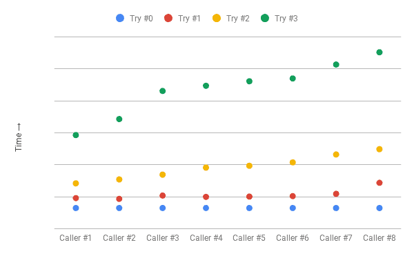

Также можно реализовать с помощью библиотеки resilence4j - link:https://habr.com/ru/articles/793550/[habr].

=== 2. Circuit Breaker pattern

Смотри статью link:../ch4_architecture/p077_circuit_breaker_pattern.adoc[p077_circuit_breaker_pattern.adoc] со схемами и картинками.

Пример реализации с помощью библиотеки resilence4j - link:https://habr.com/ru/articles/544074/[habr] и link:https://habr.com/ru/articles/793550/[habr2]. Библиотека resilence4j еще и отдает метрики, так что можно настроить мониторинг.

=== 3. Rate Limiter pattern

См статьи link:https://habr.com/ru/articles/448438/[habr] и link:https://learn.microsoft.com/en-us/azure/architecture/patterns/rate-limiting-pattern[microsoft].

Если вы отправляете запросы к перегруженному сервису или сервису с недостаточной пропускной способностью, вам нужно будет отслеживать отклоненные запросы и затем повторять эти операции. По мере увеличения количества операций может потребоваться несколько проходов повторной отправки данных, что приведет к большему влиянию на производительность и рейт error-логов.

Вообще есть разные способы организации ограничения запросов - Leaky Bucket (протекающее ведро), Fixed Window (фиксированное окно), Sliding Log (скользящий журнал), Sliding Window (скользящее окно), - подробнее расписано на link:https://habr.com/ru/articles/448438/[habr]. Но в данном примере мы рассмотрим наиболее простую реализацию в библиотеке resilence4j - она предполагает решение "в лоб", но работающее.

В качестве примера рассмотрим попытку обработать 10000 запросов к обработчику платежей через платежный сервис от фронта с пользователями - см link:https://medium.com/@truongbui95/microservice-patterns-rate-limiting-with-spring-boot-7e2a068e1b8b[medium]:

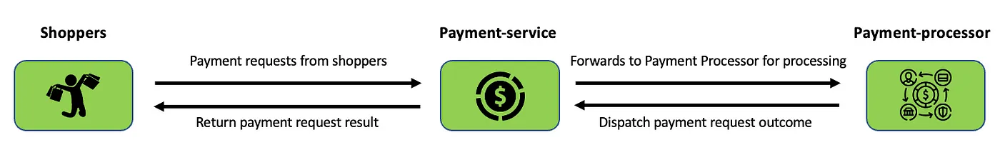

Для этого в платежном сервисе нужно реализовать rate limiter. Для этого опять же можно использовать ту же библиотеку resilence4j - link:https://habr.com/ru/articles/793550/[habr] - с использованием удобных аннотаций.

Для начала отойдем от webflux и предположим, что мы используем обычный RestTemplate.

[source, java]
----
@Service
@RequiredArgsConstructor
public class PaymentServiceImpl implements PaymentService {

    private final RestTemplate restTemplate;
    private static final String PAYMENT_PROCESSOR_URL = "/processor-payment";

    @RateLimiter(name = "payment-service",
            fallbackMethod = "fallbackMethod")
    public Type submitPayment(String paymentInfo) {
        HttpEntity<String> entity =
            new HttpEntity<>(paymentInfo, buildHeaders());

        ResponseEntity<String> response =
            restTemplate.exchange(PAYMENT_PROCESSOR_URL,
                HttpMethod.POST, entity, String.class);

        return new Success(response.getBody());
    }

    private Type fallbackMethod(RequestNotPermitted rnp) {
        return new Failure("Payment service does not "
                              + "permit further calls");
    }
}
----

Мы аннотируем метод с помощью *@RateLimiter*. Атрибуту *_name_* присвоено значение "payment-service", что связывает метод и конфигурацию в application.yaml - пример конфига приведем позже. Затем мы используем атрибут *_fallbackMethod_* с целью вызова резервного метода в случае rate limit exceed и возникновения исключения. Важно - оба метода должны возвращать один и тот же тип данных.

Давайте теперь посмотрим на конфигурацию (через instances, еще можно через configs):

[source, yaml]
----
resilience4j.rateLimiter:
  instances:
    payment-service:
      timeoutDuration: 5s
      limitForPeriod: 10
      limit-refresh-period: 1s
      register-health-indicator: true
----

В данном примере если количество вызовов метода превысит 10 за секунду, то вызывающие потоки будут ждать 5 секунд, перед тем как попытаться снова вызвать метод. Если количество вызовов метода превысит limitForPeriod и потоки не дождутся своей очереди, то будет выброшено исключение RequestNotPermitted или вызван fallback метод, если мы его задали.

Рассмотрим подробнее настройки rateLimiter:

- timeoutDuration - время в течение которого поток ждет разрешения, по умолчяанию 5 сек.
- limitRefreshPeriod - период за который ограничивается число вызовов, по умолчяанию 500 наносекунд.
- limitForPeriod - предельное число вызовов за время указанное в limitRefreshPeriod, по умолчяанию 50.
- registerHealthIndicator - данные о запросах в rateLimiter передаются в эндпоинт /health, подробнее смотри link:https://medium.com/@truongbui95/microservice-patterns-rate-limiting-with-spring-boot-7e2a068e1b8b[medium].

Также можно использовать webClient с webflux вместе с rateLimiter - см link:https://habr.com/ru/articles/793550/[habr]. Во внутренней реализации с использованием webflux добавляет `.delaySubscription()` - т.е. откладывает именно подписку на издателя (Mono/Flux), а не откладывает пропускание самих элементов. Поэтому если ваш аннотированный метод не создает Mono/Flux, а например принимает его в качестве параметра, добавляет в цепочку операторы и возвращает в ответе, то работать RateLimiter не будет (или будет неправильно):

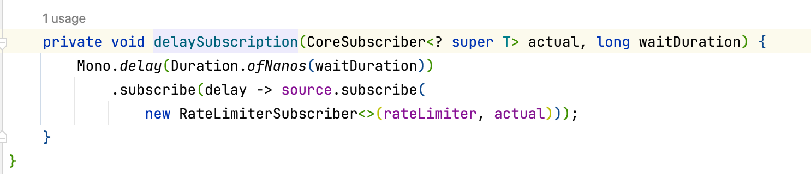

Пример использования webflux вместе с rateLimiter:

[source, java]
----
@RateLimiter(name = "myRateLimiter", fallbackMethod = "myFallbackMethod")
public Mono<SomeResult> doSomething() {
    // ...
}

private Mono<SomeResult> myFallbackMethod(Exception ex) {
    log.warn(ex.getMessage(), ex);
    return Mono.error("error");
}
----

=== 4. Throttling pattern

См статью link:https://jacobjustcoding.medium.com/throttling-pattern-f1d80350beaa[medium]

Пример из реального мира - диверсифицированная нагрузка. Она часто зависит от времени, т. е. в рабочие дни, в начале и конце дня/будних дней/месяцев и т. д., и может быть значительно увеличена, что означает, что приложение должно быть восприимчивым к этому и иметь возможность обрабатывать возросший трафик.

Наиболее очевидной стратегией обработки нагрузки является автомасштабирование. В зависимости от потребностей потребителей системные ресурсы автоматически масштабируются в той степени, в которой они соответствуют ожиданиям генерируемой нагрузки между потребителями и поставщиком. Однако такой метод не лишен недостатков, поскольку автомасштабирование подвержено задержкам. В результате чрезвычайно быстрое увеличение нагрузки на систему может создать узкое место из-за задержки автомасштабирования.

Второй способ решения таких проблем — установить допустимый порог нагрузки. Для этого можно использовать разные шаблоны и стратегии, в том числе:

- Rate Limiter pattern, рассмотренный ранее
- Priority Queue pattern
- Queue-Based Load Leveling pattern
- Отклонение запросов от того, кто дергает наше API слишком много раз
- Деактивация менее важных услуг, чтобы дать больше ресурсов более важным

Рассмотрим пункт 4 более подробно, с примером. Допустим у нас есть 3 услуги - feature A, feature B, feature C. На схеме ниже показаны результаты задержки операций. Непосредственно перед точкой времени T1 общее число ресурсов, выделенных для всех приложений, использующих эти функции, достигает порогового значения (ограничения на использование ресурсов). На этом этапе существует риск, что приложения исчерпают доступные ресурсы. В этой системе функция B менее важна, чем функции A и C, поэтому она временно отключается и используемые ею ресурсы освобождаются. Между точками времени T1 и T2 приложения, использующие функции A и C, продолжают работать в обычном режиме. Со временем использование ресурсов этими двумя функциями снизится до такой степени, что в момент времени T2 высвободится достаточно ресурсов, чтобы снова включить функцию B:

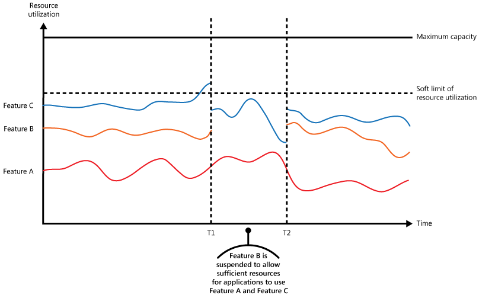

=== 5. Bulkhead pattern

См статьи link:https://bool.dev/blog/detail/bulkhead-pattern[bool.dev],
link:https://learn.microsoft.com/ru-ru/azure/architecture/patterns/bulkhead[microsoft]

Шаблон построен на основе реального мира - это аналог секционных перегородок корпуса корабля. Если корпус корабля поврежден, только поврежденная часть наполняется водой, что предотвращает затопление корабля:

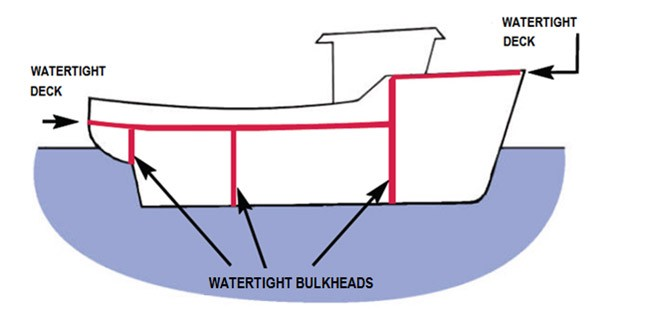

ПО аналогии облачное приложение может включать несколько сервисов, каждый из которых имеет одного или нескольких клиентов. Чрезмерная нагрузка или сбой в сервисе повлияют на всех клиентов.

Когда пользователь отправляет запрос к неисправному сервису, выделенные для этого запроса ресурсы могут не освободиться своевременно. При этом запросы продолжают поступать, что может привести к исчерпанию ресурсов того же пула клиентских подключений для всех сервисов. Теперь проблема затрагивает уже и запросы потребителей к другим сервисам. В конечном итоге потребители не смогут отправлять запросы ко всем сервисам, а не только к проблемному.

Даже если сервис исправен, большое количество запросов от одного клиента может исчерпать все доступные сервису ресурсы. Тогда другие пользователи не смогут использовать сервис, что приводит к каскадному сбою.

===== Решение

Разделять экземпляры сервиса на разные группы в зависимости от нагрузки потребителя и требований к доступности. Такой дизайн помогает изолировать сбои и позволяет поддерживать функциональность сервисов для некоторых потребителей даже во время сбоя.

Потребитель также может разделять ресурсы, чтобы гарантировать, что ресурсы, используемые для вызова одного сервиса, не влияет на ресурсы используемые для вызова другого сервиса. Например, потребителю, который вызывает несколько сервисов, может быть назначен пул соединений для каждого сервиса. Если сервис начинает давать сбой, это влияет только на пул соединений, назначенный для этого сервиса, что позволяет потребителю продолжать использовать другие сервисы.

На следующей диаграмме показаны bulkheads, структурированные вокруг пулов соединений, которые вызывают отдельные сервисы. Если у сервиса A что-то фейлиться, пул соединений изолируется, поэтому затрагиваются только workloads, использующие пул потоков, сервиса A. workloads, использующие сервисы B и C, не затрагиваются и могут продолжать работать без задержек:

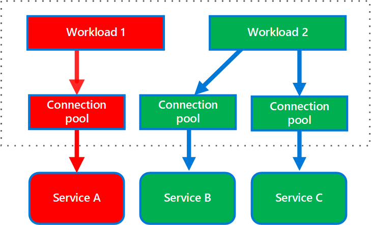

На следующей диаграмме показано, как несколько клиентов вызывают однин сервис. Каждому клиенту назначается отдельный экземпляр сервиса. Клиент 1 сделал слишком много запросов и перегрузил свой экземпляр. Поскольку каждый экземпляр сервисаизолирован от других, другие клиенты могут продолжать делать запросы:

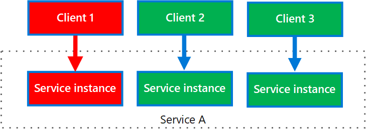

К преимуществам Bulkhead можно отнести:

- Изолирует потребителей и сервисы от каскадных сбоев. Проблема, затрагивающая потребителя или сервис, может быть изолирована внутри отдельного bulkhead`а, что предотвращает сбой всего солюшина.
- Позволяет сохранить рабочими некоторые функции в случае сбоя сервиса.
- Позволяет деплоить сервисы, предлагающие различную нагрузку
- Пул консюмеров с высоким приоритетом можно настроить для использования приоритетных сервисов.

К недостаткам:

- Менее эффективное использование ресурсов
- Дополнительная сложность поддержки, сложная структура

===== Пример

Приведенный ниже k8s конфиг файл создает изолированный контейнер для запуска одного сервиса, с собственными ресурсами CPU, памяти и лимитами:

[source, yaml]
----
apiVersion: v1
kind: Pod
metadata:
  name: drone-management
spec:
  containers:
  - name: drone-management-container
    image: drone-service
    resources:
      requests:
        memory: "64Mi"
        cpu: "250m"
      limits:
        memory: "128Mi"
        cpu: "1"
----

=== 6. Fallback Cache pattern

Сервис в архитектуре микросервисов должен быть спроектирован с учетом отказов, например, если сервис-источник данных стал недоступным. При этом сервис-потребитель не обязан отдавать самые свежие данные сервиса-источника.

Можно использовать резервный кэш - Fallback Cache. Задача такого кэша сохранить последние данные и в случае сбоя источников данных отдать последние успешно прочитанные данные. Как правило этот шаблон используется совместно с шаблоном Circuit Breaker:

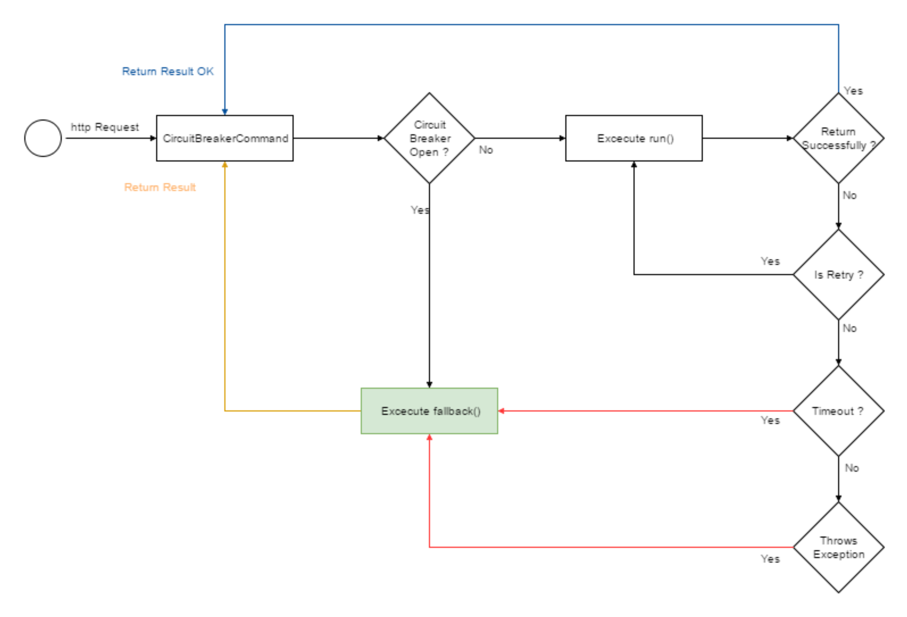

=== 7. Priority Queue pattern

См статью link:https://learn.microsoft.com/en-us/azure/architecture/patterns/priority-queue[microsoft]

Приложения, которые делегируют задачи фоновой обработки другим сервисам, или интергируются с ними, зачастую используют очередь сообщений. И если зачастую очередность обработки полученных запросов не важна, то в случае очередей с приоритетом есть различные скорости и приоритет обслуживания для отдельных клиентов. Высокоприоритетные запросы должны обрабатываться раньше, чем запросы с более низким приоритетом, даже если последние были уже отправлены ранее.

Существует два основных подхода к реализации шаблона Priority Queue:

- Одна очередь: все сообщения отправляются в одну очередь, и каждому сообщению назначается приоритет.
- Несколько очередей: для каждого приоритета сообщений используются отдельные очереди с разным количеством потребителей.

===== Единая очередь

При использовании одной очереди приложение назначает приоритет каждому сообщению и отправляет сообщение в очередь. Очередь упорядочивает сообщения по приоритету, гарантируя, что потребители обрабатывают сообщения с более высоким приоритетом раньше, чем сообщения с более низким приоритетом. Не все message brokers способны такое поддержать:

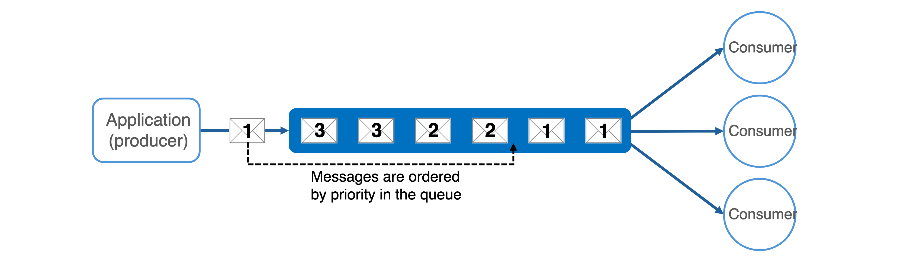

===== Несколько очередей

Несколько очередей позволяют разделять сообщения по приоритету. Приложение назначает приоритет каждому сообщению и направляет сообщение в очередь, соответствующую его приоритету. Потребители обрабатывают сообщения. Решение с несколькими очередями использует либо *_один пул потребителей_*, либо *_несколько пулов потребителей_*.

При наличии *нескольких пулов потребителей* каждая очередь имеет выделенные ей ресурсы потребителей. Очереди с более высоким приоритетом должны использовать больше потребителей или более высокие уровни производительности для более быстрой обработки сообщений, чем очереди с более низким приоритетом:

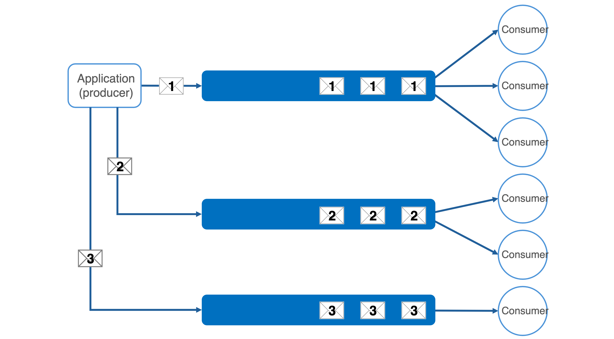

Используйте несколько пулов потребителей, если у вас:

- *Строгие требования к производительности* - различные приоритеты задач имеют строгие требования к производительности, которые должны выполняться независимо.
- *Высокая надежность* - если надежность и изоляция неисправностей имеют решающее значение, то проблемы в одной очереди не будут влиять на другие очереди.
- *Сложные приложения* - используйте для сложных приложений с различными типами задач, требующими различных характеристик обработки и гарантий производительности.

При использовании *единого пула потребителей* потребители сначала обрабатывают сообщения из очереди с наивысшим приоритетом и только при отсутствии сообщений с более высоким приоритетом обрабатывают сообщения из очередей с более низким приоритетом. В результате единый пул всегда обрабатывает высокоприоритетные сообщения перед низкоприоритетными. Однако это может привести к тому, что сообщения с более низким приоритетом, возможно, никогда не будут обработаны:

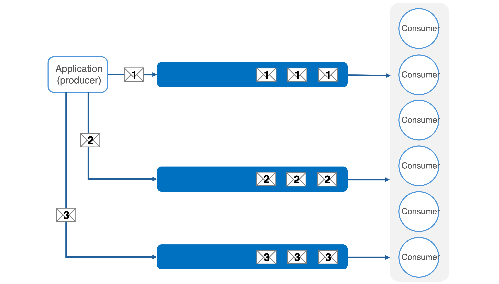

Используйте единый пул потребителей для:

- *Простоты управление* - подходит для приложений, где важна простота настройки, обслуживания и мониторинга.
- *Унифицированная обработка* - единый пул потребителей полезен, когда характер входящих задач очень схож.

=== 8. Leader Election (выбор лидера) pattern

См статьи link:https://learn.microsoft.com/ru-ru/azure/architecture/patterns/leader-election[microsoft], link:https://aws.amazon.com/ru/builders-library/leader-election-in-distributed-systems/[aws]

Ситуация: приложение имеет много скоординированных равноправных задач. Они выполняются по отдельности большую часть времени, но может также потребоваться координировать действия каждого экземпляра задачи, чтобы гарантировать, что они не конфликтуют, не вызывают конкуренции за общие ресурсы и не мешают работе, выполняемой другими экземплярами задач. Пример - параллельные вычисления или доступ к единому ресурсу. Все экземпляры задач являются равноправными, поэтому нет естественного лидера, который мог бы выступать в качестве координатора или агрегатора.

Один экземпляр задачи должен быть выбран в качестве лидера, и этот экземпляр должен координировать действия других подчиненных экземпляров задач. Если все экземпляры задач выполняют один и тот же код, каждый из них может выступать в качестве лидера. Поэтому процессом выборов необходимо управлять осторожно, чтобы не допустить одновременного занятия позиции лидера двумя или более экземплярами.

Система должна предоставлять надежный механизм выбора лидера. Этот метод должен справляться с такими событиями, как сбои в работе сети или сбои процессов. Во многих решениях подчиненные экземпляры задач отслеживают лидера с помощью некоторого метода heartbeat или опроса. Если назначенный лидер неожиданно завершает работу или сбой сети делает лидера недоступным для подчиненных экземпляров задач, им необходимо выбрать нового лидера.

Существует несколько стратегий выбора лидера среди набора задач в распределенной среде, в том числе:

- Гонка за получение общего, распределенного мьютекса. Первый экземпляр задачи, который получает мьютекс, становится лидером. Однако система должна гарантировать, что если лидер завершает работу или отключается от остальной части системы, мьютекс освобождается, чтобы другой экземпляр задачи мог стать лидером.
- Реализация одного из общих алгоритмов выборов лидера, таких как *_Bully Algorithm_*, *_Raft Consensus Algorithm_* или *_Ring Algorithm_*. Эти алгоритмы предполагают, что каждый кандидат на выборах имеет уникальный идентификатор и что он может надежно взаимодействовать с другими кандидатами.

=== 9. Queue-Based Load Leveling pattern

Все очень просто: используйте очередь между сервисами, которая будет сглаживать нагрузки. Обычно именно так и используется та же kafka.

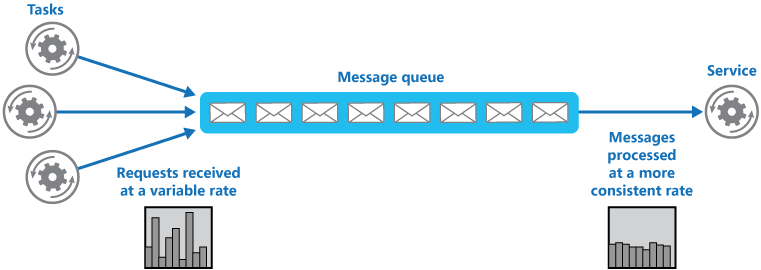

Очередь отделяет задачи от сервиса, и сервис может обрабатывать сообщения в своем собственном темпе независимо от объема запросов от параллельных задач. Кроме того, нет задержки для задачи, если сервис недоступен в момент отправки сообщения в очередь.

=== 10. Health Endpoint Monitoring pattern

См статью link:https://learn.microsoft.com/ru-ru/azure/architecture/patterns/health-endpoint-monitoring[microsoft]

Реализуйте мониторинг работоспособности, отправляя запросы к эндпоинту приложения. Приложение должно выполнить необходимые проверки, а затем возвращать свой статус.

Код ответа указывает состояние приложения. При необходимости в ответе также предоставляется состояние компонентов и сервисов, которые использует данный сервис. Кроме того, приложение может выполнять свои независимые проверки.

Сервис мониторинга выполняет проверку задержки или времени отклика.

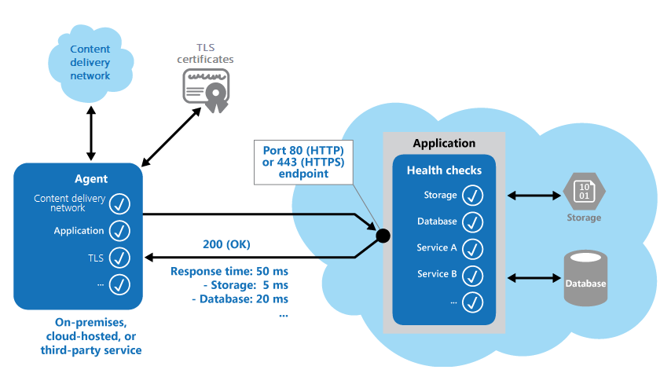