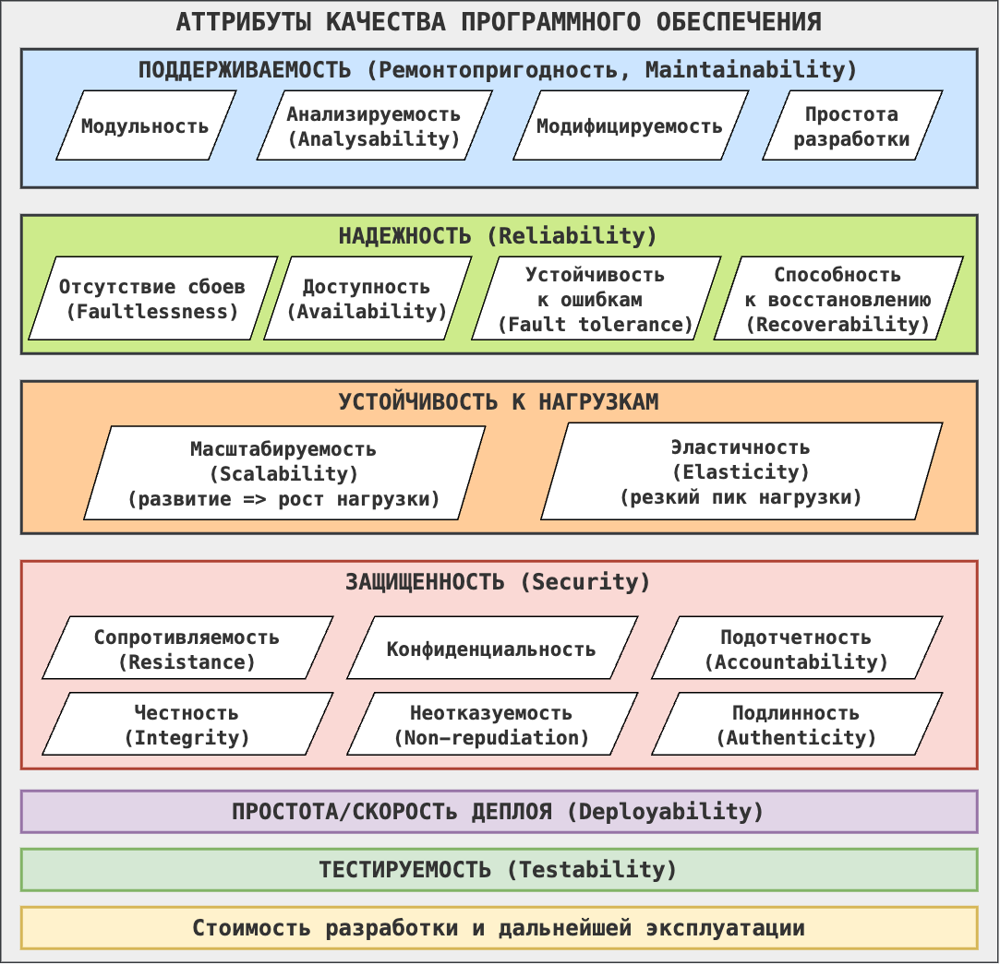

== Аттрибуты качества ПО

=== 1. Поддерживаемость (Ремонтопригодность, Maintainability)

Речь о том, что система может изменяться в рамках жизненного пути, и эти изменения должны быть максимально безошибочными (не привносить новых проблем) и безболезненными. Также можно разделить на:

- A) *Модульность* - больше независимых компонентов, изменение одного практически не влияет на другие. Плохой пример - *_common-модуль_* в common-библиотеках. Хороший - если common-библиотека есть, а common-модуля нет.
- B) *Анализируемость (Analysability)* - степень оценки влияния изменений на систему, оценки какие части нужно менять, "понятность" системы.
- C) *Модифицируемость* - система может быть модифицирована без получения на выходе дефектов либо в ущерб существующему качеству.
- D) *Простота разработки* - несколько система сложна для понимания (и погружения в нее новых разработчиков), насколько тяжело в голове держать бизнес/source code контекст.

=== 2. Надежность (Reliability)

Речь о том, что система работает в различных условиях (спокойствие, высокая нагрузка, проблемы инфраструктуры и т. д.). Также можно разделить на:

- A) *Отсутствие сбоев (Faultlessness)* - система работает без сбоев при стандартных условиях.
- B) *Доступность (Availability)*
- C) *Устойчивость к ошибкам (Fault tolerance)* - система продолжает работать, несмотря на сбои.
- D) *Способность к восстановлению (Recoverability)* - система может восстановить валидное (необходимое) состояние при сбое. Тут можно вспомнить как ретраи, так и бэкапы.

=== 3. Устойчивость к нагрузкам

- A) *Масштабируемость (Scalability)* - способность системы справляться с увеличением нагрузки (увеличивать свою производительность) *_при добавлении ресурсов_*. Т е мы сами добавили ресурсов - все стало работать. Масштабируемость - это постепенный рост (а не резкий). Это может быть как горизонтальное, так и вертикальное масштабирование.
- B) *Эластичность (Elasticity)* - способность системы справляться с резким увеличением нагрузки путем регуляции своих ресурсов. Выглядит как опциональный аттрибут, поскольку способность автоматически выделять нужный объем ресурсов на ту или иную нагрузку это скорее фича чем стандарт.

=== 4. Простота/скорость деплоя (Deployability)
Развертывание системы должно быть простым и быстрым - это уменьшит количество падений деплоя и позволит вовремя вывести нужный функционал.

=== 5. Тестируемость (Testability)
Степень трудозатрат на тестирование системы/погружение в процесс тестирования/времени тестов и т. д.

=== 6. Защищенность (security)
Защищенность данных от злоумышленников, случайных изменений, ошибок в работе системы или смежных систем. Смежные системы должны иметь только необходимые доступы. Также см https://www.techtarget.com/searchsecurity/definition/nonrepudiation[ссылку]. Аттрибут можно разделить на:

- A) *Конфиденциальность (Confidentiality)* - данные должны быть доступны только тем, у кого есть доступ.
- B) *Сопротивляемость (Resistance)* - система продолжает работу при атаках.
- C) *Подотчетность (Accountability)* - действия объекта могут быть отслежены вплоть до идентификации источника.
- D) *Честность (Integrity)* - гарантия системы, что ее данные и состояние защищены от несанкционированного или ошибочного изменения.
- E) *Неотказуемость (Non-repudiation)* - гарантирует, что ни одна сторона не может отрицать, что она отправила или получила сообщение посредством шифрования и/или цифровых подписей или одобрила какую-либо информацию.
- F) *Подлинность (Authenticity)* - тот, кто получает доступ, должен быть однозначно идентифицирован.

=== 7. Стоимость разработки и дальнейшей эксплуатации