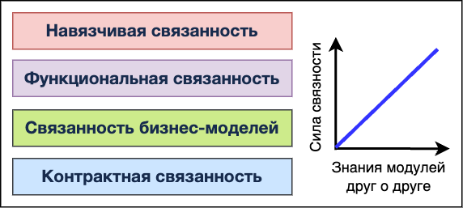
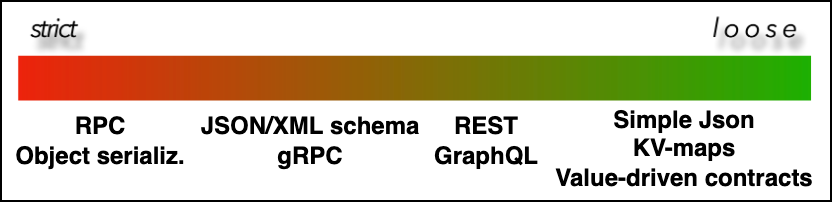
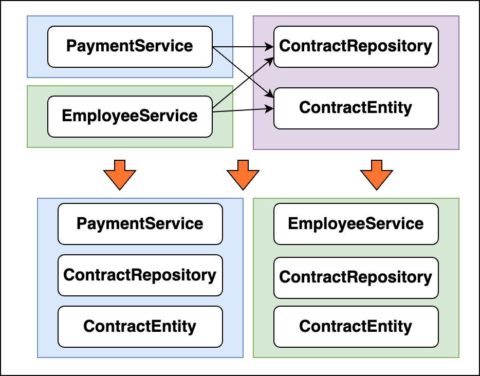
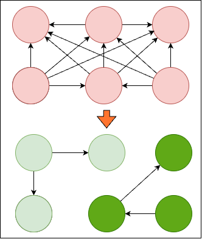
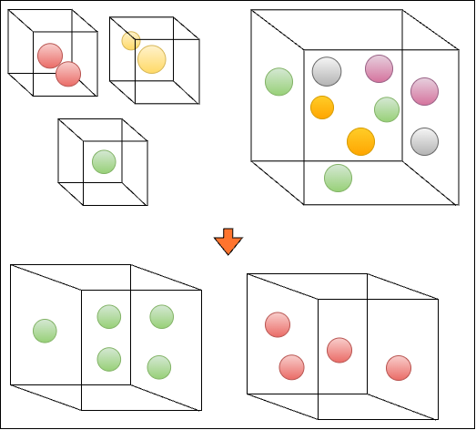

== Модульность как свойство системы

Если система слишком связана, то вносить в нее правки будет очень больно. Но от связей вообще отказаться не получится - в конце концов, как тогда коммуницировать и работать над одним бизнес-доменом?

Пусть у нас есть два сервиса - A и B. Причем связь их выглядит так: B -> A (т е B зависит от A). Если при внесении изменений в А есть высокий риск сломать что-то в B - такие компоненты называют *_сильно связанными_*.

Может показаться, что связность либо есть, либо нет. Однако это не так. Вообще, связность имеет три параметра для измерения:

- Сила связи
- Расстояние
- Изменчивость (совместная изменчивость компонентов)

=== 1. Сила связи

Модель *_Integration Strength_* описывает 4 уровня силы от большего к меньшему:

Каждый уровень имеет подуровни с различными силами связи. Например, контрактная связанность может делиться на синхронную и асинхронную. Асинхронные связи еще больше развязывают модули (но только на read-operations).

Пример контрактов по уровню связанности:

- 1) *_Strict_* - контракты с жесткой схемой (Avro) - валидируют данные еще на входе. Хорошо подходят для интеграционных тестов. Интеграция хрупкая и плохо подвержена изменениям. Такой контракт требует соблюдения имен/типов/порядка максимально жестко.
- 2) *_Loose_* - контракты, у которых гибкая схема, без или почти без валидаций. Риски ошибок высокие, но не нужно менять контракт на второй стороне. Требуется высокий уровень зрелости команд.
- 2) *_Tunable_* - контракт, у которых строгая схема, но они дают пользователю выбрать, какие данные ему конкретно нужны (GraphQL).

==== 1.1 Навязчивая связанность

Компоненты связаны на уровне реализации/reflection/приватных методов. Изменения в реализации upstream компонента могут сломать downstream компонент. Также примером такой связи может служить связь через БД.

==== 1.2 Функциональная связанность

Компоненты реализуют одну или тесно связанную бизнес-функцию, и любое изменении этой бизнес функции по смыслу (запрос из бизнеса) скорее всего затронет оба компонента, даже если они связаны через контракт rest/kafka, etc.

==== 1.3 Связанность бизнес-модели. Bounded context

Компоненты используют одну и ту же бизнес-модель, например, общие dto/entity в common-library. Это вносит зависимость всех внешних компонентов от этих общих частей и невозможность изменить модель без затрагивания других компонентов.

Решением данной проблемы может являться концепция ограниченных контекстов - *_Bounded context_*, - которую предложил Мартин Фаулер. Суть в том, что мы в каждый бизнес-контекст вносим все необходимые сущности. Вся внутренняя реализация моделей/БД не выходит за границы ограниченного контекста. В этом случае мы полностью разрываем контракт:

==== 1.4 Контрактная связанность

Компоненты связаны только контрактом и не зависят от деталей реализации.

Можно предположить, что чем ниже сила связности, тем лучше. Но всегда ли это так? Для этого надо рассмотреть остальные два параметра связности компонентов:

=== 2. Расстояние между связанными компонентами

Можно поделить расстояния по типу в каких местах надо делать изменения, от более ближнего к более дальнему расстоянию:

- 1) Между инструкциями одного метода
- 2) Между методами одного класса
- 3) Между классами одного компонента сервиса
- 4) Между разными компонентами сервиса
- 5) Между разными сервисами, которые поддерживает одна команда
- 6) Между разными сервисами, которые поддерживает разные команды
- 7) Между разными системами

Чем расстояние дальше, тем дороже обойдутся изменения.

=== 3. Совместная изменчивость компонентов

Совместная изменчивость - это вероятность, что изменения потребуются в разных компонентах/классах/системах и т. д. Это можно понять только из требований и специфики бизнеса.

=== 4. Баланс между всеми тремя параметрами

Выведем формулу БОЛИ:
----
Боль = Сила * Расстояние * Изменчивость
----
Уменьшите хотя бы один из них до близкого к 0 значению, чтобы свести к минимуму неудобства связанности компонентов.

- 1) Вариант 1 - плохой - _**Big ball of mud** = большая Сила * большое Расстояние * большая Изменчивость_. +
Когда все параметры большие - получается система, в которую очень тяжело вносить изменения. Программист с другого проекта изменил что-то в своем сервисе - и от этого страдает вся ваша система - такие ситуации здесь нормальны.

- 2) Вариант 2 - _**Loose coupling** = малая Сила * большое Расстояние * малая Изменчивость_.
Coupling - это мера того, насколько связанны два компонента. В большинстве случаев, говоря о *слабом (loose) coupling*, мы подразумеваем две далекие системы, которые будут мало изменяться и контракт у них будет адекватный, со слабой связностью. Это уже хороший вариант стандартной далекой интеграции. +

- 3) Вариант 3 - _**Legacy pragmatic** = большая Сила * большое Расстояние * малая Изменчивость_.
Возьмем предыдущий вариант и сделаем большую силу связности. Если у вас система почти не меняется (легаси) - боли вы практически не получите (а где боль если изменений ноль). В этом случае допустима сильная сила связности - можно делать связь хоть через remote procedure call, хоть через БД.

- 4) Вариант 4 - _**High cohesion** = большая Сила * малое Расстояние * большая Изменчивость_.
Сohesion - это мера того, насколько функционально связаны два компонента. В большинстве случаев, говоря о *высоком (high) cohesion*, мы подразумеваем два близких компонента (два класса или метода), при этом какая бы не была изменяемость или сила связности, из-за малого расстояния у нас не будет больших каскадных изменений. Это хороший вариант стандартной близкой интеграции. +

Наиболее адекватные варианты - *_Loose coupling_* и *_High cohesion_*. +
Существует зависимость между coupling и cohesion - если coupling увеличивается, то cohesion уменьшается (все становится хуже), и наоборот. Если в вашей системе high coupling, у вас будет low cohesion (и это плохо).