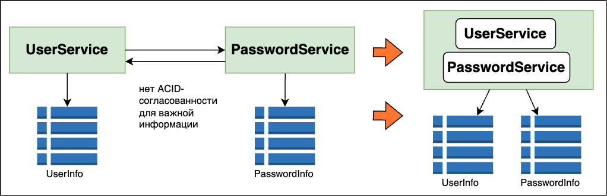

== Гранулярность сервисов (размер частей интеграции/разбиения)

*Content:*

- 1. Дезинтеграторы и интеграторы
- 2.1 Функциональность и размер сервиса
- 2.2 Пропускная способность и масштабируемость
- 2.3 Активность изменений
- 2.4 Расширяемость
- 2.5 Отказоустойчивость
- 2.6 Безопасность
- 3.1 Общий исходный код
- 3.2 Транзакции в БД
- 3.3 Общие процессы и хореография
- 3.4 Неразделяемость на уровне данных

Если модульность (link:sn2_modularity.adoc[modularity]) - это про разбиение системы на отдельные части, то *гранулярность* - это про размер этих самых частей, которые также называются *единицами деплоя*. Очевидно, что речь в том числе идет о кусках, которые можно задеплоить/улучшать независимо.

=== 1. Дезинтеграторы и интеграторы

Говоря простыми словами, *дезинтегратор* - это индикатор разделения, и он показывает, что система теоретически может требовать разделения на части. Это не обязательное правило, а, скорее, признак. Много дезинтеграторов - это скорее показатель того, что систему лучше разделить.

Подобно дезинтегратору, *интегратор* - это обратный индикатор, показывающий, что несколько кусков/модулей теоретически могут требовать объединения в одно целое.

Рассмотрим таблицу основных *_дезинтеграторов_*:

|===
|Дезинтеграторы |Причина применения

|*_Функциональность и размер сервиса_*
|Сервис делает избыточное количество несвязанных (функционально, бизнесово) вещей.

|*_Пропускная способность и масштабируемость_*
|Если разные части сервиса стоит скейлить по-разному или нагрузка на них разноплановая (low/high performance)

|*_Активность изменений_*
|Возможно, часть сервиса изменяется в другом темпе, чем его остальные части.

|*_Расширяемость_*
|Возможность добавления дополнительной функциональности по мере развития частей. Если где-то очень нужна расширяемость и абстракции - можно выделить в отдельный модуль.

|*_Отказоустойчивость_*
|Может ли быть такое, что какая-то часть сервиса подвержена сбоям, и это будет влиять на остальные части?

|*_Безопасность_*
|Необходима ли некоторым частям сервиса более высокий уровень безопасности? (обработка данных платежных карточек на сертифицированном контуре)
|===

Рассмотрим таблицу основных *_интеграторов_*:

|===
|Интеграторы |Причина применения

|Общий исходный код
|Общий исходный код в общей библиотеке при изменении будет влиять на слишком много частей или нет?

|Транзакции в БД
|Разным сервисам требуется транзакционность в работе с БД (ACID, согласованность).

|Общие процессы и хореография (когда нет saga orchestrator - link:../ch4_architecture/p110_Saga_pattern.adoc[p110_Saga_pattern.adoc])
|Когда для достижения результата сервисам требуется активно общаться друг с другом.

|===

=== 2. Дезинтеграторы

=== 2.1 Функциональность и размер сервиса

Если у сервиса низкая cohesion (что не есть ок) - его можно делить на составляющие. Иначе говоря, речь о многозадачных сервисах, задачи которых слабо связаны - как в примере на картинке:

=== 2.2 Пропускная способность и масштабируемость

Если разные части сервиса стоит масштабировать по-разному или у них различается пропускная способность - то можно разделить сервис на части. Возьмем, к примеру, сервис нотификаций, который позволяет отправлять нотификации по различным каналам - в messenger, email или по смс. Допустим, что нотификаций в messenger гораздо больше приходит чем по email и смс. При этом активность отправки по email выше всего в пятницу и поэтому нагрузка на email в пятницу может привести к необходимости дополнительно скейлить сервис. Поэтому резонно вынести все функционалы отправки в отдельные сервисы, передавая входящую инфу, например, по kafka:

=== 2.3 Активность изменений

Допустим, сервис messenger менялся каждую неделю, сервис email менялся каждые 2 недели, а сервис sms меняется раз в 2 месяца. Тогда можно выделить эти сервисы в отдельные части для раздельного деплоя/тестирования и для организации работы команды над ними. В теории можно вынести messenger/email в один блок, а sms - в другой.

=== 2.4 Расширяемость

Рассмотрим опять же наш notification service. Допустим, в sms sender решили сделать отправку более надежной, вместо ретраев завезли кафку. В то время как в email sender добавили возможность принимать и отсылать изображения и другие медиафайлы. Это абсолютно разная расширяемость, и тащить ее в один сервис будет большой нагрузкой на кодовую базу и на общий код. Кроме того, добавление потребует дополнительной регрессии всего кода, увеличиваются риски развертывания. И это влияет на messenger sender, который вообще никак не менялся функционально.

=== 2.5 Отказоустойчивость

Если сервис sms-сообщений может терпеть сбои - то это также повлияет на доступность других модулей (пропускная способность, ресурсы CPU и т. д.)

=== 2.6 Безопасность

Если модулю требуется более высокий уровень безопасности, то его можно выделить в отдельный сервис и отправить в специальный защищенный контур вместо того, чтобы отправлять в этот дорогой контур весь сервис со всем функционалом. Предположим, что теперь мы хотим защитить отправку sms-сообщений и email-сообщений, чтобы было нельзя определить номер или почту получателя.

=== 3. Интеграторы

=== 3.1 Общий исходный код

Если речь идет о каком-то утилитном классе, то обычно нет проблем в использовании общего кода. Тем не менее, общая библиотека может предоставлять многое - например, механику динамического создания листенеров kafka или какой-то общий листенер чего-то сквознофункционального, базовые классы для работы с пользователями и т. д. В результате изменения в таких бизнес-важных кусках библиотеки могут привести к поломке работающего функционала в зависимых сервисах. Можно общий код выносить в каждый сервис, а можно объединить все сервисы в один. Возможно, это справедливо для сервисов, которые сами по себе невелики и не представляют из себя отдельного бизнес-домена. Тогда не очень понятно, зачем эти сервисы вообще создавались - скорее всего их создание и было ошибкой. Пункт требует уточнения.

=== 3.2 Транзакции в БД

В распределенной среде нам недоступны ACID транзакции - поэтому либо используется eventual consistency, либо, в ряде случаев, появляются сервисы, которые работают с одной БД (общаются через БД). Иногда такие сервисы стоит объединить в один, если это действительно важно.

=== 3.3 Общие процессы и хореография

Если сервисы для достижения конечной цели много общаются друг с другом, то используется saga orchestrator или хореография. Если сервисы слишком мелкие, то их межсервисная связь может оказаться такой сильной, что будут негативные последствия зависимости друг от друга. +
Например, если у нас сервисы A, B, C синхронно зависят от D, то при сбое на сервисе D сбоить будут и остальные сервисы. +
Кроме того, большое количество запросов равно длительному времени ожидания завершения операции. Если нам нужен запрос, который ходит в 4 сервиса, то это будет долго (допустим, время 1 запроса 300 мс, тогда время 4 запросов равно 1200 мс).

