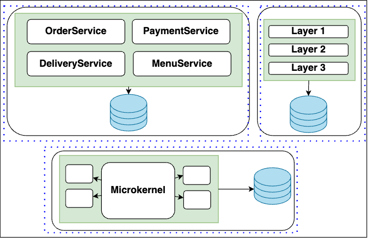
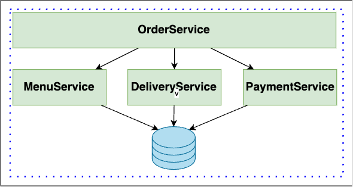
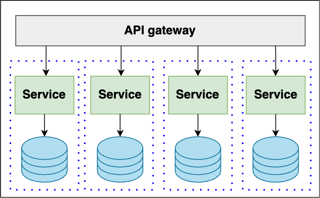
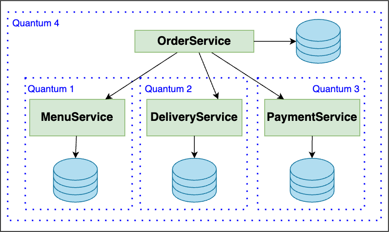
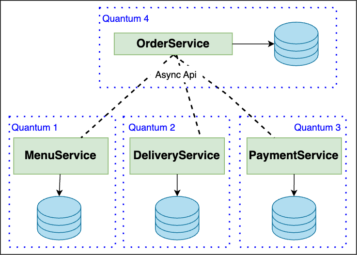

== Архитектурный квант

=== 1. Определение

----
An architecture quantum is an independently deployable artifact with high functional cohesion, high static coupling, and synchronous dynamic coupling.
----

Согласно Форду (Neal Ford), архитектурный квант - это:

1. Независимо разворачиваемая архитектурная единица (с БД, поисковым движком и пр.)
2. С высокой функциональной сплоченностью (*_high functional cohesion_*). +
Где _cohesion_ - это про сплоченность в рамках рабочего процесса. Например, если речь о сервисе заказа еды, то пользователю нужна доступность как минимум order/delivery/payment/menu. Иначе говоря, без этих компонентов сервис order не имеет бизнес-ценности. Хотя по отдельности menu может иметь бизнес-ценность, т к может использоваться как электронное меню в ресторане. +
Вообще говоря, кванты не могут быть вложенными (квант menu не вложен в квант сервиса заказа еды, т к квант сервиса заказа еды состоит из сервисов order/delivery/payment/menu), но могут быть разные пользовательские сценарии которые объединяют сервисы в кванты. Таким образом, для разных пользовательских сценариев получаются разные кванты. Так и здесь - сценарий заказа еды образует большой квант, а сценарий просмотра меню - малый.

3. Имеющая сильную статическую связь (*_high static coupling_*) между своими компонентами. +
Это по сути говорит о "силе контрактов" между частями. И если "static coupling" - это про все зависимости, в частности, БД, библиотеки, операционные системы, очереди, механизмы оркестрации и др. То понятие "high" - это про сильную связь. Например, БД или библиотека имеет сильную связь, очередь - среднюю, а механизм оркестрации - слабую.
4. Не имеющая в своих (особенно в синхронно связанных компонентах) сильно несовместимых различий в аттрибутах качества. +
Грубо говоря, если у нас есть вызывающая система и вызываемая, и вызывающая система более производительная, то вызываемая система попросту не сможет обработать все запросы при нагрузке, которые в нее отошлет вызывающая система.
5. Да и вообще, при синхронном внешнем вызове вызываемая система захватывается в архитектурный квант вызываемой. Это называется *_synchronous dynamic coupling_*.

=== 2. Примеры

==== 2.1. *_Монолитная архитектура_*
один архитектурный квант, поскольку деплоится весь целиком:

==== 2.2. *_Service-Oriented-Architecture с одной БД_*
Один квант, т. к. БД это high static coupling - и мы превращаемся в один архитектурный квант. Была бы очередь - может быть и было бы несколько квантов:

==== 2.3. *Архитектура с общим оркестратором и БД_*
Один квант. С БД все понятно, а вот с оркестратором работает пункт 5 - синхронная связь для рабочего процесса в распределенной архитектуре. Возможно, речь идет о распределенной транзакции с сагой - в любом случае, оркестратор подходит под определение "synchronous dynamic coupling":

==== 2.4. *_Микросервисы с одним и несколькими юзер-интерфейсами_*
Один и много квантов в первом и втором случае соответственно.
Если рассматривать микросервисы отдельно от фронта, то имеем много квантов:

Если юзер-интерфейс один - то имеется сильная связность с одним юзер-интерфейсом, что превращает систему в один квант:

image::img/quant_microservices_2.png[]

Если юзер-интерфейсов несколько - то каждый юзер-интерфейс объединяет один квант (в случае паттерна "microservices с microfrontends"):

image::img/quant_microservices_3.png[]

==== 2.5. *_Сервис заказа еды с синхронным взаимодействием/оркестратором._*
Как мы рассматривали в пункте 2 списка признаков кванта, сервис order имеет high functional cohesion относительно всех остальных сервисов. При этом отдельно сервис menu создает свой отдельный квант. Т е здесь мы видим аж 4 кванта, самый большой из них - квант сервиса заказа еды.

==== 2.6. *_Сервис заказа еды с асинхронным взаимодействием._*
Пример более сложный и очень интересный. Используется асинхронный паттерн SAGA, в результате получается, что сервисы не синхронны и не объединены операционными характеристиками (т е аттрибуты качества у них могут быть какими угодно). Точно такая же ситуация с общим процессом - его просто нет, все работает асинхронно. Сервис order не обязан координировать остальные, как в примере выше. Поэтому мы имеем четыре независимых кванта.

=== 3. Рекомендации при проектировании

Если появляется квант поставщик-потребитель (пункт 5, когда потребитель захватывается квантом поставщика) - лучше всего разорвать синхронную связь и сделать асинхронную. В этом случае помогают паттерны Message Broker, link:https://scs-architecture.org[Self Contained Services] и Event-Driven Architecture. +
Монолиты не всегда удобны из-за больших квантов - но это если монолит большой. У монолитов зачастую высокая связность на уровне данных (чаще всего общая БД), да и и компоненты не могут быть развернуты независимо друг от друга. +
Микросервисы могут создать мелкие кванты, однако дополнительные накладные расходы на распределенные транзакции и сеть накладывают свои ограничения. На кванты тоже надо все делать с умом, не обязательно чем мельче квант - тем лучше.
