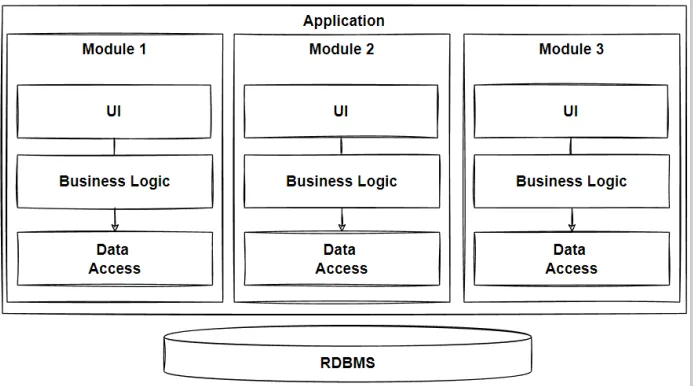
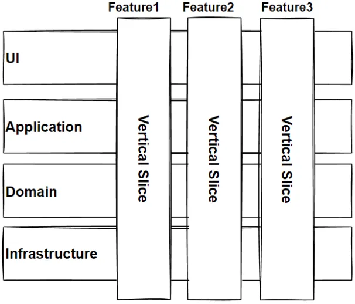

== Модульная монолитная архитектура

link:https://www.fullstack.com/labs/resources/blog/modular-monolithic-vs-microservices[ссылка 1], link:https://medium.com/design-microservices-architecture-with-patterns/microservices-killer-modular-monolithic-architecture-ac83814f6862[ссылка 2]

[cols="2,1"]
|===
|Тип деления модулей |домены
|Кванты |1
|Deployability |[big red]#*1/5*#
|Эластичность |[big red]#*1/5*#
|Ремонтопригодность (Maintainability) |[big olive]#*3/5*#
|Стоимость разработки/эксплуатации |[big lime]#*5/5*#
|Производительность |[big yellow]#*2/5*#
|Reliability (надежность) |[big olive]#*3/5*#
|Масштабируемость (Scalability) |[big red]#*1/5*#
|Простота |[big lime]#*5/5*#
|Тестируемость |[big lime]#*5/5*#
|===

Простота и стоимость - эти аспекты унаследованы от слоеной архитектуры. Тестируемость и ремонтопригодность - от vertical sliced-архитектуры. Однако имеет еще более модульную архитектуру по сравнению с vertical sliced и layered. Поскольку архитектура все еще монолитная, она имеет все те же низкие показатели масштибируемости, развертываемости, эластичности и надежности.

=== 1. Определение

Монолитное приложение также может быть разделено на модули по шаблону ограниченных контекстов. Каждый модуль - это ограниченный контекст. Похоже на микросервисы, но на самом деле принцип другой. В микросервисах - принцип независимого завертывания и независимой доставки ценности на прод. Модульный монолит же борется с big ball of mud, который возникает в обычных монолитах или даже в layered архитектуре.

Модульная монолитная архитектура состоит из модулей, причем каждый модуль должен быть:

- *_независимым_*
- *_изолированным_*
- иметь свою собственную *_бизнес-логику_* — и, при необходимости, свою *_базу данных или схему_*
- Каждый модуль - это *_ограниченный контекст_*.

Также каждый модуль может следовать своей собственной внутренней архитектуре. Например, на рисунке ниже каждый модуль следует стилю layered-архитектуры, но также они могут использовать принцип clean architecture. Таким образом, вы можете строить и изменять слои каждого модуля, не влияя на другие:

Модульная монолитная архитектура взяла в себя лучшее из Layered и Vertical Slices архитектур. Каждый модуль разбит на вертикальные слои и горизонтальные слои, что делает эту архитектуру одновременно устойчивой к изменению бизнес функциональностей и чистой с точки зрения разграничения ответственности между горизонтальными слоями:

Эти модули могут быть потенциальными микросервисами, когда необходимо будет независимо развертывать и масштабировать наше приложение в будущем. Таким образом, мы можем постепенно рефакторить нашу архитектуру в архитектуру микросервисов, а не прыгать к ней с самого начала.

=== 2. Плюсы и минусы

*Преимущества:*

1. *_Инкапсуляция бизнес-логики_*. Бизнес-логика инкапсулируется в модули, что обеспечивает высокую степень повторного использования, при этом данные остаются неизменными, а модели взаимодействия простыми.
2. *_Повторно используемый код_*. Модульные утилитные компоненты могут быть повторно использованы.
3. *_Разделение задач_*: каждый уровень фокусируется на определенной функции, например, логике представления, бизнес-логике или хранении данных.
4. *_Простота разработки и отладки_*. *_Изоляция разработки_*: изменения на одном модуле, как правило, не влияют на другие, что способствует независимой разработке и обслуживанию.
5. *_Разделение команд_*. Команды, как и в случае с микросервисами, могут работать отдельно над каждым модулем. Это позволяет разделять команды и делать работу параллельно.
6. *_Простота управления_*. Не нужно возиться с оркестратором, эксплуатация одного сервиса проще чем нескольких отдельных.
7. *_Согласованность ACID_*. Полезно, если данные не подходят для распределенной архитектуры. Например, если ваше приложение хранит важные данные, такие как дебет на банковском счете, и вам нужна строгая согласованность данных.

*Недостатки:*

1. *_Невозможно масштабировать и развертывать независимо_*. Поскольку приложение представляет собой единое целое, его нельзя масштабировать на отдельные части или развертывать независимо, как микросервисы.
2. *_Нет изоляции системных ошибок_*. Если инфраструктура шалит на вашем сервере - то не будет работать весь монолит целиком. Или же если на одном из модулей будет критический сбой, то этот модуль будет влиять на все остальные, и упадет (если не прекратится вообще) производительность всех модулей.
3. *_Нельзя использовать разные технологии_*. Не получится один сервис написать на go, второй нв java, третий на python.
