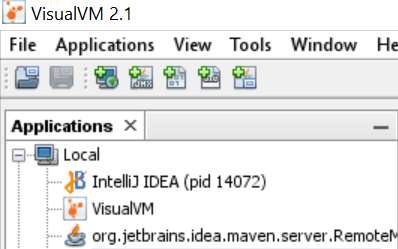

== Как подключаться из кубера к VisualVM?

- 1) Добавляешь параметры в *_Deployment_*:

[source, yaml]
----
containers:
  args:
    - >-
      ...
      -Dcom.sun.management.jmxremote
      -Dcom.sun.management.jmxremote.ssl=false
      -Dcom.sun.management.jmxremote.authenticate=false
      -Dcom.sun.management.jmxremote.port=1098
      -Djava.rmi.server.hostname=127.0.0.1
      -Dcom.sun.management.jmxremote.rmi.port=1098
----

- 2) Потом делаешь *_port-forward_*:

[source, bash]
----
kubectl port-forward service-name-0000000000-0000 1098:1098 -n namespace-name
----

- 3) Потом добавляешь `localhost:1098` соединение в `VisualVM`, ждешь немного и все отображается:

