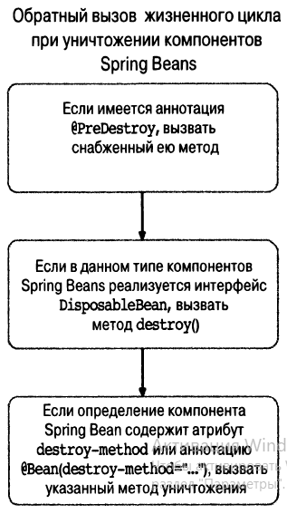

=== Жизненный цикл бинов и методы

Важной особенностью любого контейнера IoC (в т.ч. Spring) является возможность построения бинов таким образом, чтобы _получать уведомления в определенные моменты своего **жизненного цикла**_. Это дает бинам возможность выполнять надлежащую обработку в это время. Для бинов важны два события: после инициализации и перед уничтожением бина. **__Событие создани__**я работает для всех scopes, *_уничтожения_* - для всех, кроме *_prototype_*.

В каркасе Spring предоставляются три механизма, которые можно применять в компоненте Spring Bean *_для привязки_* к каждому из этих *_событий_* и выполнения *_дополнительной обработки_*. Эти механизмы основаны на 1)*_интерфейсах_*, 2)*_методах_* и 3)*_аннотациях_* соответственно.

===== Схема создания бина:

1. Загрузка описаний бинов, создание графа зависимостей(между бинами)
2. Создание бинов и внедрение значений в свойства бина
3. Если бин реализует *_NameBeanAware_*, то ID бина передается в метод _setBeanName()_
4. Если бин реализует *_BeanFactoryAware_*, то Spring устанавливает ссылку на bean factory через метод _setBeanFactory()_
5. -
6. Если бин реализует интерфейс *_ApplicationContextAware_*, то Spring устанавливает ссылку на ApplicationContext через _setApplicationContext()_
7. Если присутствует аннотация - *_@PostConstruct_*, вызвать снабженный ею метод
8. Если Веап реализует интерфейс *_InitializingВеап_*, вызвать метод _afterPropertiesSet()_
9. Если определение Веап содержит атрибут *_init-method_* или аннотацию *_@Веап(init-method='...')_*, вызвать указанный метод инициализации

Используя *_обратный вызов_* при инициализации, бин может проверить требующиеся ему зависимости. Это нельзя выполнить в конструкторе, потому что, может быть, еще не все зависимости предоставлены (а вдруг метод установки). Обратный вызов при инициализации инициируется после того, как каркас Spring завершит предоставление зависимостей и выполнит любые запрашиваемые проверки зависимостей.

*_See_* _p201_bean_init_method/..._

===== Схема уничтожения бина:

1. Если имеется аннотация *_@РrеDеstrоу_*, вызвать снабженный ею метод
2. Если Веап реализует *_DisposableВеап_*,вызвать метод _destroy()_
3. Если Веап содержит атрибут *_destroy-method_* или аннотацию *_@Вean(destroy-method='...')_*, вызвать указанный метод уничтожения

*_See_* _p201_bean_init_method/..._

Проблема обратных вызовов при уничтожении бинов в Spring заключается в том, что удаление не запускается автоматически, т.е. перед закрытием приложения следует вызвать метод *_AbstractApplicationContext.destroy()_*. Если приложение выполняется как сервлет, указанный метод destroy() можно вызвать в методе destroy() данного сервлета. Но в автономном приложении дело обстоит не так просто, особенно при наличии многих точек выхода из приложения. +
Решение выглядит так. В языке Java допускается создание *_перехватчика завершения_* - *_потока_*, _который исполняется непосредственно перед завершением приложения_. Это отличный способ вызвать метод *_destroy()_* AbstractApplicationContext. Задействовать этот механизм проще всего с помощью метода *_registerShutdownHook()_*. Этот метод автоматически предписывает каркасу Spring зарегистрировать перехватчик завершения базовой исполняющей среды виртуальной машины JVM. *_See_* _p201_bean_init_method/CarDemo.java_