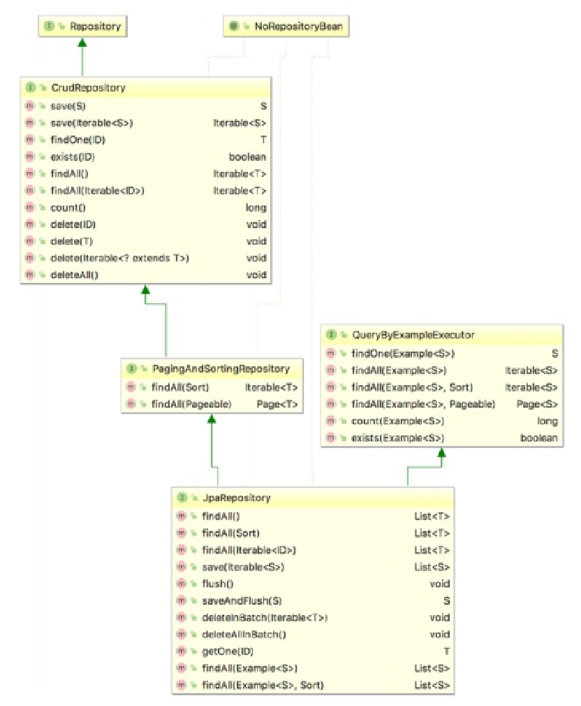

== Spring Data JPA

- Введение [p 580]
- Абстракция хранилища в Spring Data JРА для операций в БД; CrudRepository [p 580]
- JpaRepository [p 588]
- Кастомные запросы, @Query [p 590]

=== Введение

*_Spring Data JPA_* является подпроектом, разработанным в рамках проекта Spring Data. Главное назначение Spring Data JPA -  дополнительные возможности для упрощения разработки приложений, использующих JPA. В проекте Spring Data JPA предоставляется немало основных средств, и два из них будут рассмотрены в этом разделе:

- _Абстракция информационного хранилища_ типа *_Repository_* (*_CrudRepository_*, *_JpaRepository_*)
- *_Приемник сущностей_*, предназначенный для отслеживания в базе данных аудиторской информации по классам сущностей

=== Абстракция хранилища в Spring Data JРА для операций в БД; CrudRepository

Одним из главных понятий в проекте Spring Data и всех его подпроектах является *_абстракция информационного хранилища_* типа _Repository_, относящаяся к проекту _Spring Data Commons_ (link:https://github.com/spring-projects/spring-data-commons[github]). В Spring Data JPA _абстракция информационного хранилища_ служит *_оболочкой_*, в которую заключается интерфейс *_EntityManager_* и которая предоставляет более простой интерфейс для доступа к данным через интерфейс JPA.

Главным в Spring Data является маркерный интерфейс *_Repository<T, ID extends Serializable>_*, входящий в дистрибутив Spring Data Commons. В проекте Spring Data предоставляются различные расширения интерфейса Repository, одним из которых служит интерфейс *_CrudRepository_*, в котором предоставляется ряд часто употребляемых методов. Ниже приведено объявление этого интерфейса, взятое из исходного кода проекта Spring Data Commons:
[source, java]
----
@NoRepositoryBean
public interface CrudRepository<T, ID extends Serializable> extends Repository<T, ID> {
    long count();
    void delete(ID id);
    void delete(Iterable<? extends Т> entities);
    void delete(T entity);
    void deleteAll();
    boolean exists(ID id);
    Iterable<T> findAll();
    Т findOne(ID id);
    Iterable<T> save(Iterable<? extends Т> entities);
    Т save(T entity);
}
----

Достаточно объявить интерфейс, который нследуется от _CrudRepository_ и определить в нем методы, которые *_по имени метода_* будут выполнять все запросы за вас (если только вы не определите кастомный запрос через *_@Query_*): +
*_See_* _p580_Spring_Data_JPA_start/repository/SingerRepository.java_

В отличие от стандартной конфигурации JPA, конфигурация _Spring Data_ содержит аннотацию *_@EnableJpaRepositories_*, которая предписывает использовать JPA репозитории. А остальные зависимости (от компонентов *_emf_* и *_transactionManager_*) внедряются автоматически контейнером IoC в Spring. При этом использование _Spring Data_ не запрещает использование конфигов с настройками типа бинов _transactionManager_, но позволяет обойтись и без них, оставив в конфигах только _dataSource_ +
*_See_* _p580_Spring_Data_JPA_start/config/SpringDataConfig.java_

=== JpaRepository

*_PagingAndSortingRepository_* extends *_CrudRepository_* +
*_JpaRepository_* extends *_PagingAndSortingRepository_*

- The *_CrudRepository_* interface provides methods for CRUD operations, so it allows you to _create, read, update and delete_ records without having to define your own methods.
- The *_PagingAndSortingRepository_* provides additional methods to retrieve entities using *_pagination and sorting_*.
- The *_JpaRepository_* provides some JPA-related methods such as *_flushing the persistence context_* and *_deleting records in a batch_*.

=== Кастомные запросы, @Query

В сложных приложениях могут потребоваться специальные запросы, которые нельзя автоматически вывести средствами Spring. В таком случае запрос должен быть явно определен с помощью аннотации *_@Query_*. Воспользуемся этой аннотацией для поиска всех музыкальных альбомов, содержащих слово The в своем названии. С этой целью объявим интерфейс AlbumRepository:

*_See_* _p580_Spring_Data_JPA_start/repository/AlbumRepository.java_, _p580_Spring_Data_JPA_start/SpringDataJpaDemo.java_