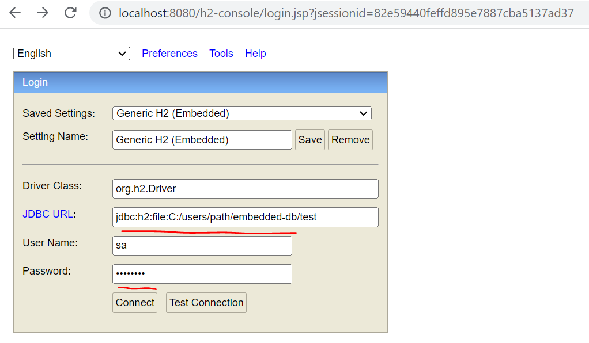
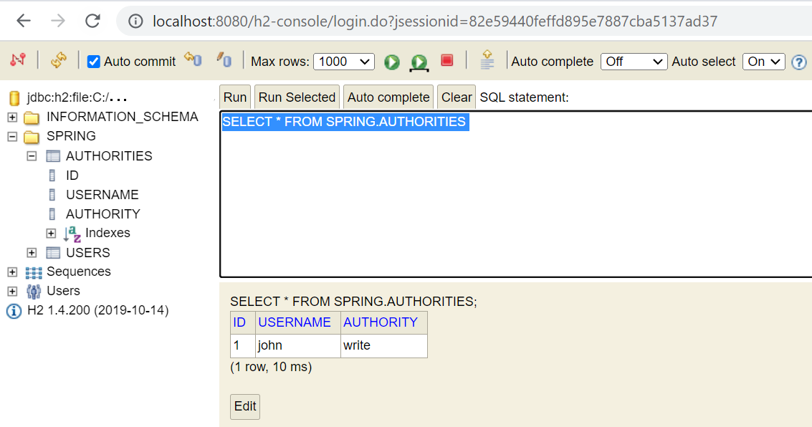

== Spring datasource

- 1. Введение в H2
- 2. Файловая и embedded база H2. Доступ к файловым данным H2

=== 1. Введение в H2

Для внутренней разработки можно использовать *_embedded_* базу *H2*. Она работает через jdbc. Для этого надо добавить зависимости:

[source, xml]
----
<dependencies>
    <!-- to enable h2 db -->
    <dependency>
        <groupId>org.springframework.boot</groupId>
        <artifactId>spring-boot-starter-jdbc</artifactId>
    </dependency>
    <dependency>
        <groupId>com.h2database</groupId>
        <artifactId>h2</artifactId>
    </dependency>
</dependencies>
----

Для автосоздания базы и наполнения ее данными можно в папочке *resources* создать *_schema.sql_* и *_data.sql_*.

Однако иногда нам надо переопределить это поведения (например, читать данные из другого файла). И тут на помощь приходят проперти (_application.properties_):

- `spring.sql.init.schema-locations=classpath:schema_p79.sql` - переопределяет путь к файлу schema.sql
- `spring.sql.init.data-locations=classpath:data_p79.sql` - переопределяет путь к файлу data.sql

*_See_* +
_spring-security-learning/.../p79_JdbcUserDetailsManager/..._ & +
_spring-security-learning/.../resources/application-with-h2_p79.properties_

=== 2. Файловая и embedded база H2. Доступ к файловым данным H2

Ссылка: link:https://www.baeldung.com/spring-boot-h2-database[baeldung]

Для того чтобы БД (c именем test) сохранялась в файл, надо использовать конструкцию типа:
----
spring.datasource.url=jdbc:h2:file:C:/.../DRIVE/embedded-db/test
----
Но после рестарта приложения файлы в папке `embedded-db/test` не перезапишутся, надо удалять текущий файл будет. Либо - если вы рестартуете одно и то же приложение - использовать конструкцию `create schema if not exists <schema_name>` (cм. link:../../spring-security-learning/src/main/resources/schema_p79.sql[schema_p79.sql]). В обычном случае все-таки профитнее использовать обычную in-memory db (хотя доступа к ней из UI не будет).
----
spring.datasource.url=jdbc:h2:mem:test
----

Пример такого приложения (если раскомментить строку в _application-with-h2_p79.properties_) - *See* _spring-security-learning/.../p79_JdbcUserDetailsManager/..._ Каждый раз базу нужно удалять из файла (либо поставить туда drop schemes или написать схему так чтобы она не пересоздавала себя если уже существует), либо надо посмотреть на еще какие-то настройки.

Перейдем к случаю файлового хранилища. Мы можем получить доступ к данным H2 из браузера:

- 1) Урл - http://localhost:8080/h2-console
- 2) Если вы используете Spring Security, то надо исключить урл консоли H2 из обработки (у H2 есть свой собственный менеджер аутентификации):

[source, java]
----
@Configuration
public class ProjectConfig extends WebSecurityConfigurerAdapter {
  // omitted code
  @Override
  public void configure(WebSecurity web) {
    web
        .ignoring()
        .antMatchers("/h2-console/**");
  }
}
----

Далее надо зайти в консоль и залогиниться, предварительно подставив password из `spring.datasource.password=password` и JDBC URL из `spring.datasource.url=jdbc:h2:file:C:/users/path/embedded-db/test`:

И потом можно зайти на страницу H2:

При получении ошибки (использование файловой БД):
----
Database "..." not found, either pre-create it or allow remote database creation (not recommended in secure environments) [90149-200] 90149/90149
----

Просто создайте файлик `test.mv.db` внутри вашей папки (test или другое имя, зависит от имени вашей БД).

*NOTE!* либо оставляйте дефолтную schema - public - и не надо ее создавать в schema.sql; либо переименуйте схему, укажите ее в properties и создайте в schema.sql:
[source, properties]
----
spring.jpa.properties.hibernate.default_schema=testname
----
